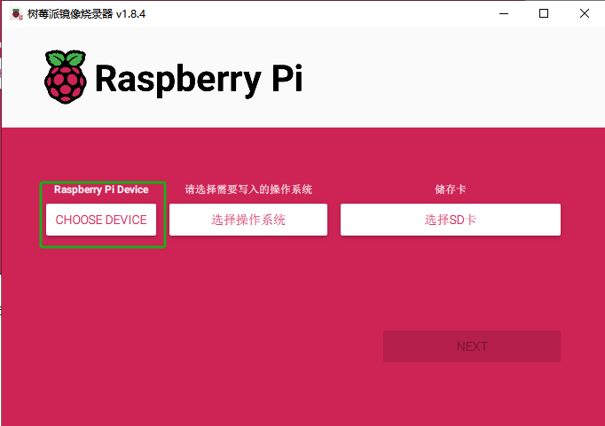
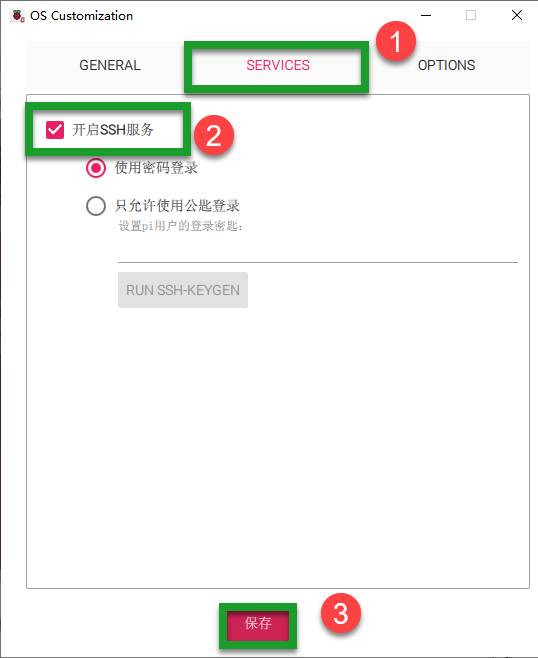
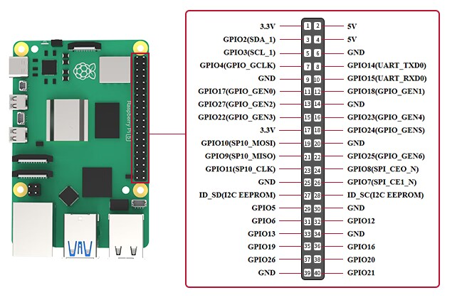

# 树莓派5硬件及系统介绍

## 1. 树莓派5介绍

Raspberry Pi，中文名为“树莓派”，简写为 RPi，或 RasPi/RPI，是一款只有信用卡大小的计算机，由英国的树莓派基金会所开发，被赋予的希望是能够帮助全世界的孩子学习编程， 并能够了解计算机是如何工作的。树莓派可连接键盘、鼠标和网线，同时拥有视频模拟信号的电视输出接口和 HDMI 高清视频输出接口，它适合于各个年龄段的人学习使用，比如能够用来学习 Python 这样的编程语言。同时它也能够做一切你期望台式电脑能做的事，从浏览网页、播放高清视频，到制作电子表格、进行文字处理，还能够玩游戏！

### 1.1 树莓派5简介

Raspberry Pi 5 采用 64 位四核 Arm Cortex-A76 处理器，运行频率为 2.4GHz，与 Raspberry Pi 4 相比，CPU 性能提高了2至3倍。除了 800MHz VideoCore VII GPU 大幅提升图形性能外;通过 HDMI 实现双 4Kp60 显示输出;以及重新架构的Raspberry Pi 图像信号处理器的先进相机支持，它为消费者提供了流畅的桌面体验，并为工业客户打开了新应用的大门。

这是第一台全尺寸的Raspberry Pi计算机，使用Raspberry Pi内部构建的芯片。[RP1](https://www.raspberrypi.com/documentation/microcontrollers/rp1.html) 为 Raspberry Pi 5 提供了大部分 I/O 功能，并在外设性能和功能方面实现了飞跃式变化。总 USB 带宽增加了一倍以上，从而加快了到外部 UAS 驱动器和其他高速外设的传输速度;早期型号上的专用双通道 1Gbps MIPI 摄像头和显示接口已被一对四通道 1.5Gbps MIPI 收发器取代，总带宽增加了三倍，并支持最多两个摄像头或显示器的任意组合;通过支持 SDR104 高速模式，峰值 SD 卡性能翻倍;该平台首次公开了单通道 PCI Express 2.0 接口，为高带宽外设提供支持。

### 1.2 树莓派5的结构及特点

- #### 树莓派5的硬件结构分布如下图所示

- #### 主要特点

(1) 四核 Arm Cortex-A76 @ 2.4GHz，加密扩展支持（硬件上的 AES），每核 512KB L2 缓存，2MB 三级缓存；

(2) 4GB 或 8GB LPDDR4X-4267 SDRAM；

(3) 双 4kp60 HDMI 显示输出，支持 HDR，4kp60 HEVC 解码器；

(4) VideoCore VII 显卡，支持 OpenGL-ES 3.1、Vulkan 1.2；

(5) Raspberry Pi 图像传感器处理器 （ISP）；

(6) 用于 PCIe 的 Raspberry Pi 连接器（1 个 2.0 端口，需要额外的 HAT）；

(7) 802.11ac 双频 Wi-Fi和蓝牙 5.0（支持 BLE）；

(8) 千兆以太网；

(9) 2 个 USB2.0 ，2 个 USB3.0（能够同时实现全吞吐量）；

(10) PoE 支持（需要额外的 HAT）；

(11) 双通道 4 通道 MIPI CSI/DSI 收发器，支持2x 显示;或2倍相机;或1 个显示器 + 1 个摄像头；

(12) Raspberry Pi 40 针 GPIO 接头；

(13) 风扇连接器；

(14) 实时时钟 （RTC）；

(15) 电源按钮。

- #### 优点

(1) 具有强大的运算性能；

(2) 开源硬件及易利用性；

(3) 与 Microsoft 系统相比，工具是免费的；

(4) 可做为低成本开发平台，可用作故障排除工具；

(5) 无需上网即可打开所有应用程序；

(6) 体积小巧，尺寸为信用卡大小。

正是基于这些优点，在世界各地，人们更多的选用树莓派来学习编程技能，构建硬件项目，进行家庭自动化项目，甚至在工业应用中使用它们。

### 1.3 树莓派5与树莓派4B参数对比

### 1.4 尺寸图（单位：mm）

### 1.5 树莓派的用途 

(1) 网络服务器

因为它只使用非常少的电力，树莓派可以全天候停留，无需冷却风扇或大量电力，通过

互联网或仅在本地网络中提供网页速度也足够快。

(2) 笔记本电脑

树莓派可以作为笔记本电脑的“**大脑**”，只需要配备一个电脑屏幕给它即可。

(3) 家庭影院机顶盒

有许多免费的操作系统可以将树莓派变成一个能够流式播放您喜欢的内容的机顶盒。

(4) 游戏模拟器

在任何的树莓派上使用免费的 RetroPie OS，可以玩 Game Boy，街机，SNES 等游戏。

(5) 监视器

只需要相对较少的投入，外接一个摄像头即可构建一个简易监控系统。

(6) Wi-Fi 扩展器

如果您在家中的某些角落无法获得良好的 Wi-Fi 信号，那么您的树莓派可以通过变成扩展器来提供帮助。在树莓派的内置 Wi-Fi 上，只需一个 USB Wi-Fi 适配器来重复信号。

(7) 音乐流光与多房间音频

使用合适的软件和一些树莓派，可以创建一个便宜的音响系统，在您家中的不同位置播放音乐。

诸如上述，树莓派不仅是一个开发小能手，还是生活中的“贴心伴侣”，还有更多方面的 应用在这里就先不一一说明了。

## 2. 树莓派系统介绍及安装

### 2.1 主流操作系统介绍 

在前面的章节已经提到树莓派本身就是一个微型电脑，所以一个电脑没有操作系统怎么能行？

操作系统（Operating System, OS）是一组主管并控制计算机操作、运用和运行硬件、软件资源和提供公共服务来组织用户交互的相互关联的系统软件程序。它是硬件基础上的第一层软件，是硬件和其它软件沟通的桥梁（或者说接口、中间人、中介等）。

我们常见的 Windows 就是一种操作系统。它为其他程序的运行提供基础支持如内存管理、文件系统、网络通信、图形化人机交互等。

目前在个人电脑或服务器上常见的操作系统有 Linux、Windows、macOS 等。那其实适合树莓派的发行版本也有很多，并足以满足不同人群的需求。如果需要的只是 某一方面的功能，那么选择第三方的系统也是可以的。在接下来，会列举几个发行的系统版本，以便于大家挑选最适合自己的的系统。

(1) **NOOBS**

官方推荐系统，全称 New Out of Box System（全新开箱即用系统），是一个非常好用 的多系统引导管理器。它本身含有操作系统的全部文件，可以完全不依赖网络直接安装系统， 只需记得安装完成后更新系统即可。

(2) **Raspbian**

官方推荐系统，树莓派系统的首选，为当前使用最广泛的操作系统。它是用 Debian 专

门为 ARM 卡片式计算机树莓派定制的版本。不仅软件丰富、系统安全稳定，而且国内的更

新源多，无论是初学者还是资深用户使用起来都非常顺手。

(3) **Windows IoT Core**

Windows IoT 是微软生态下的物联网操作系统，从最早发布时就是支持树莓派的。不过需要注意的是，这个版本与以往使用的 Windows 版本是不同的，硬件也不仅仅限于 x86 架构，同时也可以在 ARM 架构上运行。

(4) **Ubuntu MATE**

接触过 Linux 的用户可能会不陌生，这个是 Ubuntu 的一个版本，基于桌面环境 MATE，属于 Ubuntu Linux 官方的一个派生版。它是面向智能设备的最新平台，可运行存储在本地或依赖于云端的相同软件。

(5) **Kali Linux**

Kali Linux 是基于 Debian 的 Linux 发行版，设计用于数字取证及渗透测试。Kali 预装了很多渗透性软件，用户可通过硬盘、liveCD 或 live USB 运行 Kali Linux。既有 32 位和 64位镜像，可用于 X86 指令集，同时还有基于 ARM 架构的镜像。

(6) **OSMC**

英文全称是 Open Source Media Cente，是树莓派官方推荐的影音系统，可以播放本地和互联网上的资源，目的是以配合电视机打造一个多媒体中心（家庭高清电视播放平台）。

这些是比较常见的树莓派发行系统，关于主流系统的介绍就到这里为止，感兴趣的用户 可以搜索一下。在本节，我们将选用 Raspbian 操作系统（Raspbian 的基础是 Debian）作为示例系统。

### 2.2 准备工作 

:::{Note}
烧写镜像将会格式化 SD 卡，如果 SD 卡有数据请提前备份。
:::

我们需要准备一个读卡器、一张 32G SD 卡（建议 8G 以上）及可联网的电脑，然后将插入 SD 卡的读卡器连入电脑的任意一个 USB 接口。

### 2.3 使用官方工具在线安装系统 

树莓派官方开发了一款图形化 TF 卡烧写工具 Raspberry Pi Imager，其适用于 Windows、Mac OS 和 Ubuntu 等操作系统，它不仅可以一键下载镜像并将其安装到 SD 卡中，还可以刷写其它任何自定义的镜像，操作简单、非常适合新手入门。

本节将以此工具在 Windows 环境下为例进行说明，关于使用其它工具烧写的方法可自

行网搜。

(1)  打开树莓派官网“**[https://www.raspberrypi.com/software/](https://www.raspberrypi.com/software/)**”下载镜像烧录客户端安装包。

(2)  下载完成，按照下方图示进行操作，完成后打开客户端安装包。

(3) 点击“**CHOOSE DEVICE**”，然后从列表中选择Raspberry Pi型号，Imager 始终会在列表顶部显示适用于您的型号的Raspberry Pi OS 推荐版本，这里我们选择“**Raspberry pi 5**”

(4) 点击“**选择操作系统**”选择需要写入的操作系统，这里选择“**Raspberry Pi OS（64-bit）**”。

(5) 用读卡器将SD卡插入到电脑，再点击“**选择SD卡**”，一定要选择正确的SD卡。

(6) 点击“**NEXT**”，可以选择“编辑设置”来自定义操作系统。

(7) 编辑设置可让您在首次启动之前设置 Raspberry Pi。可以预先配置：用户名和密码、WiFi凭证、设备主机名、时区、键盘布局、远程连接。如下图所示：

(8) 因为需要使用SSH进行远程连接，所以需要打开相关服务，点击“**SERVICES**”，勾选“**开启SSH服务**”，然后点击“**保存**”。

(9) 点击“**是**”应用刚才的设置，然后开始写入系统，烧录需要一定时间，请耐心等待。

(10) 在镜像烧录完成后，则会先弹窗提示格式化的选项，点击“**取消**”。（切勿选择“**格式化磁盘**”，否则会造成刚烧录的镜像被清除掉）

## 3. 外壳、散热器安装及介绍

### 3.1 散热片的安装

本小节仅以单个散热片安装至树莓派CPU为例。

步骤如下所示：

(1) 取出散热片，撕开散热片的背后贴纸。

(2) 通过散热片背后的粘性粘贴至图示CPU方向即可。

### 3.2 树莓派外壳及风扇的安装

步骤如下所示：

(1)  取出树莓派和散热风扇。

(2)  将风扇的4 针JST接口与树莓派的4 针JST接口连接。

(3)  取出树莓派和外壳最下层的亚克力底板。

(4)  将树莓派安装到黑色亚克力底板上，安装的时候需要树莓派主板从侧面插进底板卡槽。

(5)  将树莓派成功安装到亚克力底板后，接下来取出亚克力保护壳。

(6)  将亚克力保护壳从上往下安装到装有树莓派的亚克力底板上，安装的时候需要注意亚克力保护壳侧边的音频、电源线等接口槽与树莓派上的接口相对应。如下图所示：

(7)  将散热风扇贴标签的面朝内，安装至亚克力上板的背面。

(8)  将亚克力上板从上往下安装到亚克力保护壳上，安装时需要注意亚克力上板上凸起的卡扣要与亚克力保护壳上的凸起对应。

(9)  最后将SD卡按图中的方向插入亚克力底板侧边的卡槽中，SD卡有文字的那面朝向亚克力的底板底部，如下图所示：

### 3.3 主动式散热器的安装

【视频】

## 4. 树莓派5使用注意事项

### 4.1 显示器

(1) 可以先接显示器的电源线，再接HDMI线。如果顺序相反的话，可能会导致接完线之后，屏幕依然是黑屏状态。

(2) 如果先给树莓派5开机，远程登录之后，再连接屏幕的话，可能出现远程闪退的情况。这时候，可以重启树莓派5。

### 4.2 远程登录

当树莓派5跟显示器连接时，如果远程登录桌面系统，画面的分辨率是以屏幕的分辨率为准的。即使在系统中更改分辨率，也不会生效。

如果在接了显示器的情况下要使修改的分辨率生效的话，需要把显示器拔掉，然后重启树莓派。

在树莓派修改分辨率生效的情况下，如果外接显示屏的话，远程桌面系统的分辨率会变成跟屏幕的分辨率一样。

### 4.3 电源供电

树莓派5采用5.1V/5A的电流进行供电，如果使用的电源在首次启动时无法在+5V电压提供5A电流，操作系统将警告外设的电流消耗将限制为600mA。

对于希望驱动硬盘和SSD等高功率外设，同时为峰值工作负载保留余量的需求，建议使用能够提供+5V（25W）电流的USB-PD电源。如果树莓派5固件检测到支持的5A电源，它会将外设的USB电流限制增加到1.6A，为下游USB设备提供5W的额外功率，以及5W的额外板载功率预算。

### 4.4 固件更新

除非树莓派官网提示，否则请勿更新树莓派5上的固件。如想了解是否有可用的固件更新信息，可以参考官方网站（[https://www.raspberrypi.com/documentation/computers/raspberry-pi-5.html](https://www.raspberrypi.com/documentation/computers/raspberry-pi-5.html)）的相关资料。

### 4.5 其他使用注意事项

(1) 树莓派5长期高负荷工作会造成过高温，可采取贴散热片等措施进行适当散热。

(2) 手触摸树莓派前需先接地消除静电，防止静电损坏元器件。

(3) GPIO引脚工作电压为+3.3V，不要强制输入5V电压以免损坏。

(4) 树莓派工作温度范围是0-50℃，超出可能对性能或寿命产生影响。

(5) 要确保树莓派5和软件的匹配，避免出现兼容性问题。

## 5. 树莓派5GPIO接口说明

### 5.1 简介

GPIO接口作为树莓派5的主要数字IO接口，共计40个，编号为GPIO0-GPIO27，其核心作用是实现树莓派5与外设的数字信号连接传输。

### 5.2 GPIO引脚作用

(1)  **电源输入/输出**

提供5V、3.3V和GND引脚，可以为外设设备提供电源输入、输出。

(2)  **数字输入/输出**

GPIO口支持数字信号的输入和输出功能。可以读取外部数字信号,也可以输出数字信号来控制外部设备。

(3)  **接线通信协议**

部分GPIO引脚支持I2C、SPI等通信协议功能。可以通过这些引脚实现与外设的串行通信。

(4)  **PWM输出**

GPIO23引脚支持脉冲宽度调制功能PWM输出。可以用它来控制电机转速或者调节LED亮度。

(5)  **接入外设设备**

通过GPIO口可以将各种外设设备如传感器、开关按键、LCD显示屏等连接到树莓派上,实现数据收发。

(6)  **触摸板或者按键输入**

GPIO可以读取触摸板或者开关的高低电平状态,实现触摸输入或按键控制功能。

(7)  **驱动输出设备**

GPIO口支持数字输出,可以控制外挂的LED灯、蜂鸣器等输出设备开关。

(8)  **通信模组控制**

通过GPIO可以实现与GSM/GPRS模块、WiFi模块通信,进行信息传输。

(9)  **程序控制**

通过Python和C语言可以灵活编程控制GPIO的每个引脚,实现各种自动化应用。

如需要进一步开发学习，可以参考官方（[https://www.raspberrypi.com/documentation/computers/raspberry-pi-5.html](https://www.raspberrypi.com/documentation/computers/raspberry-pi-5.html)）的教程。

## 6. 树莓派5PCle接口说明

### 6.1 接口位置

相比于树莓派4B，树莓派5增加了一个PCle2.0接口，其位置在主板LOGO的左侧。

### 6.2 PCle简介

PCI-Express(peripheral component interconnect express)是一种高速串行计算机扩展总线标准。属于高速串行点对点双通道高带宽传输，所连接的设备分配独享通道带宽，不共享总线带宽。PCIe有两种存在形式M.2接口通道形式和PCIe标准插槽。

PCIe可拓展性强，可以支持的设备有：显卡、固态硬盘（PCIe接口形式）、无线网卡、有线网卡、声卡、视频采集卡、PCIe转接M.2接口、PCIe转接USB接口、PCIe转接Tpye-C接口等。

### 6.3 PCle接口在树莓派5的应用

树莓派5搭载了一个PCle2.0接口，符合标准PCle插槽规格，可以扩展多种应用，大大增加了树莓派5的适用场景。以下是PCle接口在树莓派5上的主要应用：

(1) 通过PCle插槽连接支撑千兆以上高速网络的以太网卡，大幅提升树莓派的网络连接能力。

(2) 连接基于PCle接口规格的独立GPU或硬件加速卡，给树莓派5提供图形和计算处理。

(3) 连接基于PCle的FPGA扩展卡，利用其可编程能力扩展树莓派5功能。

(4) 连接PCle SSD固态硬盘卡，给树莓派5增加高速存储空间。

(5) 连接PCle音频接口卡或DVI接口转换卡，扩展树莓派的音频和视频输出功能。

(6) 连接PCle工控接口卡，给树莓派5增加工业控制和自动化接口。

(7) 连接PCle接口的WIFI或5G芯片卡，实现高速无线网络功能。

(8) 连接通过FPGA或者CPLD等实现的自定义功能扩展卡。

如需要进一步开发学习，可以参考官方（[https://www.raspberrypi.com/documentation/computers/raspberry-pi-5.html](https://www.raspberrypi.com/documentation/computers/raspberry-pi-5.html)）的教程。

## 7. MIPI CSI/DSI连接说明

### 7.1 接口位置

树莓派5新增了MIPI CSI(Camera Serial Interface)和MIPI DSI(Display Serial Interface)连接器，用于连接MIPI标准的摄像头和显示器。其位置在主板的右下角。

### 7.2 MIPI CSI/DSI简介

(1)  **MIPI CSI**

MIPI CSI(Camera Serial Interface)是一种串行数字图像传输接口标准,用于在嵌入式系统中将图像传感器连接到主机处理器。

(2)  **MIPI DSI连接器**

MIPI-DSI是一种应用于显示技术的串行接口，兼容DPI(显示像素接口，Display Pixel Interface)、DBI(显示总线接口，Display Bus Interface)和DCS(显示命令集，Display Command Set)，以串行的方式发送像素信息或指令给外设，而且从外设中读取状态信息或像素信息，而且在传输的过程中享有自己独立的通信协议，包括数据包格式和纠错检错机制。

### 7.3 MIPI CSI/DSI接口在树莓派5上的应用及好处

树莓派5与MIPI规格的数字摄像头和显示屏的标准化连接,采用了MIPI高速低功耗的串行物理层和链路层协议,支持最高4 lane单向1.5Gbps的传输速率,总带宽可达6Gbps。这种标准化接口相比传统CSI/DSI模块更小巧可靠,可以直接连接更广泛的MIPI视觉产品,大幅提升了树莓派在图像采集和显示领域的兼容性。同时高速传输也满足了更高清晰度下的实时处理需求。通过MIPI接口,树莓派5能够应用在更多视觉类项目中,如视频监控、人脸识别等,减少验证时间,提高研发效率。这为树莓派5在视觉AI等新兴領域的应用创造了很好的条件。

如需要进一步开发学习，可以参考官方（[https://www.raspberrypi.com/documentation/computers/raspberry-pi-5.html](https://www.raspberrypi.com/documentation/computers/raspberry-pi-5.html)）的教程。

## 8. UART连接说明

### 8.1 接口位置

树莓派5新增了专用的调试UART接口，支持高速低延迟的串行通信。其位置在主板的左下角。

### 8.2 UART简介

UART即通用异步收发传输器（Universal Asynchronous Receiver/Transmitter），它是一种串行通信的物理接口形式。它将要传输的资料在串行通信与并行通信之间加以转换。发送UART将来自CPU等控制设备的并行数据转换为串行形式，并将其串行发送到接收UART，接收UART然后将串行数据转换回接收设备的并行数据。

### 8.3 UART接口在树莓派5的应用

UART接口始终处于活动状态并启用，并提供对早期启动和固件信息的直接访问以及启动后的Linux控制台，也可以连接GPS模块、GSM模块、调试助手等外设设备。但要注意的是，收发数据线需要正确连接RXD与TXD对应引脚。

如需要进一步开发学习，可以参考官方（[https://www.raspberrypi.com/documentation/computers/raspberry-pi-5.html](https://www.raspberrypi.com/documentation/computers/raspberry-pi-5.html)）的教程。

## 9. 实时时钟

### 9.1 接口位置

树莓派5新增了一个RTC时钟电池接口，其核心作用是让树莓派5具备较强的实时功能，在断电状态下也可进行有限工作，这扩充了树莓派5的应用范围。其位置在主板的左下角。

### 9.2 RTC实时时钟简介

RTC（Real Time Clock）是个独立的定时器。RTC模块拥有一个连续技术的计数器，在相应的软件配置下，可以提供时钟日历的功能。修改计数器的值可以重新设置当前时间和日期RTC还包含用于管理低功耗模式的自动唤醒单元。

在断电情况下，RTC仍可以独立运行，只要芯片的备用电源一直供电，RTC上的时间会一直走。

### 9.3 RTC实时时钟在树莓派5上的应用及好处

使用官方提供的可充电的锂锰硬币电池，预安装的两针JST插头和粘合剂安装垫，适用于树莓派5的主电源断开时为RTC实时时钟进行供电，并在个位数微安（μ A）中测量断电电流，提供可在数月内测量的保留时间。

RTC电池接口可以让树莓派5具备较强的实时功能,在断电状态下也可进行有限工作，如记录时间事件，在断电后还能继续工作，不丢失记录；在断电情况下依然能运行预设的定时任务；记录实时数据和事件，在断电后依然存储，方便事后查询分析等等，这进一步扩充其应用范围。

如需要进一步开发学习，可以参考官方（[https://www.raspberrypi.com/documentation/computers/raspberry-pi-5.html](https://www.raspberrypi.com/documentation/computers/raspberry-pi-5.html)）的教程。

## 10. 以太网供电（PoE）连接说明

### 10.1 接口位置

树莓派5上的以太网插孔支持PoE+，支持IEEE802.3at-2009PoE标准。其接口为4针以太网供电（PoE），位于以太网插孔和两个MIPI连接器之间。

### 10.2 以太网供电（PoE）简介

PoE（Power over Ethernet）是指通过网线传输电力的一种技术，借助现有以太网通过网线同时为IP终端设备（如：IP电话、AP、IP摄像头等）进行数据传输和供电。又被称为基于局域网的供电系统（Power over LAN，简称PoL）或有源以太网（Active Ethernet），有时也被简称以太网供电。

使用于数据传输的网线同时具备直流供电的能力，有效解决IP电话、无线AP、便携设备充电器、刷卡机、摄像头、数据采集等终端的集中式电源供电，具有可靠、连接简捷、标准统一的优势。

为了规范和促进PoE供电技术的发展，解决不同厂家供电和受电设备之间的适配性问题，IEEE标准委员会先后发布了三个PoE标准：IEEE 802.3af标准、IEEE 802.3at标准、IEEE 802.3bt标准。

### 10.3 以太网供电（PoE）在树莓派5上的应用及好处

树莓派5继承了树莓派4B的以太网端口，支持PoE供电。只需通过一条网线即可实现数据和电源双向传输，可极大方便树莓派5在智能视频监控、工业互联网等需要长期连网的边缘场景下的安装和部署。与传统需要额外电源的设计相比,PoE技术省去了复杂的电源线路布设,大大节约了安装成本和后期维护难度。它还支持IEEE标准,与现有PoE设施兼容,并带来更高的可靠性,避免因为电源问题导致系统故障。总之,PoE给树莓派5在物联网领域的大规模商用应用创造了很好的条件,既简化了安装,也降低了总成本,提高了系统运行的稳定性,这对于边缘计算领域非常重要。

如需要进一步开发学习，可以参考官方（[https://www.raspberrypi.com/documentation/computers/raspberry-pi-5.html](https://www.raspberrypi.com/documentation/computers/raspberry-pi-5.html)）的教程。
