# 树莓派5基础操作和配置

## 1. 首次开机及外设连接

:::{Note}
若没有显示器、键盘和鼠标等外设设备，可参考本章节“第2课 远程访问和远程传输文件”的课程，进行远程连接。
:::

### 1.1 启动前的准备

在前面的章节，我们将树莓派已经准备好了，就像日常生活中我们购买了一台新电脑启动前一样，需要从组装到安装系统再到连接线路准备开机。

没错，现在我们只需要进行一些开机前的工作即可正式开始“树莓派之旅”！

首先需要自备一个家用电脑的显示器，一套USB接口的键盘鼠标，Micro-HDMI线（根据你的显示器接口选择用于连接显示器的HDMI转VGA的、或者HDMI线转DVI的连接线）。

(1) 将之前烧录好系统镜像的SD卡插入树莓派中，注意SD卡金手指方向面向树莓派主板，如下图所示：


(2) 再将USB接口的键盘鼠标接入树莓派USB口中。与树莓派3B/3B+主板不同的是，树莓派5内的4个USB接口其中两个蓝色孔位的为USB3.0。


(3) 用HDMI线一端连接树莓派的HDMI接口，另一端插入显示器接口。


(4) 接上电源线，并打开电源（插入插排后可按按钮）；树莓派5采用Type-C供电接口，支持更大的电源输入（5.1V，5A），故直接插入电脑的USB接口是无法带动树莓派的。


### 1.2 启动树莓派

开启电源后，信号灯亮红色，随后变为绿色，等待几秒绿灯不规律闪烁，进入桌面，之后绿色灯常亮。


## 2. 远程访问和远程传输文件

### 2.1 准备工作

- #### 2.1.1 硬件准备

准备一台笔记本电脑，若使用台式电脑，请自备无线网卡，否则会无法和树莓派5连接到同一个局域网中。

- #### 2.1.2 MobaXterm工具安装和使用

MobaXterm是一个集成了多种远程计算工具并提供图形化界面的软件，我们可以通过连接树莓派的Wi-Fi热点，直接在电脑上控制树莓派。接下来将会分步讲解如何安装该软件。

(1) 双击“**MobaXterm_Installer_v22.1**”文件夹中的“**MobaXterm_installer_22.1.msi**”文件，单击“**Next**”。

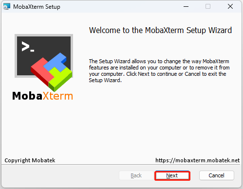

(2) 在弹出的界面中选择同意接受协议，单击“**Next**”。


(3) 选择要安装的路径，然后单击“**Next**”。


(4) 单击“**Next**”。


(5) 等待安装，片刻之后出现安装完成提示页面，单击“**Finish”**按钮即可。


- #### 2.1.3 树莓派5开机

(1)  按照前面所学的教程，我们已经给树莓派5连接上了局域网。这里以教程演示为例，树莓派5已经连上“**Hiwonder**”的热点，这时候给我们的电脑也连上“**Hiwonder**”的热点。


(2)  通过**win+R**键打开“运行”窗口，输入cmd打开管理员模式。


(3)  输入“**ping raspberrypi -4**”命令，查看热点给树莓派5分配的IP地址。


### 2.2 使用MobaXterm工具连接树莓派5

(1)  打开”**MobaXterm**“在主界面，点击左上角“**Session**”，新建一个会话。


(2)  在会话界面，选择“**SSH**”，输入机器人的IP，，IP为“**192.168.11.199**”，勾选“**Specify username**”，然后输入用户名“**pi**”。点击“**OK**”选项即可。


(3)  第一次连接需要输入树莓派5的密码“**raspberrypi**”，输入密码不会显示，输入正确后按下回车键即可。


(4)  密码输入正确，进入系统成功，系统界面如下图所示：


### 2.3 树莓派的文件传输

我们经常会需要在自己的电脑与树莓派之间传输文件，本章将以SSH为例，使用MobaXterm工具进行说明，关于其他文件传输方法，可自行上网搜索学习。

- #### 2.3.1 从电脑端传输文件到树莓派

(1)  通过SSH连接后，这里以电脑端桌面新建一个test.txt文件为例。

(2)  调整MobaXterm放大比例，选中需要传输的文件，用鼠标拖拽文件到MobaXterm文件区。


(3)  文件会自动传输到树莓派系统桌面，输入查看所有文件的指令“**ls**”，按下回车。如下图所示，从电脑端导入的文件已经传输成功。

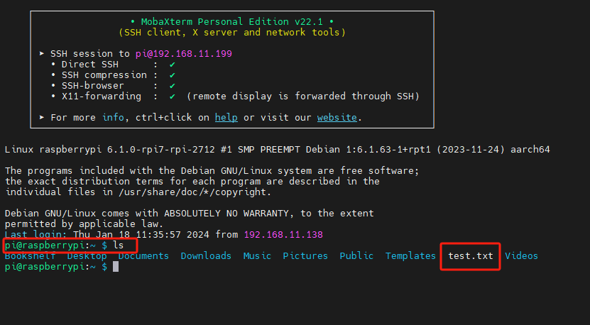

- #### 2.3.2 从树莓派传输文件到电脑端

通过SSH连接后，在MobaXterm文件区找到选中需要传输的文件，用鼠标拖拽文件到电脑桌面，文件会自动传输到电脑桌面。


### 2.4 开启VNC连接

如果你对命令行操控不熟悉或者不习惯，而树莓派5烧录的官方系统镜像，默认是不开启VNC连接，我们可以通过ssh连接后进行相关操作开启VNC连接。

(1)  通过SSH连接后，输入“**sudo raspi-config**”指令，按下回车,打开树莓派5配置窗口。


(2)  在该界面使用“↑↓”箭头选择，“Enter”回车键用于确定，“Esc”键用于返回上一级。找到“**Interface Options**”，并按下回车，进入相关设置界面。


(3)  找到“**I2 VNC**”，并按下回车，进行VNC开关界面。


(4)  选择“**Yes**”,并按下回车键，即可开启VNC连接。

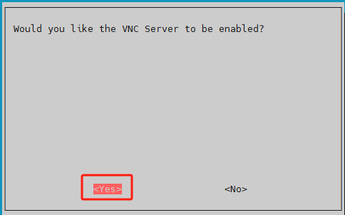

开启VNC连接后，我们可以通过VNC连接到树莓派5的系统里面。

### 2.5 VNC安装和连接

VNC是一款远程控制工具软件，就像常用的Windows操作界面一样，能通过图形化桌面的方式来进行操作。

- #### 2.5.1 安装VNC

(1)  双击本文件夹中的“**VNC-Viewer-6.17.731-Windows**”文件，在弹出的对话框中选择安装语言为“**English**”，单击“**OK**”按钮。


(2)  在弹出的界面单击“**Next**”按钮。


(3)  在新的提示框中勾选同意协议，然后单击“**Next**”，接着弹出安装位置设置，保持默认设置，继续单击“**Next**”。


(4)  在新弹出的页面中单击“**Install**”。


(5)  等待安装，片刻之后出现安装完成提示页面，单击“**Finish**”按钮即可完成安装。


(6)  VNC完成连接，直接打开图标即可。

- #### 2.5.2 VNC连接

(1)  按照前面所学的教程，我们已经给树莓派5连接上了局域网。这里以教程演示为例，树莓派5已经连上“**Hiwonder**”的热点，这时候给我们的电脑也连上“**Hiwonder**”的热点。


(2)  打开安装完毕的VNC客户端。在打开的VNC Viewer中输入树莓派5的IP地址：**192.168.11.199**，然后按回车键。如果提示不是安全连接的话单击“**Continue**”。

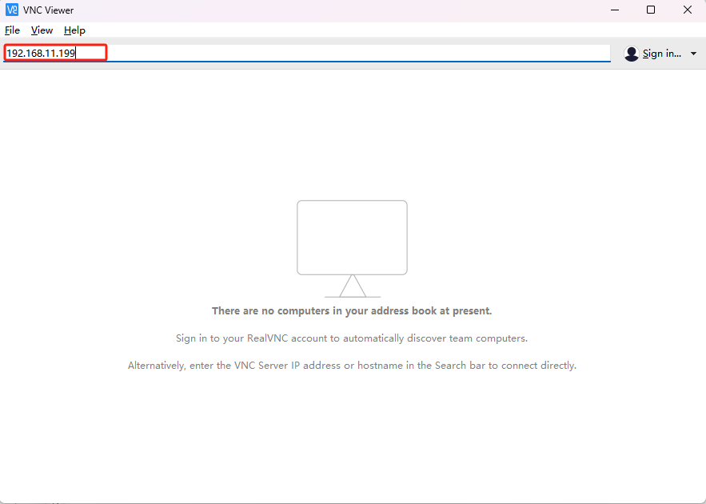

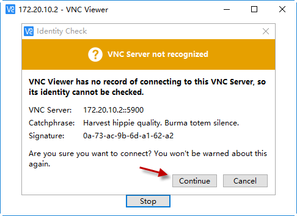

(3)  此时弹出一个提示框，要求输入密码，填入密码：**raspberrypi**（如果需要填账号的话输入“**pi**”）,勾选上记住密码框，然后单击“**OK**”，此时即可看到远程打开树莓派的桌面了。（如果是黑屏，只有一个鼠标的指针的画面，可尝试在重新启动树莓派后重复上述操作。）


## 3. 树莓派系统换源

树莓派默认的软件下载服务器是国外的，如果不进行换源的话，下载软件速度会比较慢或会发生出错的情况，所以需要切换成国内的服务器进行下载。

这里以切换到清华大学开源软件镜像站为例进行说明，其他的服务器可以参考官方提供的镜像列表：<https://www.raspbian.org/RaspbianMirrors>


### 3.1 修改sources.list文件

(1)  按下“**Ctrl+Alt+T**”，打开命令行终端，输入“**sudo nano /etc/apt/sources.list**”命令编辑sources.list文件，然后按下回车。

```bash
sudo nano /etc/apt/sources.list
```

(2) 通过键盘“← →”移动光标，移动到下图所示位置。


(3) 按下“**#**”，注释原文件所有内容。


(4) 然后将光标移动到最下面空行，依次追加下方内容。（可通过复制粘贴进行，如果要粘贴，不能使用Ctrl+V，可按鼠标中键或右键选择“粘贴”。）**注意这里的源是清华大学开源软件镜像站，如使用其它的请对应修改。另外请严格按照下列格式进行，切勿换行，否则会失效造成换源失败。**

```bash
deb https://mirrors.tuna.tsinghua.edu.cn/debian/ bookworm main contrib

deb https://mirrors.tuna.tsinghua.edu.cn/debian/ bookworm-updates main contrib

deb https://mirrors.tuna.tsinghua.edu.cn/debian/ bookworm-backports main contrib

deb https://security.debian.org/debian-security bookworm-security main contrib
```

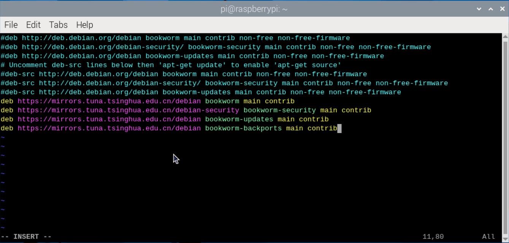

(5) 按下“**Ctrl+O**”保存，出现下方提示，再按下回车。


(6) 保存完成以后，按下“**Ctrl+X**”即可退出。

### 3.2 修改raspi.list文件

(1)  按下“**Ctrl+Alt+T**”，打开命令行终端，输入“**sudo nano /etc/apt/sources.list.d/raspi.list**”命令编辑raspi.list文件，然后按下回车。

```bash
sudo nano /etc/apt/sources.list.d/raspi.list
```

(2) 通过键盘“← →”移动光标，移动到下图所示位置。


(3) 按下“**\#**”，注释原文件所有内容。


(4) 然后将光标移动到最下面空行，依次追加下方内容。（可通过复制粘贴进行，如果要粘贴，不能使用Ctrl+V，可按鼠标中键或右键选择“粘贴”。

```bash
deb https://mirrors.tuna.tsinghua.edu.cn/raspberrypi/ bookworm main
```


(5) 按下“**Ctrl+O**”保存，出现下方提示，再按下回车。


(6) 保存完成以后，按下“**Ctrl+X**”即可退出。

## 4. 更新和升级操作系统

使树莓派保持最新状态可以提高系统的安全性，但对于开发人员并不建议随意更新！

### 4.1 图像化界面更新

一般桌面的右上角也会显示树莓派系统更新的提示，可以点击相应选项进行更新。

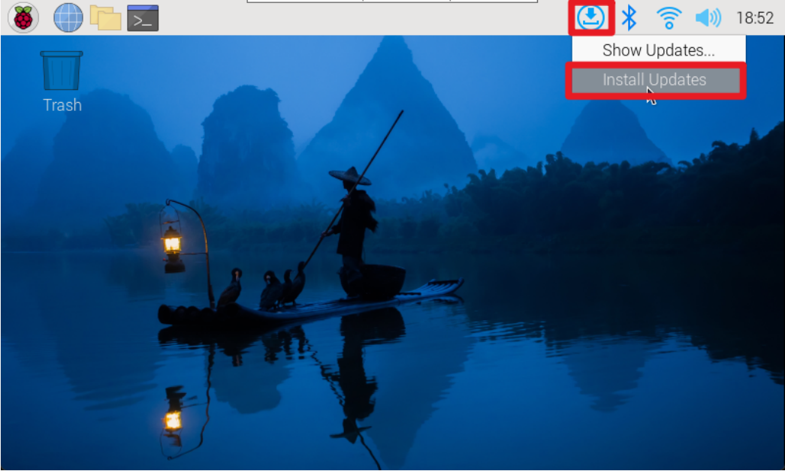

### 4.2 命令行终端更新

(1)  按下“**Ctrl+Alt+T**”，打开命令行终端，输入“**sudo apt update**”，更新本地包缓存。更新过程中会提示是否愿意接受更改，输入“**Y**”按下回车，然后等待更新完成即可。

```bash
sudo apt update
```


(2) 输入命令“**sudo apt full-upgrade**”更新软件包，更新过程如出现提示消耗空间的选项，同样按下“**Y**”，再按下回车继续。（注意：初次配置，时间会比较久，需耐心等待）

```bash
sudo apt full-upgrade
```


## 5. raspi-config配置工具介绍及使用

Raspi-config是树莓派操作系统Raspberry Pi OS中预装的配置工具，提供了一种简单便捷的命令行界面来管理树莓派系统的配置，使用户可以轻松地定制和优化其系统设置。

### 5.1 打开raspi-config工具

(1)  按下“**Ctrl+Alt+T**”，打开命令行终端，输入“**sudo raspi-config**”命令，然后按下回车。

```bash
sudo raspi-config
```

(2) 在该界面使用“↑↓”箭头选择，“Enter”回车键用于确定，“Esc”键用于返回上一级。


### 5.2 功能列表

输入配置命令后，会看到raspi-config工具的界面，中间灰色框中会列出所有的选项。

(1)  **System Options**

系统选项菜单，允许对引导、登录和网络、声音等各个部分进行配置更改，以及一些系统级别的更改。


(2)  **Display Options**

显示选项，用来配置分辨率，去除黑边等。


(3)  **Interface Options**

接口选项菜单，有以下选取可启用/禁用：Camera、SSH、VNC、SPI、I2C、Serial、1-wire和远程访问GPIO。


(4)  **Performance Options**

性能选项，包括超频、调整显存大小、风扇转速等功能。

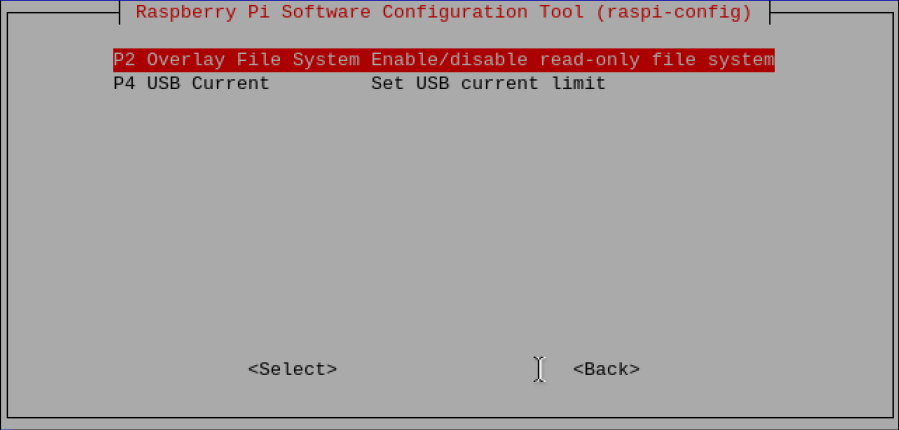

(5)  **Localisation Options**

本地化选项，提供：键盘布局、时区、区域设置和无线LAN国家代码。

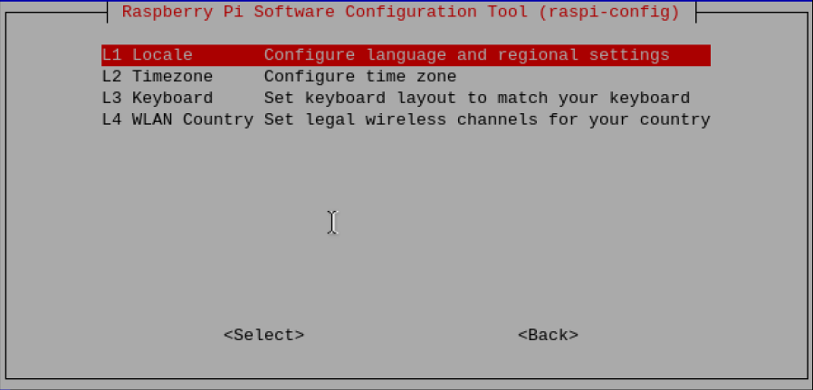

(6)  **Advanced Options**

高级选项，可以对磁盘扩展、引导启动等选项进行设置。


(7)  **Update**

将raspi-config工具更行到最新版本。


(8)  **About raspi-config**

关于raspi-config的信息。


### 5.3 设置WIFI国家

(1)  选择“**5 Localisation Options Configure language and regional settings**”，然后按下“**Enter**”键。


(2)  然后选择“**L4 WLAN Country Set legal wireless channels for your country**”，然后按下“**Enter**”键。


(3)  选中“**HK Hong Kong**”，按下“Enter”键即修改成功。


## 6. config.txt文件说明

由于树莓派并没有传统意义上的BIOS，所以现在各种系统配置参数通常被存在“config.txt”这个文本文件中。

树莓派的config.txt文件会在ARM内核初始化之前被GPU读取，是树莓派系统特有的启动配置文件，位于SD卡的第一个（引导）分区上，其路径为：**/boot/config.txt**


### 6.1 文件格式

双击打开config.txt文件。每行单个语句，内容是整数或字符串；每个语句前可添加一行注释来解释语句作用，每行长度限制为98个字符，超过限制的内容部分会被忽略。


### 6.2 常用选项

(1) **Camera_auto_detect**

启用此设置后，固件将自动加载其识别的CSI摄像机的叠加层。

设置为禁用：

camrea_auto_detect=0

(2) **Display_auto_detect**

启用此设置后，固件将自动加载它识别的DSI显示器的叠加层。

设置为禁用：

display_auto_detect=0

(3) **Dtoverlay**

用于加载和配置设备树覆盖，通过配置dtoverlay，用户可以添加额外的硬件支持或功能到树莓派系统中。

加载启用内核图形驱动程序的覆盖层：

dtoverlaydtoverlay=vc4-kms-v3d

这里只列举部分选项，更详细的资料请去官方（[https://www.raspberrypi.com/documentation/computers/raspberry-pi-5.html](https://www.raspberrypi.com/documentation/computers/raspberry-pi-5.html)）查看教程。

## 7. vim编辑器的使用教程

Vim支持多种编程语言，有丰富的快捷键，是Linux系统自带的编辑器。早期的Unix系统中，都是使用Vi作为系统默认的编辑器。Vim即Vi的升级版，其代码补充、编译及错误跳转等方便编辑的功能非常丰富，更便于用户编辑。

### 7.1 Vim的模式介绍

Vim共有3种模式，分别是命令模式，插入模式，底线命令模式，三种模式的具体说明见下表。

| 模式名称 | 模式介绍 | 模式功能 |
|:--:|:--:|:--:|
| 命令模式 | 进入Vim编辑器后的默认模式。 | 可以移动光标、删除字符等。 |
| 输入模式 | 在命令模式下输入命令“i”，进入编辑模式。 | 可以在此模式下输入字符，按“ESC”将回到命令模式。 |
| 末行命令模式 | 在命令模式下按“:”，进入功能模式。 | 可以保存文件、退出Vim、设置V im、查找等功能。 |

三种模式的切换方法可参考下图。


“输入模式”下可以编辑文件内容；命令模式是一个中间状态，可以查看代码，删除代码，“末行命令模式”下可以对文件整体进行保存等操作，也可以退出编辑器。

三者之间的关系可以类比为员工上班的过程。进入公司（vi 某文件）办公（编辑模式）需要员工证（输入命令），如果你没有出示员工证，便只能以访客的身份观看大楼风景。但如果你出示了员工证，那么你就可以进入公司内办公了。当天办公结束，下班前，你需要去打个卡（末行命令模式）来记录（保存）今天的出勤记录，然后离开公司（按下“ENTER”），这样就正式完成了一天的工作。

### 7.2 Vim的基本操作

我们以表格的形式介绍三种模式下不同的按键操作，感兴趣的同学可自行查阅更多相关的资料来学习。

<table class="docutils" border="1">
    <thead><tr><th>模式</th><th>按键说明</th></tr></thead>
    <tbody>
    	<tr><td rowspan="3">命令模式</td><td>“i”——切换到输入模式。</td></tr>
        <tr><td>“x”——删除当前光标所在处的字符。</td></tr>
        <tr><td>“:”——切换到底线命令模式。</td></tr>
        <tr><td rowspan="9">输入模式</td><td>“Enter”——回车，换行。</td></tr>
        <tr><td>字符按键及“Shift”组合——输入字符。</td></tr>
        <tr><td>“Back Space”——退格键，删除光标前一个字符。</td></tr>
        <tr><td>“Del”——删除键，删除光标后一个字符。</td></tr>
        <tr><td>方向键——在文本中移动光标。</td></tr>
        <tr><td>“Home/End”——移动光标到行首/行尾。</td></tr>
        <tr><td>“Page up/Page down”——上下翻页。</td></tr>
        <tr><td>“Insert”——切换光标为输入/切换模式，光标将变为竖线/下划线。</td></tr>
        <tr><td>“Esc”——推出输入模式，切换至命令模式。</td></tr>
        <tr><td rowspan="3">末行命令模式</td><td>“q”——退出程序。</td></tr>
        <tr><td>“w”——保存文件。</td></tr>
        <tr><td>“q!”——不保存强制退出。</td></tr>
    </tbody>
</table>


### 7.3 Vim的实操演练

(1) 启动树莓派，打开LX终端。

(2) 虽然我们使用的系统版本已经预装了vim编辑器，但是并不是完整版的，因此我们输入命令“**sudo apt-get install -y vim**”，安装完整版的vim编辑器。


(3) 安装过程中若出现以下提示，则需要先将vim-common文件删除，输入指令“**sudo apt-get remove vim-common**”，回车，即可进行删除，然后再重复步骤2。


(4) 输入“**vim**”和想要编辑或建立的文件名，便可进入vim编辑器。在这里我们以新建一个名称为“**abc**”的纯文本文件为例，进行演示，输入格式如下图所示：


(5) 按下“ENTER”回车键，可以看到我们已经建立一个名为“abc”的新文件，并进入了vim编辑器。


(6) 我们刚进入文件时是命令模式，在键盘上按下“i”，切换到输入模式，此时终端左下角会显示“-- 插入--”的提示。


(7) 使用键盘输入以下字符“**hello raspberry**!”。


(8) 结合前面所学，使用“**Insert**”按键来切换光标，替换字符。我们可以在“**raspberry**”的“r”替换为一个“1”，然后再使用“Del”按键删除掉。


(9) 结合前面所学，使用“Insert”按键来切换光标，替换字符。我们可以在“raspberry”的“r”替换为一个“1”，然后再使用“Del”按键删除掉。


(10) 体验完“**输入模式**”后，我们需要切换到“**末行命令模式**”来保存文件内容。按下“**ESC**”退出“输入模式”，然后按下“:”按键，并输入“**wq**”，在终端底部会出现我们输入的命令，如下图所示：


(11) 按下“**ENTER**”键（回车键），即可保存并退出终端界面。接下来输入命令“ls”，查看目录下是否成功建立了名称为“abc”的文件。


(12) 刚才输入命令后我们在文件夹内找到了新建的“abc”文件，接下来输入命令“cat abc”，该命令可以直接查看文件“abc”的内容。


(13) 如果想要对文件“abc”的内容进行更改，输入命令“vim abc”即可进入“abc”文件当中。


(14) 进入“abc”文件，之后根据“5)--8)”的操作方法对文件进行修改并保存。若修改完成后不想保存，按下键盘上的“**Esc**”，再按下“**：**”按键，并输入“**q！**”再按下回车键，即可不保存强制退出此文件。


### 7.4 配置网络方法

树莓派5的网络配置方法有AP、STA和网线直连这三种模式，下面介绍这三种模式的网络配置方法。本节课需要vim编辑器，如未安装请参考本文件夹的“**vim编辑器的安装及使用教程**”。

- #### 7.4.1 AP模式

(1)  按下“**Ctrl+Alt+T**”，打开命令行终端，输入“**sudo vim /etc/NetworkManager/system-connections/pi5.nmconnection**”命令，然后按下回车，创建并编辑pi5.nmconnection文件。

```bash
sudo vim /etc/NetworkManager/system-connections/pi5.nmconnection
```


(2) 输入以下代码。


(3) 配置树莓派5的网络AP模式，热点名称为：pi5，密码为：**12345678**，并设置成固定IP：**192.168.149.1**。输入完成后，按下键盘的“**Esc**”键，并输入“**:wq**”，按下回车，即可完成保存与退出操作。


(4) 输入“**sudo systemctl restart NetworkManager**”，重启网络配置相关文件。

```bash
sudo systemctl restart NetworkManager
```

(5) 再输入“**sudo reboot**”命令，重新启动系统，即可完成对AP模式的配置。

```bash
sudo reboot
```

- #### 7.4.2 STA模式

(1)  按下“**Ctrl+Alt+T**”，打开命令行终端，输入“**sudo vim /etc/NetworkManager/system-connections/hiwonder.nmconnection**”命令，然后按下回车，创建并编辑hiwonder.nmconnection文件。

```bash
sudo vim /etc/NetworkManager/system-connections/hiwonder.nmconnection
```


(2) 输入以下代码。


(3) 配置树莓派5的网络STA模式，连接的WIFI名称为：**WWW**，密码为：**hiwonder**，并设置成固定IP：**192.168.1.111**。输入完成后，按下键盘的“Esc”键，并输入“**:wq**”，按下回车，即可完成保存与退出操作。


(4) 输入“**sudo systemctl restart NetworkManager**”，重启网络配置相关文件。

```bash
sudo systemctl restart NetworkManager
```


(5) 再输入“**sudo reboot**”命令，重新启动系统，即可完成对STA模式的配置。

```bash
sudo reboot
```

- #### 7.4.3 网线直连

(1)  按下“**Ctrl+Alt+T**”，打开命令行终端，输入“**sudo vim /etc/NetworkManager/system-connections/hiwonder.nmconnection**”命令，然后按下回车，创建并编辑hiwonder.nmconnection文件。

```bash
sudo vim /etc/NetworkManager/system-connections/hiwonder.nmconnection
```


(2) 输入以下代码。


(3) 配置树莓派5的网线直接模式，设置成固定IP：192.168.1.112。输入完成后，按下键盘的“Esc”键，并输入“:wq”，按下回车，即可完成保存与退出操作。


(4) 输入“**sudo /etc/init.d/networking restart**”，重启网络配置相关文件。

```bash
sudo /etc/init.d/networking restart
```


(5) 再输入“**sudo reboot**”命令，重新启动系统，即可完成对网线直连模式的配置。

```bash
sudo reboot
```

## 8. 设置显示屏分辨率和旋转

显示屏分辨率选择不正确的话可能会出现花屏现象，可以按照产品支持的显示器分辨率设置。

### 8.1 外接显示屏显示设置

(1)  点击左上角的logo，选择**Preference → Screen Configuration**。


(2)  鼠标右击的HDMI输出接口就可以设置分辨率、旋转方向等。修改之后需要重启系统。


### 8.2 VNC远程显示设置

(1)  点击左上角的logo，选择**Preference →Raspberry Pi Configuration**。

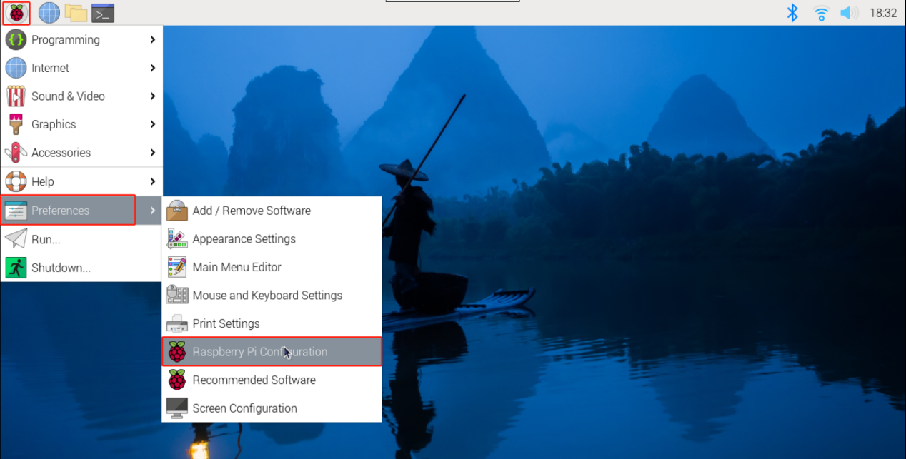

(2)  点击进入“Raspberry Pi Configuration”界面，选择“**Display**”，并根据自身电脑屏幕的分辨率选择合适的尺寸。修改之后需要重启系统，重新连接VNC。


## 9. 设置屏幕休眠

树莓派5系统默认是10分钟无操作后自动息屏，接下来将演示两种设置方法如何修改屏幕休眠时间。

### 9.1 图形化界面设置

(1)  点击左上角的logo，选择**Preference →Raspberry Pi Configuration**。


(2)  点击进入“**Raspberry Pi Configuration**”界面，选择“**Display**”界面，Screen Blanking的启用/禁用是设置屏幕是否息屏。修改之后需要重启系统。


### 9.2 命令行终端设置

可以通过修改lightdm.conf文件来设置屏幕休眠。

(1)  按下“**Ctrl+Alt+T**”，打开命令行终端，输入“**sudo nano /etc/lightdm/lightdm.conf**”命令，打开lightdm.conf文件。

```bash
sudo nano /etc/lightdm/lightdm.conf
```


(2) 取消“**xserver-command=X**”的注释符#，并修改成“**xserver-command=X -s 0-dpms**”，其中-s参数即为设置屏幕保护不启动，-dpms为关闭电源节能管理。

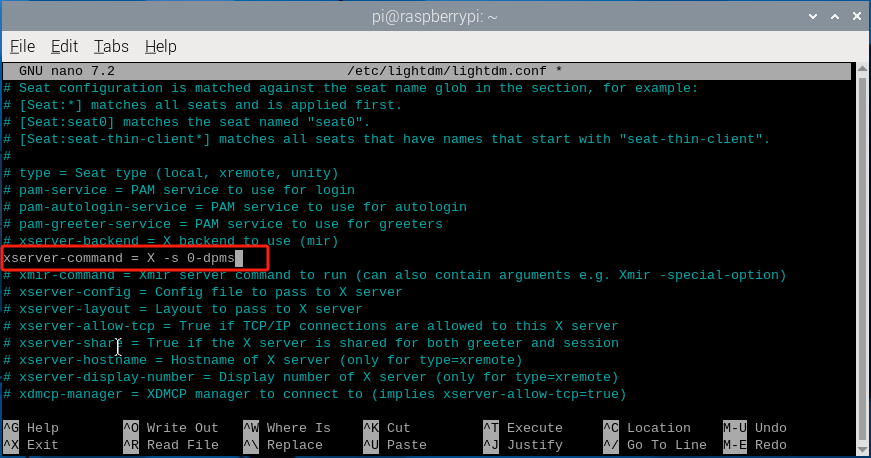

(3) 修改完成后，按下“Ctrl+X”,并输入Y，然后回车，即可保存文件。


(4) 保存文件后，需要重启系统。

## 10. 播放音频和视频

VLC是最好的免费和开源的媒体播放器之一，几乎任何设备都可以使用。VLC的特点是支持绝大多数的视频和音频格式，而且内置支持来自互联网的流媒体。由于在基本的VLC安装中包含了大量的解码编码库，就不必担心寻找额外的编解码器了。

在树莓派5上播放音频和视频的最简单方法是使用预装的VLC应用程序，VLC程序使用硬件加速，可以播放许多流行的音频和视频文件格式，但由于树莓派5取消了音频接口，需要用户自行外接带有音频输出的显示器或者蓝牙音频设备。

### 10.1 安装VLC应用程序

VLC应用程序在树莓派操作系统仓库中是可用的，可以通过运行“apt install”命令轻松安装VLC。

按下“**Ctrl+Alt+T**”，打开命令行终端，输入“**sudo apt install -y vlc**”，更新本地包缓存。更新过程中会提示是否愿意接受更改，输入“**Y**”按下回车，然后等待更新完成即可。

```bash
sudo apt install -y vlc
```


下面以播放demo.mp4文件为例，列出一些常用的指令合集：

| 指令 | 说明 |
|:--:|:--:|
| vlc demo.mp4 | 播放demo.mp4文件 |
| vlc --play-and-exit demo.mp4 | 播放完demo.mp4文件，退出应用 |
| vlc --play-and-exit --fullscreen demo.mp4 | 全屏播放demo.mp4文件，播放完并退出应用 |
| cvlc --play-and-exit demo.mp4 | 不显示VLC图形界面播放demo.mp4 |

### 10.2 启动VLC

- #### 10.2.1 命令行启动

按下“**Ctrl+Alt+T**”，打开命令行终端，输入“**vlc /home/pi/demo.mp4**”，运行demo.mp4这个视频文件，其路径在/home/pi。

```bash
vlc /home/pi/demo.mp4
```


- #### 10.3.1 图形化界面启动

点击左上角的logo，选择并点击**Sound&Video→VLC Media Player**，即可打开“**VLC Media Player**”播放器。


找到demo.mp4文件，打开并播放该文件。


## 11. 树莓派系统显示中文及安装中文输入法

### 11.1 显示中文的方法

由于树莓派系统默认为英文字库，如果你在使用中需要打开中文的文件，出现了一堆方块的情况，那么可以参照本小节的教程—手动来安装中文字体。

(1)  树莓派在开机后，打开LX终端，输入以下命令“**sudo apt-get install ttf-wqy-zenhei**”。

```bash
sudo apt-get install ttf-wqy-zenhei
```

(2) 如果安装过程碰到（Y/n），都选择“y”。


### 11.2 中文输入法的安装

小企鹅输入法是一个以GPL方式发布的输入法平台,可以通过安装引擎支持多种输入法，支持简入繁出，是在 Linux 操作系统中常用的中文输入法。它的优点是，短小精悍、跟程序的兼容性比较好。

(1)  在LX终端界面中输入命令“**sudo apt-get install fcitx fcitx-config-gtk fcitx-table-all im-switch fcitx-frontend-gtk3 fcitx-frontend-gtk2 fcitx-ui-classic**”，以安装fcitx（小企鹅）输入法。

```bash
sudo apt-get install fcitx fcitx-config-gtk fcitx-table-all im-switch fcitx-frontend-gtk3 fcitx-frontend-gtk2 fcitx-ui-classic
```


(2) 如果安装过程碰到（Y/n）,都选择“y”。


(3) 安装完成后输入“**sudo reboot**”并按下“**Enter**”（回车键）重启树莓派（注意：一定要重启）。

```bash
sudo reboot
```

(4) 重启后，我们任意打开一个中文文件或在LX终端上测试一下输入法。


(5) 点击右上角的输入法图标，选择“**Input Method**”中的“**Sunpinyin**”或者“**Google** **Pinyin**”即可切换输入法。


(6) 或者按 “**Ctrl+Space**”（空格键）。在终端尝试输入汉字，下图可看到已经能够实现正常使用。


## 12.获取树莓派实时温度

树莓派获取实时温度的原理是通过读取系统文件来获取实时的温度数据。在树莓派上，CPU温度信息被保存在一个特定的文件中，而我们可以通过两种方式来获取温度数据。

### 12.1 通过指令查看

按下“**Ctrl+Alt+T**”，打开命令行终端，输入“**vcgencmd measure_temp**”， vcgencmd是树莓派中用以查看硬件状态的命令，按下回车直接查看CPU温度。通过输出的信息可以得知当前树莓派5CPU的温度为60.9℃。

```bash
vcgencmd measure_temp
```


### 12.2 读取temp文件查看

按下“**Ctrl+Alt+T**”，打开命令行终端，输入“**cat /sys/class/thermal/thermal_zone0/temp**”， 按下回车直接查看CPU温度。返回值（60050）除以1000则为CPU当前的温度值，即当前温度为60.05℃。

```bash
cat /sys/class/thermal/thermal_zone0/temp
```


### 12.3 通过状态栏实时查看

(1)  在任务栏上点击右键，选择“**Add/Remove Plugins**”选项。


(2)  选择“**CPU Temp**”，然后点击“**Add to right**”，最后点击“**OK**”确定。这就把CPU温度显示在任务栏的右边。


(3)  完成操作后，可以在任务栏的右边看看CPU的温度实时显示了。


## 13. 了解LED警告闪烁状态

树莓派5相比于其他版本的树莓派少了一个LED灯，只剩下ACT LED灯。我们可以通过观察LED闪烁状态来判断树莓派的工作状态。


| 状态 | 含义 |
|:--:|:--:|
| 闪烁1次，间隔1秒 | 表示SD卡读取错误，可能是SD卡损坏、文件系统错误或未正确插入SD卡 |
| 闪烁2次，间隔1秒 | 表示SD卡写入错误，可能是SD卡写保护、文件系统错误或SD卡空间已满。 |
| 闪烁3次，间隔1秒 | 表示启动文件系统错误，可能是启动分区损坏、启动文件缺失或启动文件系统错误。 |
| 闪烁4次，间隔1秒 | 表示启动超过最长启动时间，可能是启动过程中遇到问题，导致启动超时。 |
| 闪烁5次，间隔1秒 | 表示无法检测到根文件系统，可能是SD卡中根文件系统损坏或未正确挂载。 |

以下是一些常见的ACT LED灯闪烁状态及其含义：

请注意，这些闪烁状态可能因树莓派的型号、操作系统版本和配置有所不同。如果遇到ACT LED的闪烁状态，建议参考树莓派的官方文档（**https://www.raspberrypi.com/**）或相关支持论坛，以获取更具体的指导和解决方案。

## 14. 外部存储配置

树莓派5搭载了2个USB2.0（黑色）和2个USB3.0（蓝色）的端口，这可以将外部硬盘、SSD或USB记忆棒连接到树莓派上的任何USB端口，然后挂载文件系统以访问存储在其上的数据。


默认情况下，树莓派会在/home/pi目录中自动挂载一些流行的文件系统，例如FAT、NTFS和HFS+。要设置存储设备使其始终挂载到选择的特定位置，必须手动挂载。下面演示如下配置外部存储：

(1)  将外部存储设备（例如USB闪存启动器、硬盘驱动器或SSD）连接到树莓派的USB端口上。

(2)  按下“**Ctrl+Alt+T**”，打开命令行终端，输入“**sudo fdisk -l**”命令， 查看已连接的存储设备和它们的挂载点。如“/dev/ram0”或“/dev/ram1”等，则是磁盘设备的挂载点。

```bash
sudo fdisk -l
```


(3) 输入“**sudo mkdir /home/pi/test**”，创建挂载点目录到“**/home/pi/test**”下。

```bash
sudo mkdir /home/pi/test
```


(4) 输入“**sudo mount /dev/sda2 /home/pi/test**”命令，将外部存储设备（**/dev/sda2**）挂载到先前创建的挂载点上（**/home/pi/test**），这就将外部存储设备挂载到指定路径下了。

```bash
sudo mount /dev/sda2 /home/pi/test
```


## 15. 更改默认用户配置

在烧录树莓派官方镜像的时候，就已经将主机名、用户名和密码等设置好了。下面演示如何修改主机名（raspberrypi）。


(1)  按下“**Ctrl+Alt+T**”，打开命令行终端，输入“**sudo vim /etc/hosts**”，打开hosts文件。

```bash
sudo vim /etc/hosts
```


(2) 找到“**127.0.1.1 raspberrypi**”这行代码。


(3) 按下“**i**”进入编辑模式，将“**raspberrypi**”替换成要修改的名字，这里以替换成“**hiwonder**”为例。


(4) 然后按下“**Esc**”键，接着按下“**:wq**”，进行保存。


(5) 修改完后重启树莓派即可。

如需修改其他默认配置，请参考官方（https://www.raspberrypi.com）的相关教程。

## 16. USB摄像头测试及使用

树莓派5搭载了2个USB2.0（黑色）和2个USB3.0（蓝色）的端口，这可以将USB摄像头连接到树莓派上的任何USB端口。


### 16.1 安装FSWebcam工具

FSWebcam是一个用于Linux系统的开源命令行工具，用于捕捉摄像头图像并保存为图像文件。它是通过Video4Linux接口与摄像头进行交互的，并提供了一些选项和参数来控制图像的质量、分辨率和其他设置。下面通过命令行来安装FSWebcam工具。

(1)  按下“**Ctrl+Alt+T**”，打开命令行终端，输入“**sudo apt install fswebcam**”指令， 安装FSWebcam工具。

```bash
sudo apt install fswebcam
```


(2) 输入“**sudo usermod -a -G video pi**”指令，添加用户权限到群组中。

```bash
sudo usermod -a -G video pi
```


(3) 输入“**groups**”查看用户是否已正确添加到群组中。

```bash
groups
```


### 16.2 USB摄像头测试

按下“**Ctrl+Alt+T**”，打开命令行终端，输入“**fswebcam /dev/video0 /home/pi/img1.jpg**”指令，抓拍图片，并命名为img1.jpg，存放于“/home/pi”下。（/dev/video0是 Linux 系统中用于视频设备的默认设备文件路径。它通常对应于第一个检测到的视频设备）

```bash
fswebcam /dev/video0 /home/pi/img1.jpg
```


以下是FSWebcam工具的部分参数详解：

| 参数 |        说明        |           作用           |
| :--: | :----------------: | :----------------------: |
| -？  |       --help       |   显示此帮助页面并退出   |
|  -c  | --config\<文件名\> |      从文件加载配置      |
|  -q  |      --quiet       | 隐藏所有消息（错误除外） |
|  -v  |     --verbose      |   捕获时显示额外的消息   |
|  -l  |    --loop\<秒\>    |         循环运行         |
|  -b  |    --background    |        在后台运行        |
|  -o  | --output\<文件名\> |     将日志输出到文件     |

## 17. 树莓派正确的关机

树莓派虽然是一个微型电脑，但是没有像普通PC那样的电源开关。许多人都是不使用后直接拔掉电源线，这样的操作对SD卡数据可能会造成损坏。我们都知道SD卡不仅当作树莓派的系统，同时在系统内还会存在大量的文件。为了避免直接断电可能造成的数据丢失及SD卡损坏，最好按照一种更安全的方法来关闭。

我们在需要关闭树莓派的时候，打开LX终端界面，输入“**sudo shutdown -h now**”。这里需要注意“**-h**”会将系统挂起，当然你也可以将“**-h**”删除，则会立即执行关机操作。你也可以使用“**sudo halt**”命令，这个命令更短，其功能也是同前面一致的。

```bash
sudo shutdown -h now
```

如果你需要告诉你的设备在一个特定时间关闭，输入“**sudo shutdown -h 30**”，这将会告诉设备在30分钟后关闭。如果需要一个确切的时间，也是可以的（例：“**sudo shutdown -h 12:30**”）。

```bash
sudo shutdown -h 30
```

输入命令“**sudo reboot**”设备将会重启，也可以输入“**shutdown -r now**”让其立刻重启，如果需要定时重启（比如13点30分20秒）输入“**shutdown -r 13:30:20**”。

```bash
sudo reboot

shutdown -r now

shutdown -r 13:30:20
```

## 18. 树莓派系统备份

### 18.1 系统备份的意义

为应对文件、数据丢失或损坏等可能出现的意外情况，将树莓派SD卡的数据提前复制至其他存储设备中，以便于及时恢复和还原系统，避免重复配置浪费时间精力。

### 18.2 备份的方式

通常，备份有以下三种方式，它们的特点可以参考下表，用户可根据实际情况及自身需求进行参考选择。

| 平台 | 工具 | 优点 | 缺点 |
|:--:|:--:|:--:|:--:|
| Windows | Win32Disklmager、WinImager | 制作镜像简单 | 制作镜像时间久 |
| Raspbian（Linux） | 命令行、脚本 | 生成镜像文件小，不占用电脑空间。 | 操作麻烦 |
| Raspbian（Linux） | SD Card Copier | 即插即用，效率比较高。 | 无法生成镜像文件，难以批量。 |

- #### 18.2.1 Windows下使用第三方软件制成镜像

**推荐使用WinImager软件，具体教程用户可自行搜索。**

(1)  先在电脑本地新建一个空白的.img后缀的文件。(选择“**是**”)


(2)  插入带有系统镜像的SD卡，打开Win32Disklmager工具，选择对应的SD卡的盘符和新建的.img后缀的文件。


(3)  点击“**Read**”读取，即可将树莓派的SD卡文件转为镜像。


- #### 18.2.2 Linux下使用命令行形式

(1)  启动树莓派，打开LX终端。首先依次输入以下命令安装需要的软件（出现选择y和n的提示都选y）。

```bash
sudo apt-get install dosfstools

sudo apt-get install dump

sudo apt-get install parted

sudo apt-get install kpartx
```

(2) 输入“df -h”命令（df与-h之间有一个空格）查看树莓派实际使用空间，然后在决定生成文件的大小。在这里只需查看root的剩余空间，可以看到已经使用了5.5G。


(3) 在任意位置（例如home/pi下）输入“sudo nano backup.sh”命令可以创建一个名为“backup”的脚本文件。在其空白位置，复制以下内容。

```bash
#!/bin/sh

sudo dd if=/dev/zero of=raspberrypi.img bs=1MB count=7500

sudo parted raspberrypi.img --script -- mklabel msdos

sudo parted raspberrypi.img --script -- mkpart primary fat32 8192s 122879s

sudo parted raspberrypi.img --script -- mkpart primary ext4 122880s -1

loopdevice=`sudo losetup -f --show raspberrypi.img`

device=`sudo kpartx -va $loopdevice | sed -E 's.(loop[0-9])p.1g' | head -1`

device="/dev/mapper/${device}"

partBoot="${device}p1"

partRoot="${device}p2"
```

(4) 复制完成后，按“**Ctrl+X**”键，会提示确认是否保存，按“**Y**”键确认并按“**Enter**”回车键退出。

(5) 退出后输入“**sudo chmod 777 backup.sh**”命令，给文件增加一个所有用户都可读可写可执行的权限。


```bash
sudo chmod 777 backup.sh
```


(6) 需要执行脚本开启备用功能时，输入“**sh backup.sh**”命令即可。

```bash
sh backup.sh
```


(7) 执行完毕后，可以看到生成的备份文件。


- #### 18.2.3 树莓派的SD Card Copier工具

(1)  将空白的SD卡装入读卡器，并插入树莓派的USB接口。

(2)  启动树莓派后，点击左上角树莓派标志，展开界面中选择“**Accessories**”，打开“**SD Card Copier**”工具。


- 在“**Copy From Device**”这里选择装有镜像的SD卡（在dev/mmcblk0路径），在“**Copy To Device**”选择新的SD卡（在/dev/sda路径）。

- 下方“**New Partition UUIDs**”为新建分区选项，用户可根据自身需要勾选，不勾选也不影响实际效果。
