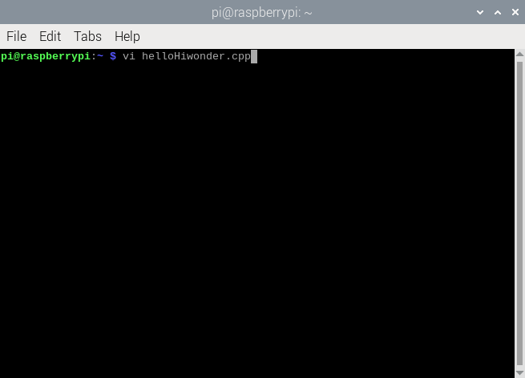
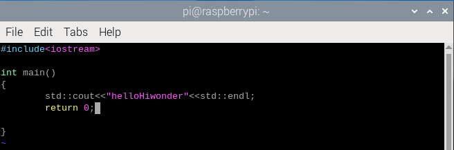
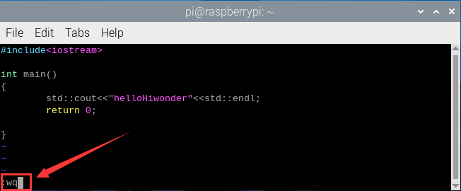
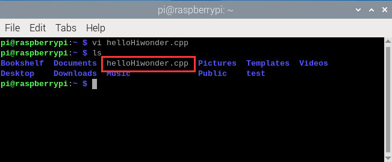
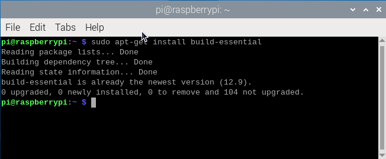
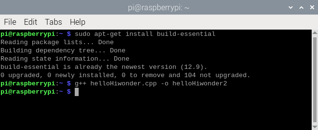
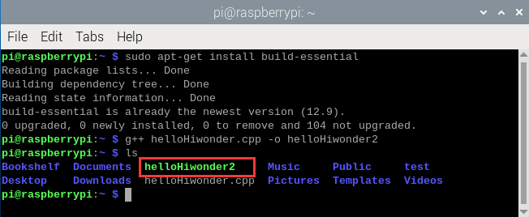
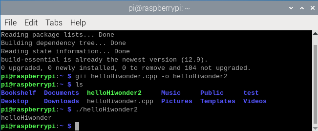

# C++编程

## 1. C++概述

### 1.1 C++ 简介

C++ 是一种静态类型的、编译式的、通用的、大小写敏感的、不规则的编程语言，支持过程化编程、面向对象编程和泛型编程。

C++ 被认为是一种中级语言，它综合了高级语言和低级语言的特点。

C++ 是由 Bjarne Stroustrup 于 1979 年在新泽西州美利山贝尔实验室开始设计开发的。C++ 进一步扩充和完善了 C 语言，最初命名为带类的C，后来在 1983 年更名为 C++。

C++ 是 C 的一个超集，事实上，任何合法的 C 程序都是合法的 C++ 程序。

:::{Note}
使用静态类型的编程语言是在编译时执行类型检查，而不是在运行时执行类型检查。
:::

### 1.2 面向对象程序设计

C++ 完全支持面向对象的程序设计，包括面向对象开发的四大特性：

**封装（Encapsulation）：** 封装是将数据和方法组合在一起，对外部隐藏实现细节，只公开对外提供的接口。这样可以提高安全性、可靠性和灵活性。

**继承（Inheritance）：** 继承是从已有类中派生出新类，新类具有已有类的属性和方法，并且可以扩展或修改这些属性和方法。这样可以提高代码的复用性和可扩展性。

**多态（Polymorphism）：** 多态是指同一种操作作用于不同的对象，可以有不同的解释和实现。它可以通过接口或继承实现，可以提高代码的灵活性和可读性。

**抽象（Abstraction）：** 抽象是从具体的实例中提取共同的特征，形成抽象类或接口，以便于代码的复用和扩展。抽象类和接口可以让程序员专注于高层次的设计和业务逻辑，而不必关注底层的实现细节。

### 1.3 标准库

标准的 C++ 由三个重要部分组成：

核心语言，提供了所有构件块，包括变量、数据类型和常量，等等。

C++ 标准库，提供了大量的函数，用于操作文件、字符串等。

标准模板库（STL），提供了大量的方法，用于操作数据结构等。

### 1.4 C++ 的使用

C++ 语言在许多行业和领域都有广泛应用，包括：

**游戏开发：** C++ 是游戏开发领域中最常用的编程语言之一，因为它具有高效的性能和直接控制硬件的能力。许多主要的游戏引擎，如 Unreal Engine 和 Unity，都使用 C++ 编写。

**嵌入式系统开发：** C++ 可以在嵌入式系统中发挥重要作用，如智能手机、汽车、机器人和家电等领域。由于嵌入式系统通常具有严格的资源限制和实时要求，因此 C++ 的高效性能和内存控制功能非常有用。

**金融领域：** C++ 在金融领域中被广泛应用，如高频交易、算法交易和风险管理等领域。由于这些应用程序需要高效的性能和对硬件的直接控制，C++ 语言是一个合适的选择。

**图形图像处理：** C++ 可以用于开发图形和图像处理应用程序，如计算机视觉、计算机图形学和人工智能领域。由于这些应用程序需要高效的计算能力和对硬件的控制，因此 C++ 是一个很好的选择。

**科学计算和数值分析：** C++ 可以用于开发科学计算和数值分析应用程序，如数值模拟和高性能计算等领域。由于这些应用程序需要高效的计算能力和对硬件的直接控制，C++ 语言是一个很好的选择。

## 2. 第一个程序“Hello World”

### 2.1 编写简单的C++程序

(1) 启动树莓派，打开VNC。

(2) 使用快捷键“Ctrl+Alt+T”或者点击左上角终端图标，进入终端界面。

(3) 在界面中新建一个C++文件（文件名后面加上“.cpp”），这里以新建一个“helloHiwonder.cpp”的文件为例，进行演示。输入“vi helloHiwonder.cpp”，然后按下“ENTER”键。

(4) 在打开的vim编辑器中按下键盘上的“i”键，进入“输入模式”，然后输入下图所示C++代码。“std::cout\<\<”helloHiwonder”\<\<std::endl;”这行代码的作用是输出字符串“helloHiwonder”然后换行。

(5) 输入完毕后，按下键盘上的“Esc”键，退出“输入模式”，紧接着输入命令“:wq”，然后按下“ENTER”键。

(6) 输入“ls”，查看是否已经成功建立“hellopHiwonder.cpp”文件。

### 2.2 运行C++程序

Python是解释型语言，所以前面我们可以直接调用解释器（Python3）运行Python程序。C++程序需要使用编译器将源代码转换为可执行程序。所以我们需要先安装编译系统，转换源码，才能运行程序，接下来将分步讲解如何安装编译器。

(1) 在终端输入“sudo apt-get install build-essential”，按下键盘上的“Enter”键（回车）将会自动安装编译系统（我们的镜像系统默认已经安装）。

(2) 确认已经有编译系统后，就可以把源程序转为可执行文件了。这里以转换前面写的helloHiwonder.cpp文件为例，进行演示。首先输入“**g++ helloHiwonder.cpp -o helloHiwonder2**”，按下“**ENTER**”键后稍等片刻完成编译，得到名称为“**helloHiwonder2**”的可执行文件。

(3) 输入“**ls**”，回车后可以看到生成的“**helloHiwonder2**”文件。

(4) 输入“**./helloHiwonder2**”，按下“**ENTER**”键，即可执行该文件。

如想深入学习C++语言，可参考“[http://www.cplusplus.com/](http://www.cplusplus.com/)”进行学习。

