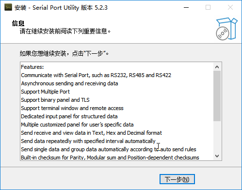
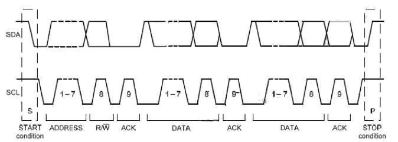

# 硬件控制教程

## 1. 硬件控制环境搭建

### 1.1 GPIO简**介**

树莓派的GPIO（通用输入输出）口是一组用于连接和控制外部电子元件的引脚。树莓派上的GPIO具有多种功能，可以作为数字输入、数字输出或模拟输入输出来使用。

### 1.2 GPIO接口说明

树莓派5上设有40PIN的接口。树莓派5的GPIO电压为3.3V，因此在不使用电压电平转换的情况下，不应将高于3.3V的电压电平连接树莓派5的GPIO引脚。GPIO接口功能如下图：


### 1.3 GPIOD库安装

树莓派的GPIOD库是一个用于控制GPIO（通用输入输出）的用户空间库。它是一个基于Linux内核的GPIO字符设备接口GPIOLIB的抽象层，提供了更简单和灵活的API，使开发者能够方便地使用C语言和其他编程语言进行GPIO的配置和控制。下面来演示如何安装GPIOD库。

(1) 按下“**Ctrl+Alt+T**”，打开命令行终端，输入“**pinout**”按下回车查看引脚编号。


(2) 输入“**sudo apt-get update -y && sudo apt-get upgrade -y**”指令，更新操作系统和软件包。

```bash
sudo apt-get update -y && sudo apt-get upgrade -y
```

(3) 输入“**sudo apt-get autoremove -y && sudo apt-get autoclean -y && sudo apt-get clean -y**”指令，清理系统中不需要的软件包和缓存文件。

```bash
sudo apt-get autoremove -y && sudo apt-get autoclean -y && sudo apt-get clean -y
```

(4) 输入“**sudo apt-get remove --purge --auto-remove firefox geany -y**”指令，清理系统中Firefox和Geany软件包。

```bash
sudo apt-get remove --purge --auto-remove firefox geany -y
```

(5) 输入“**sudo apt-get install -y vim git terminator htop curl python3-opencv gedit libjpeg-dev xclip wl-clipboard**”指令，安装多个软件包。

```bash
sudo apt-get install -y vim git terminator htop curl python3-opencv gedit libjpeg-dev xclip wl-clipboard
```

(6) 输入“**mkdir ~/.pip**”指令，在主目录下创建一个名为.pip的目录。

```bash
mkdir ~/.pip
```

(7) 再输入“**vim ~/.pip/pip.conf**”指令，打开pip.conf文件。

```bash
vim ~/.pip/pip.conf
```

(8) 按下“**i**”键进入可编辑模式，输入以下代码。


(9) 输入完成后，按下“**Esc**”键，输入“**:wq**”后按下回车，保存文件并退出。


(10) 输入“**pip3 install gpiod**”指令，安装gpiod库。

```bash
pip3 install gpiod
```

(11) 安装完后输入“**gpiodetect**”扫描系统上的GPIO端口，如果安装成功会显示相关的GPIO控制器和端口信息。

```bash
gpiodetect
```

## 2. GPIO引脚输入读取

### 2.1 GPIO引脚介绍

GPIO是通用输入或输出端口的简称，是电子设备主板上的一组引脚，这些引脚可以发送或接收电信号。将引脚与外部硬件设备连接，可实现与外部通讯、控制外部硬件或者采集外部硬件数据的功能。

### 2.2 输入介绍

输入是检测各个引脚上的电平状态，电平状态分为高电平和低电平，高电平就是有电压的状态，用数字符号“1”表示；低电平就是通常指接地端，用数字符号“0”表示。

### 2.3 树莓派5 GPIO引脚介绍

树莓派5开发板上有一个40Pin的接口，可以方便使用众多的扩展板卡。这些GPIO的控制如读、写、中断、PWM等都可以通过GPIOD库来进行。

引脚分布如图所示：


### 2.4 输入读取

(1) 把同目录下的“GPIO_IN.py”程序文件导入进主板系统的主目录下，如下图所示：


(2) 按下“**Ctrl+Alt+T**”，打开命令行终端，输入指令“**sudo python3 GPIO_IN.py**”，按下回车执行程序。

```bash
sudo python3 GPIO_IN.py
```

(3) 程序执行后会打印17号引脚的输入数据，有电压输入时打印1，无电压输入时打印0，按下“Ctrl+C”即可停止程序运行。


### 2.5 程序分析


(1)  导入所需的模块

(2)  初始化 GPIO 控制器和设置所需的 GPIO 端口。

(3)  使用 line.get_value() 方法读取 GPIO 17线路的状态。

(4)  结束时释放 GPIO 线路和关闭 GPIO 控制器

## 3. GPIO引脚输出设置

### 3.1 GPIO引脚介绍

GPIO是通用输入或输出端口的简称，是电子设备主板上的一组引脚，这些引脚可以发送或接收电信号。将引脚与外部硬件设备连接，可实现与外部通讯、控制外部硬件或者采集外部硬件数据的功能。

### 3.2 输出介绍

输出是当需要控制引脚电平的高低时需要用到的功能，高低电平可以用数字1和0表示。比如控制LED灯发光，需要在连接LED的引脚处，设置高电平状态，与另一端低电平形成电压差，产生电流，使LED灯放光。

### 3.3 树莓派5 GPIO引脚介绍

树莓派5开发板上有一个40Pin的接口，可以方便使用众多的扩展板卡。这些GPIO的控制如读、写、中断、PWM等都可以通过GPIOD库来进行。

引脚分布如图所示：


### 3.4 输出设置

(1) 把同目录下的“**GPIO_OUT.py**”程序文件导入进主板系统的主目录下，如下图所示：


(2) 按下“**Ctrl+Alt+T**”，打开命令行终端，输入指令“**sudo python3 GPIO_OUT.py**”，按下回车执行程序。

```bash
sudo python3 GPIO_OUT.py
```

(3) 程序执行后，使用万用表测量17号引脚会在高低电平之间不断切换，例如将引脚接上3.3V的电压后，会看都电压在3.3V和0V间变化。

### 3.5 程序分析

```bash
import gpiod
import time 

chip = gpiod.Chip('gpiochip0')
line = chip.get_line(17)
line.request(consumer='gpio_output', type=gpiod.LINE_REQ_DIR_OUT,default_vals=[0])

try:
    line.set_value(1)
    time.sleep(1)
    line.set_value(1)

finally:
    line.release()
    chip.close()
```

(1)  导入所需的模块


```bash
import gpiod
import time 
```

(2) 初始化 GPIO 控制器和设置所需的 GPIO 端口。使用 line.get_value() 方法设置 GPIO 17线路的输出状态。

```bash
chip = gpiod.Chip('gpiochip0')
line = chip.get_line(17)
line.request(consumer='gpio_output', type=gpiod.LINE_REQ_DIR_OUT,default_vals=[0])
```

(3) 使用 line.set_value() 方法设置 GPIO 线路的状态，先设置为高电平状态，延时一秒，恢复成低电平状态，并释放 GPIO 线路和关闭 GPIO 控制器

```bash
try:
    line.set_value(1)
    time.sleep(1)
    line.set_value(1)

finally:
    line.release()
    chip.close()
```

## 4. GPIO引脚上拉下拉设置

### 4.1 GPIO引脚介绍

GPIO是通用输入或输出端口的简称，是电子设备主板上的一组引脚，这些引脚可以发送或接收电信号。将引脚与外部硬件设备连接，可实现与外部通讯、控制外部硬件或者采集外部硬件数据的功能。

### 4.2 上拉电阻和下拉电阻介绍

每个GPIO内部都有三种状态，分别使上拉、下拉和不拉。如果是输出模式，一般是设置为不拉状态，而上拉电阻和下拉电阻主要设置于输入模式。

上拉电阻的目的是为了保证在无信号输入时，输入端的电平为高电平。而在信号输入为低电平时，输入端的电平应该也为低电平。

如果没有上拉电阻，在没有外界输入的情况下，输入端是悬空的，它的电平是未知的，而设置上拉电阻就是为了保证无信号输入时输入端的电平为高电平。

下拉电阻则是为了保证无信号输入时输入端的电平为低电平。

### 4.3 树莓派5 GPIO引脚介绍

树莓派5开发板上有一个40Pin的接口，可以方便使用众多的扩展板卡。这些GPIO的控制如读、写、中断、PWM等都可以通过GPIOD库来进行。

引脚分布如图所示：


### 4.4 输入读取

(1) 把同目录下的“**PULL_UP_DOWN.py**”程序文件导入进主板系统的主目录下，如下图所示：


(2) 按下“**Ctrl+Alt+T**”，打开命令行终端，输入指令“**sudo python3 PULL_UP_DOWN.py**”，按下回车执行程序。

```bash
sudo python3 PULL_UP_DOWN.py
```

(3) 程序执行后，17号引脚会设置成上拉电阻输入的模式，用万用表测量17号引脚电压值为3.33V，即高电平。

### 4.5 程序分析

```bash
import gpiod
import time 

chip = gpiod.Chip('gpiochip0')
line = chip.get_line(17)

try:
    line.release()
    line.request(consumer = 'gpio_pull', type = gpiod.LINE_REQ_DIR_IN, default_vals=[0])
    line.set_flags(gpiod.LINE_REQ_FLAG_BIAS_PULL_UP)

    line.set_value(1)
finally:
    line.release()
    chip.close()
```

(1)  导入所需的模块


```bash
import gpiod
import time 
```

(2) 初始化 GPIO 控制器和设置所需的 GPIO 端口。

```bash
chip = gpiod.Chip('gpiochip0')
line = chip.get_line(17)
```

(3) 设置引脚17为输出模式，使用set_flags()设置引脚为上拉模式。

```bash
try:
    line.release()
    line.request(consumer = 'gpio_pull', type = gpiod.LINE_REQ_DIR_IN, default_vals=[0])
    line.set_flags(gpiod.LINE_REQ_FLAG_BIAS_PULL_UP)

    line.set_value(1)
finally:
    line.release()
    chip.close()
```

“**gpiod.LINE_REQUEST_FLAG_BIAS_PULL_UP**”为上拉模式，“**gpiod.LINE_REQUEST_FLAG_BIAS_PULL_DOWN**”为下拉模式。

## 5. UART通信配置及编程

### 5.1 UART通信介绍

通信协议在组织设备之间的通信方面起着重要作用。它根据系统要求以不同的方式设计，并且这些协议具有在设备之间达成一致的特定规则以实现成功的通信。

嵌入式系统、微控制器和计算机大多使用 UART 作为设备到设备硬件通信协议的一种形式。在可用的通信协议中，UART仅使用两条线作为其发送端和接收端。

尽管是一种广泛使用的硬件通信协议方法，但它并没有一直得到充分优化。在微控制器内部使用 UART 模块时，通常会忽略帧协议的正确实现。

根据定义，UART是一种硬件通信协议，它使用可配置速度的异步串行通信。异步意味着没有时钟信号来同步从发送设备到接收端的输出位。

每个 UART 设备的两个信号命名为：

- 发射机 (Tx)

- 接收器 (Rx)

每个设备的发送器和接收器线的主要目的是发送和接收用于串行通信的串行数据。


发送 UART 连接到以并行形式发送数据的控制数据总线。由此，数据现在将在传输线（线）上逐位串行传输到接收UART。反过来，这会将串行数据转换为接收设备的并行数据。

UART线用作通信介质，将一个数据发送和接收到另一个数据。请注意，UART 设备具有专用于发送或接收的发送和接收引脚。

对于 UART 和大多数串行通信，需要在发送和接收设备上设置相同的波特率。波特率是信息传输到通信信道的速率。在串行端口上下文中，设置的波特率将作为每秒传输的最大位数。

在 UART 中，传输方式是数据包的形式。连接发送器和接收器的部分包括创建串行数据包并控制这些物理硬件线路。数据包由起始位、数据帧、奇偶校验位和停止位组成。


- 起始位

UART 数据传输线在不传输数据时通常保持在高电压电平。为了开始数据传输，发送 UART 将传输线从高拉低一 (1) 个时钟周期。当接收 UART 检测到从高到低的电压转换时，它开始以波特率的频率读取数据帧中的位。


- 数据框

数据帧包含正在传输的实际数据。如果使用奇偶校验位，它可以是五 (5) 位，最多八 (8) 位。如果不使用奇偶校验位，则数据帧可以是九 (9) 位长。在大多数情况下，首先发送的数据是最低有效位。


- 平价

奇偶性描述了一个数字的偶数或奇数。奇偶校验位是接收UART 判断数据在传输过程中是否发生变化的一种方式。位可以通过电磁辐射、不匹配的波特率或长距离数据传输来改变。

接收端 UART 读取数据帧后，计算值为 1 的位数，并检查总数是偶数还是奇数。如果奇偶校验位为 0（偶校验），则数据帧中的 1 或逻辑高位应总计为偶数。如果奇偶校验位为 1（奇校验），则数据帧中的 1 位或逻辑高电平应总计为奇数。

当奇偶校验位与数据匹配时，UART 知道传输没有错误。但如果奇偶校验位为 0，总数为奇数，或者奇偶校验位为 1，总数为偶数，则 UART 知道数据帧中的位发生了变化。


- 停止位

为了发出数据包结束的信号，发送 UART 将数据传输线从低电压驱动到高电压，持续一 (1) 到两 (2) 位持续时间。


### 5.2 电脑端准备工作

- #### 5.2.1 安装串口调试助手

本节以友善串口助手为例，进行说明。

双击打开本目录下的“**serial5.2.3.exe**”安装程序。然后按照下方图示步骤，依次进行。


这里建议选择需要安装的其它路径。





- #### 5.2.2 硬件接线

根据树莓派引脚图，会用到以下引脚：


使用USB转TTL模块将树莓派主板与PC通过母对母的杜邦线连接，连线如下所示：

树莓派主板引脚8（TXD）\<--\>USB转TTL模块RXD

树莓派主板引脚10（RXD）\<--\>USB转TTL模块TXD

树莓派主板引脚6（GND）\<--\>USB转TTL模块GND

### 5.3 树莓派主板端准备工作

- #### 5.3.1 安装库文件

(1)  启动树莓派主板，然后按下“**Ctrl+Alt+T**”，打开命令行终端，输入“**sudo apt-get install python3-serial**”指令，安装串口函数库。

```bash
sudo apt-get install python3-serial
```

(2) 然后输入“**sudo chmod 777 /dev/ttyAMA0**”指令，打开串口权限。

```bash
sudo chmod 777 /dev/ttyAMA0
```

- #### 5.3.2 树莓派打开UART接口

(1) 我们需要设置树莓派开机后打开UART接口，打开Serial Port。选择左上角树莓派的**logo→Preferences→Raspberry PiConfiguration**。


(2) 选择“**Interfaces**”选项，开启“**Serial Port**”和关闭“**Serial Console**”，然后点击“**OK**”


(3) 选择“Yes”后，树莓派重启完毕后将主串口指向硬件串口（若重启失败，先将USB转接器拔下来，重启完毕后再插上）。


(4) 按下“**Ctrl+Alt+T**”，打开命令行终端，输入“**sudo nano /boot/config.txt**”,打开配置文件。


(5) 在弹出的页面中利用滚轮滑到文本末尾，输入以下代码。

```bash
dtoverlay=pi3-miniuart-bt

Force_turbo=1
```


(6)  按“**Ctrl+S**”进行保存，再按下“**Ctrl+X**”返回。然后输入“**sudo reboot**”，重启树莓派。


```bash
sudo reboot
```

(7) 输入“**ls /dev -al**”查看串口指向。

```bash
ls /dev -al
```

(8) 鼠标滚轮往下翻，找到下图所示内容即为修改成功。


### 5.4 示例程序-发送及接收

本节示例以电脑上的串口调试助手显示接收到树莓派主板发送过来的说明字符串。

电脑端通过串口调试助手发送字符也可以在树莓派主板终端上显示。

- #### 5.4.1 开启串口调试助手

将USB转TTL工具插入电脑任意一个USB接口后，打开电脑的设备管理器，查看端口是否被识别，如下图：


如果未出现带有CH340标识的端口，可检查电脑是否安装了CH340驱动（驱动包在本节目录下可找到），若安装了驱动却无法识别，可更换USB接口进行排查。

双击安装好的“**Serial Port Utility**”。


打开后，选择带有CH340标识的端口，波特率、数据位等属性按照下图设置后，点击红框按钮即可。


- #### 5.4.2 导入示例程序

(1) 点击系统桌面上方的悬浮框，选择文件传输的图标。


(2) 在弹出的页面中点击“**Send filse**”，在弹出的页面中选择本文档同路径下的“**UART.py**”，并点击“**打开**”将它们导入至树莓派系统桌面。


(3) 输入指令“**chmod a+x /home/pi/Desktop/UART.py**”，为程序增加执行权限。

```bash
chmod a+x /home/pi/Desktop/UART.py
```

这里“pi”为本机创建的，用户根据实际情况对上方指令进行改写。

- #### 5.4.3 执行程序

(1)  启动树莓派，将其连接至远程控制软件VNC。

(2)  按下“**Ctrl+Alt+t**”打开命令行终端，输入“**cd Desktop/**”指令，切换到桌面。

```bash
cd Desktop/
```

(3)  输入“**python3 UART.py**”指令，运行程序。

```bash
python3 UART.py
```

- #### 5.4.4 查看效果

**串口调试端**

在串口调试助手上面可以收到树莓派主板发来的消息，波特率要修改成“**115200**”，如下：


我们可以在下方输入，例如“**nihao**”，然后点击发送。


**树莓派主板端**

在树莓派主板端的命令行界面内，可以收到来自电脑端发来的消息。


## 6. IIC通讯教程

### 6.1 IIC通信介绍

IIC，也被称为I2C，（Inter-Integrated Circuit）是IICBus简称，所以中文应该叫集成电路总线，它是一种串行通信总线。

它是由数据线SDA和时钟SCL构成的串行总线，可发送和接收数据。在CPU(单片机)与IIC模块之间、IIC模块与IIC模块之间进行双向传送。

IIC的特点：IIC是半双工，而不是全双工。

IIC是真正的多主机总线，（对比SPI在每次通信前都需要把主机定死，而IIC可以在通讯过程中，改变主机），如果两个或更多的主机同时请求总线，可以通过冲突检测和仲裁防止总线数据被破坏。

起始和终止信号都是由主机发出的，连接到I2C总线上的器件，若具有I2C总线的硬件接口，则很容易检测到起始和终止信号。

在起始信号后必须发送一个7位从机地址+1位方向位，用“0”表示主机发送数据，“1”表示主机接收数据。

每当主机向从机发送完一个字节的数据，主机总是需要等待从机给出一个应答信号，以确认从机是否成功接收到了数据。

起始信号是必需的，结束信号和应答信号，都可以不要。

(1) IIC物理连接

使用IIC通信的IIC器件有很多，比如陀螺仪加速度计MPU6050，EEPROM存储芯片AT24C02等，通过IIC总线，可以与单片机之间进行数据传输。

IIC通信线只有只有两根，数据线SDA的高低电平传输2进制的数据，时钟线SCL通过方波信号提供时钟节拍。

多个IIC器件可以并联在IIC总线上，每个器件有特定的地址，分时共享IIC总线。实际使用IIC当然还要连接电源以及共地。


(2) IIC时序


(3) IIC起始结束信号


起始：时钟线SCL为高时，数据线SDA由高到低

停止：时钟线SCL为高时，数据线SDA由低到高

注：SDA和SCL同时为高时，为IIC总线的空闲状态

(4) IIC应答


下面的波形：SCL，主机产生的时钟脉冲。

上面的波形：SDA，主机发送的8位数据。

中间的波形：SDA，从机在第9个时钟信号进行拉低回应，表示收到了主机发来的数据，拉高则表示不应答。

注：实际上，上面和中间是同样的SDA线，这里只是分开示意。因为IIC应答是一种相互关系，单片机发数据给IIC器件，IIC器件要进行应答，表示收到了数据，同样，单片机接收IIC器件的数据后，也要给IIC器件一个应答。

既然发送完都需要对方回应，那什么时候使用不应答呢？就是在读取到本次数据后，如果不需要继续读取，则发送非应答，对方以为没收到这次数据，则就不会继续发送了。

(5) IIC完整传输时序



开始标志（S）发出后，主设备会传送一个7位的Slave 地址，并且后面跟着一个第8位，称为Read/Write 位。

R/W 位表示主设备是在接受从设备的数据还是在向其写数据。

然后，主设备释放SDA 线，等待从设备的应答信号（ACK）。每个字节的传输都要跟随有一个应答位。

应答产生时，从设备将SDA 线拉低并且在SCL 为高电平时保持低。

数据传输以停止标志（P）结束，然后释放总线。但主设备也可以产生重复的开始信号去操作另一台从设备，而不发出结束标志。

所有的SDA信号变化都要在SCL 时钟为低电平时进行，除了开始和结束标志。

<p id="anchor_6_2"></p>

### 6.2 硬件接线

根据树莓派主板引脚图，会用到以下引脚：


我们这里以一个IIC接口的加速度计传感器为例，其它有IIC接口的模块用户可一样参考此连接方法。模块与树莓派主板引脚通过母对母杜邦线进行连接，示意如下：

注意：树莓派主板使用5V 3A供电，因此无需对接VCC。

树莓派主板引脚3（SDA）\<--\> 加速度计（SDA）

树莓派主板引脚5（SCL）\<--\> 加速度计（SCL）

树莓派主板引脚6（GND）\<--\> 加速度计（GND）


### 6.3 安装IIC库文件

启动树莓派主板，然后按下“**Ctrl+Alt+T**”，打开命令行终端，依次输入下方指令来安装IIC库。

sudo apt-get update

sudo apt-get install -y i2c-tools


### 6.4 配置IIC接口

(1)  我们需要设置树莓派开机后打开IIC接口，打开IIC。选择左上角树莓派的**logo→Preferences→Raspberry PiConfiguration**。


(2)  选择“**Interfaces**”选项，开启“**Serial Port**”和关闭“**Serial Console**”，然后点击“**OK**”


(3)  选择“Yes”后，将IIC开启。


### 6.5 I2C-Tools使用

- #### 6.5.1 i2cdetect

按下“**Ctrl+Alt+T**”，打开命令行终端，输入“**sudo i2cdetect -l**”指令，可列出所有安装的总线。

```bash
sudo i2cdetect -l
```


输入“**sudo i2cdetect -y l**”指令，可扫描挂载在总线上的设备，例如1号总线。

```bash
sudo i2cdetect -y l
```

有设备就会列出设备地址，如1号总线上接有1个0x68设备（[6.2 硬件接线](#anchor_6_2)）


- #### 6.5.2 i2cdump

i2cdump用于查看设备寄存器的值。例如我们使用的加速度计MPU6050，它的寄存器可参考下图：


在命令行终端，输入“**i2cdump -y 1 0x68**”指令，可查看1号总线设备0x68全部寄存器的值。

```bash
i2cdump -y 1 0x68
```


- #### 6.5.3 i2cget

i2ccget用于查看设备单个寄存器值，可用于单字节寄存器。在命令行终端，输入“**i2cget -y 1 0x68 0x6b**”指令，可读取地址为0x68设备里0x6b寄存器的值。


- #### 6.5.4 i2ctransfer

i2ctransfer用于读写设备寄存器值，可用于双字节寄存器。一般寄存器都是8位地址的，i2cdump、i2cget、i2cset 也是设置读取8位的地址，如果一次超过8位，需要用 i2ctransfer。在命令行终端，输入“**i2ctransfer -f -y 1 w2@0x68 0x01 0x6b r16**”指令，即可向1号总线上设备地址0x68，寄存器地址0x016b开始，16个字节的数据。

```bash
i2ctransfer -f -y 1 w2@0x68 0x01 0x6b r16
```


