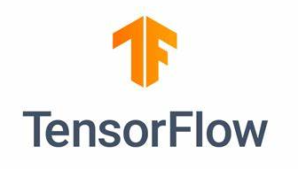
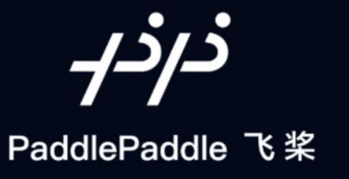
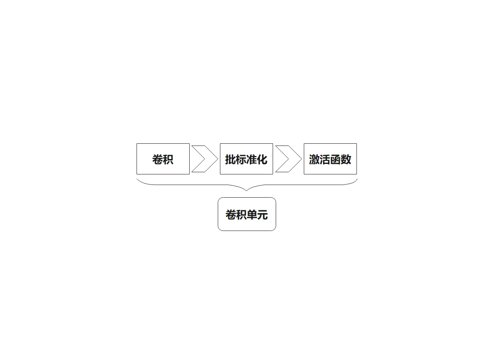
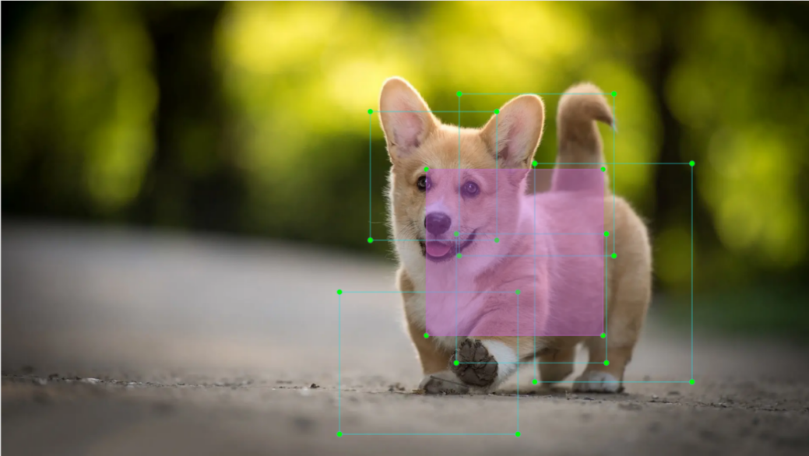

# 机器学习基础课程

## 1. 机器学习介绍

### 1.1 前言

人工智能（Artificial Intelligence）也被简称为AI，它是研究、开发用于模拟、延伸和扩展人类智能的理论、方法、技术及应用系统的一门新的技术科学。

人工智能包括了机器学习、计算机视觉、自然语言处理、深度学习。其中，机器学习是人工智能的一个子方向，而深度学习是机器学习的一类。

人工智能从诞生以来，理论和技术日益成熟，应用领域也不断扩大，已逐步成为一个独立的分支。

### 1.2 什么是机器学习

机器学习（Machine Learning）是人工智能的核心，是使得机器具备智能的根本途径。它是一门多领域交叉学科，涉及概率论、统计学、逼近论、凸分析、算法复杂度理论等多门学科。

机器学习的大体内容是研究计算机怎么通过模拟或实现人类的学习行为来获取新的知识或技能，重新组织已有的知识结构以不断改善自身的性能。从实践角度来看，就是利用数据训练模型，并使用模型进行预测。

以阿尔法围棋（AlphaGo）为例，它是第一个击败人类 职业围棋选手、第一个战胜围棋世界冠军的人工智能机器人。AlphaGo的主要工作原理就是深度学习（Deep Learning），即学习样本数据的内在规律和表示层次以获取信息。

### 1.3 机器学习分类

机器学习分为监督学习和非监督学习，两者的区别在于是否已知数据集的分类或规律。

- #### 1.3.1 监督学习

监督学习，即提供一个数据集给算法，并给定正确答案，机器利用数据集来学习正确答案的计算方法。监督学习是最常见的一种机器学习。

标记数据：监督学习使用的训练数据通常包含输入特征和相应的标签或输出。输入特征是描述数据的属性或特征，标签则是我们希望模型预测或分类的目标变量。以图片识别为例，提供大量狗的图片，并为图片添加标签（狗），这个标签就是“正确答案”，机器通过大量学习，即可学会在新图片中识别出狗。

**模型选择：** 在监督学习中，我们需要选择一个合适的模型来表示数据之间的关系。常见的监督学习模型包括线性回归、逻辑回归、决策树、支持向量机（SVM）和深度神经网络等。选择合适的模型取决于数据的特征和问题的性质。

**特征工程：** 特征工程是指对原始数据进行预处理和转换，以提取有用的特征。这包括数据清洗、缺失值处理、数据归一化或标准化、特征选择和特征变换等。良好的特征工程可以提高模型的性能和泛化能力。

**训练和优化：** 使用标记的训练数据，我们可以通过训练模型来拟合数据之间的关系。训练过程通常包括定义损失函数，选择合适的优化算法，并迭代调整模型参数，使损失函数最小化。常见的优化算法包括梯度下降和随机梯度下降等。

**模型评估：** 在训练完成后，我们需要对模型进行评估，以了解其在新数据上的性能如何。常见的评估指标包括准确率、精确率、召回率、F1分数和ROC曲线等。通过评估模型的性能，我们可以判断其是否适用于实际应用。

总结起来，监督学习涉及使用标记的训练数据来训练模型，并使用该模型来预测或分类新的未标记数据。关键步骤包括选择合适的模型，进行特征工程，训练和优化模型，并评估模型的性能。这些内容共同构成了监督学习的基本内容。

- #### 13.2 非监督学习

非监督学习，即提供一个数据集给算法，但不给定正确答案，所有数据都是一样的，机器从数据集中挖掘潜在的结构关系。

以图片分类为例，提供大量猫、狗的图片，但不为图片添加标签。通过学习，机器会将图片分为两类，分别是猫的图片和狗的图片。

## 2. 机器学习库介绍

机器学习框架数量繁多，常见的框架有PyTorch、Tensorflow、paddlepaddle和MXNet等。

### 2.1 PyTorch

Torch是一款基于BSD License的开源机器学习框架，支持大强度的多维数组操作，被广泛应用于机器学习领域。而PyTorch则是一个基于Torch的机器学习框架。但相较于Torch，PyTorch更加灵活，支持动态图，且提供Python接口。

与TensorFlow的静态计算图不同，PyTorch的计算图是动态的，它可以根据计算需要对计算图进行实时的改变，并且允许开发人员通过加速GPU执行张量计算，创建动态计算图和自动计算梯度。

### 2.2 Tensorflow

TensorFlow 是一个开源的机器学习的框架，我们可以使用 TensorFlow 来快速地构建神经网络，同时快捷地进行网络的训练、评估与保存。以最简单的方式实现机器学习和深度学习概念。它结合了优化技术的计算代数，便于计算许多数学表达式。

TensorFlow能够运行在不同类型和尺寸的机器之上。这使得TensorFlow无论是在超级计算机上，还是在嵌入式系统，或任何其他介于两者之间的计算机上都有用武之地。TensorFlow可利用CPU、GPU，或同时使用这两者。相比于其他的机器学习框架，Tensorflow 框架是最适用于工业部署的一个机器学习框架，换句话说，TensorFlow 非常适用于在生产环境中进行应用。

### 2.3 PaddlePaddle

PaddlePaddle是百度公司提出的深度学习框架。以百度多年的深度学习技术研究和业务应用为基础，集深度学习核心训练和推理框架、基础模型库、端到端开发套件、丰富的工具组件于一体，是中国首个自主研发、功能丰富、开源开放的产业级深度学习平台。

近年来深度学习在很多机器学习领域都有着非常出色的表现，在图像识别、语音识别、自然语言处理、机器人、网络广告投放、医学自动诊断和金融等领域有着广泛应用。

### 2.4 MXNet

MXNet是一个十分优秀的深度学习框架。目前包含了许多语言接口，如Python、C++、Scala、R等。它拥有类似于 Theano 和 TensorFlow 的数据流图，为多GPU 配置提供了良好的配置，有着类似于 Lasagne 和 Blocks 更高级别的模型构建块，并且可以在你可以想象的任何硬件上运行（包括手机）。

MXNet 是一个旨在提高效率和灵活性的深度学习框架。像MXNet这样的加速库提供了强大的工具来帮助开发人员利用GPU和云计算的全部功能。MXNet可以通过分布式参数服务器分布到动态的云架构上，并且可以通过多个GPU / CPU实现几乎线性的规模。

## 3. Yolov5模型

### 3.1 YOLO系列模型简介

- #### 3.1.1 YOLO系列

YOLO（You Only Look Once）系列是单阶段（One-stage）且基于深度学习的回归方法。

在YOLOv1出现之前，R-CNN系列算法在目标检测领域独占鳌头，R-CNN系列算法的检测精度高，但其双阶段（Two-stage）的网络结构使其检测速度不能满足实时性。

针对这一问题，YOLO诞生了，其核心思想是将目标检测重新定义为一个回归问题，利用整张图作为网络的输入，直接在输出层回归Bounding Box的位置与所属类别。相较于传统的目标检测方法，YOLO具备检测速度快、平均精度高等优点。

- #### 3.1.2 YOLOv5

YOLOv5在之前版本的YOLO模型基础上进行了优化，检测速度与精度都得到了极大的提升。

一个目标检测算法通常可划分为四个模块，分别是输入端、基准网络、Neck网络和Head输出端。根据模块划分来分析YOLOv5的改进思路，各模块的改进项如下：

(1) 输入端：在模型训练阶段，YOLOv5利用Mosaic数据增强来提升模型的训练速度和网络精度，并提出了自适应锚框计算和自适应图片缩放方法。

(2) 基准网络：YOLOv5引入了Focus结构与CSP结构。

(3) Neck网络：与YOLOv4相同，YOLOv5在这一部分采用了FPN+PAN结构，但两者的实现细节存在差异。

(4) Head输出层：YOLOv5输出层的锚框机制与YOLOv4相同，主要改进的是采用了损失函数GIOU_Loss，以及预测框筛选的DIOU_nms。

### 3.2 YOLOv5模型结构

- #### 3.2.1 组成元素

(1) **卷积层：** 提取图像特征

卷积就是一个事物曾经多个时间点，做或被做某件相同的事情，对事物现在状态的影响。卷积可以分解成两个部分，分别为“卷”和“积”。

“卷”可以理解成将数据进行翻转，“积”可以理解成曾经数据对于目前数据影响量积累。将数据进行翻转是为了构建数据之间的关系，方便对数据影响量积累的计算有对应的参照。

在YOLOv5中，需要处理的数据是图片，图片在计算机视觉中是二维的，相对的卷积也属于二维卷积。二维卷积的目的就是为了提取图像中特征，在进行二维卷积时，我们首先要了解卷积核。

卷积核就是每次进行卷积计算的一个单位区域，卷积核的单位区域以像素作为单位，在计算时会对每个区域内的像素进行积分。一般卷积都是通过滑动卷积核进行，卷积核的大小需要人为设置。

在进行卷积计算时，图像外围不变或扩大任意像素（根据所需效果进行设置），再将卷积的结果重新填入图像中对应的位置。以一幅分辨率为6×6的图像为例，先将其扩大为7×7的图像，再将图像代入卷积核进行计算。最后，将数据重新填入一副分辨率为6×6的空白图像中即可。

(2) **池化层：** 放大图像特征

池化层也称作下采样层，一般配合卷积层使用。卷积计算完成后，用池化层来对特征进行进一步的采样操作。池化也分为多种池化，如全局池化、平均池化、最大池化等。不一样的池化对应的效果也不一样。

为了方便大家理解，我们这里以最大池化为例进行讲解。了解最大池化前，我们需要了解过滤器，它与卷积核一样，需要我们手动设置区域，计算时会滑动过滤器，并且以像素为单位对区域内的像素进行筛选。

最大池化可以理解为保留最显著的特征，除去其余特征。以一幅分辨率为6×6的图像为例，在开始池化时，用2×2的过滤器对原图像进行计算，即可得到新的图像。

(3) **上采样层：** 恢复图像尺寸

我们可以将它理解成“反池化”，图像经过池化后会变小，若对图像进行上采样，图像会恢复为原尺寸。但恢复的只是尺寸，池化后的特征也根据其变化。

以一幅分辨率为6×6的图像为例，在开始上采样时，用3×3的过滤器对原图像进行计算，即可得到新的图像。

(4) **批标准化层：** 整理数据

对数据进行批标准化操作就是指将数据重新排列整齐，其实际作用是减少模型的计算难度，令数据更好地映射到激活函数内。

批标准化处理能够降低每次计算后特征的遗失率，使更多特征保留至下一次计算。在经过多次的计算后，模型对数据的敏感度会因此而有所提升。

(5) **RELU层：**激活函数

在模型构建过程中加入激活函数是为了增加模型的非线性。如果没有激活函数，每层就相当于矩阵相乘。每一层输出都是上层的输入的线性函数，无论神经网络有多少层，输出都是输入的线性组合，这样会导致构建好的模型无法根据实际情况来改变。

激活函数有很多种，常见的有RELU、TANH、SIGMOID等，此处以RELU为例进行讲解。ReLU（Rectified Linear Unit，修正线性单元）函数是一个分段函数，它的作用是将所有小于“0”的值都替换成“0”，其余正值保持不变。

(6) **ADD层：**张量相加

特征分为显著特征和不显著特征，而ADD层的作用是将特征的张量相加，从而达到增强显著特征的效果。

(7) **Concat层：**张量拼接

Concat层的作用是将特征的张量拼接，从而将采用了不同方式进行提取的特征拼接起来，保存更多特征。

**复合型元素**

构建模型时，如果只用上述层去构建函数，容易致使代码冗长、结构混乱、分层不明确。若将基本元素组成各种单元来调用，可以有效提高编写模型的效率。

(1)  **卷积单元**

卷积单元由一个卷积层、一个批标准化层和一个激活函数组成。先进行卷积，再进行批标准化，最后使用激活函数进行激活。

(2)  **隔列采样拼接单元（Focus）**

先将输入图片划分为多个大区域，再将各个大区域内处于同一位置的小图片拼接起来，即可将输入图片拆解为若干张图片。最后，通过卷积单元对图片进行初采样即可。

如下图所示，以一幅分辨率为6×6的图像为例，设定一个大区域是2×2，则该图像可以拆解为9个大区域，每个大区域内有4个小图片。

将各个大区域内处于1号位置的小图片拼接起来，即可得到一张3×3的图像。其他位置的小图片用同样的方式进行拼接，最终6×6的原图像会被拆解为四张3×3的图像.

(3)  **残差单元**

残差单元的作用在于让模型去学习图像上微小的变化。它的结构相对简单，是通过两条路径得到的数据叠加实现的。

第一条路径上有两个卷积单元对图像进行采样，第二条路径上不再放入卷积单元进行采样，而是直接使用原图像。最后，将第一条路径的数据叠加到第二条路径上。

(4)  **复合卷积单元**

在YOLOv5中，复合卷积单元的特点主要是可以根据需求对卷积单元进行自定义。复合卷积单元也是通过两条路径得到的数据叠加实现的。

第一条路线只有一个卷积层进行采样，第二条路线有2x+1个卷积单元和一个卷积层进行采样。采样拼接后，通过批标准化进行整理数据，然后通过激活函数。最后，使用一个卷积单元进行采样。

(5)  **复合残差卷积单元**

复合残差卷积单元将复合卷积单元内的2x个卷积单元替换成x个残差单元。在YOLOv5中，复合残差单元的特点主要是可以根据需求对残差单元进行自定义。

(6)  **复合池化单元**

将卷积单元的输出数据分别输入三个最大池化层，并另外保留一份不进行处理。随后，将四条路线的数据进行拼接，并将结果输入一个卷积单元即可。用复合池化单元处理数据，可以将原数据的特征显著放大。

(7) **结构**

YOLOv5由三部分组成，分别输出三种尺寸的数据，每种尺寸处理的方式也不同，用户可以根据下图理解YOLOv5的输出结构：

## 4. YOLOv5运行流程

本节我们使用YOLOv5里面用到的先验框、预测框、锚定框进行模型流程运行的讲解。

### 4.1 先验框

在把图像输入到模型中时，我们需要提供图像的目标识别区域，而先验框就是用于提前在图像上标识目标识别区域的方框。

### 4.2 预测框

预测框不需要人为设置，它是模型的输出结果。第一批训练数据输入到模型中时，预测框会随之自动生成。同类物体出现频率较高的位置会被设置为预测框的中心点。

### 4.3 锚定框

预测框生成后，其大小和位置可能会出现偏差，而锚定框的作用就是校正预测框的大小和位置。

锚定框生成的位置是由预测框决定的。为了能够影响预测框下一次生成的位置，锚定框会生成在现有预测框的相对中心的位置。

### 4.4 实现流程

完成对数标定后，图像上会出现先验框。随后，待图像数据输入到模型中，模型会根据先验框的位置生成预测框。预测框生成后，锚定框会随之生成。最后，将这次训练的权重更新到模型中。

每次新生成的预测框都会受到上一次生成的锚定框的影响，不断重复上述操作，预测框的大小与位置偏差会逐渐消失，直到它与先验框重合。

