# 机器学习进阶课程

## 1. 图像采集和标注

由于训练Yolov5的模型需要大量的数据，因此我们需要先进行数据的收集和标注，为后边训练模型做准备。

在开始前，可准备需要采集的图像，这里以交通标识牌为例进行说明。

关于文件的传输方法，可参考目录“**第2章 树莓派5基础操作和配置\>第2课 远程访问和远程传输文件**”下的文档。

### 1.1 图像采集

(1)  启动树莓派，将其连接至远程控制软件VNC。

(2)  将USB摄像头连接树莓派5上。

(3)  将同目录下的“**data_gather.py**”传输到树莓派中，

(4)  按下“**Ctrl+Alt+T**”，打开命令行终端，输入指令“**python3 data_gather.py**”，开启数据采集。

```bash
python3 data_gather.py
```

出现回传画面即正常：

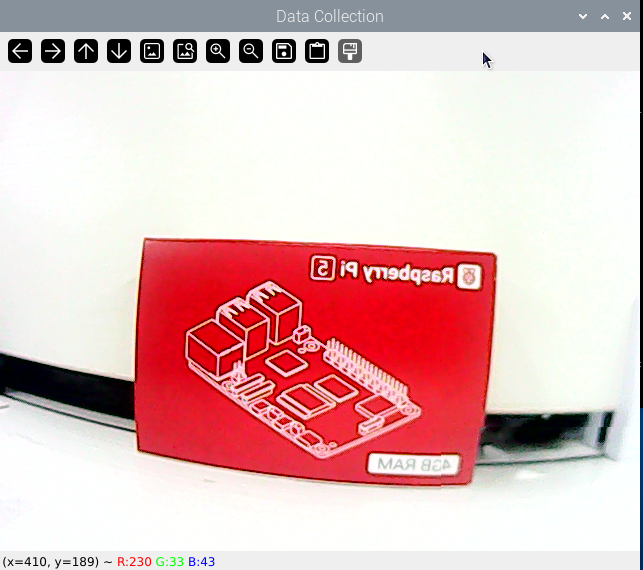

:::{Note}
①按下键盘按键“S”将回传画面的图片保存，长按将回传画面连续保存。
②按下键盘按键“Q”将退出程序。
③为提高模型可靠性，请从不同的距离、旋转角度和倾斜角度拍摄目标识别内容。
:::

在开始数据收集后会在“**/home/pi**”路径下生成“m**y_data**”文件夹，其内部包含Annotations、imageSets、JPEGImages三个文件夹，其中JPEGImages用于存储图片、Annotations用于存储标注文件、imageSets用于存储图片的路径。

### 1.2 图像标注

:::{Note}
输入指令时需要严格区分大小写，且可使用“Tab”键补齐关键词。
:::

(1)  将同目录下的“**labelImg.zip**”，传输到树莓派中。

(2)  双击系统桌面的图标，打开命令行终端。

(3)  输入指令“**unzip labelImg.zip -d ./**”，解压到主目录下。

```bash
unzip labelImg.zip -d ./
```

(4) 输入指令“**cd labelImg/**”，进入labelImg文件夹。

```bash
cd labelImg/
```

(5) 输入指令“**python3 labelImg.py** ”，打开标注软件。

```bash
python3 labelImg.py
```

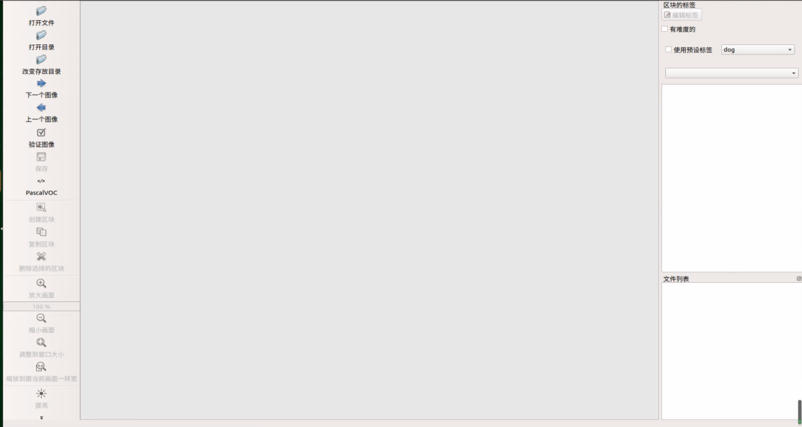

(6) 下表是部分按键的功能说明：

| **功能按键** | **快捷键** | **功能说明** |
|:--:|:--:|:--:|
|  | Ctrl+U | 选择图片存放目录 |
|  | Ctrl+R | 选择标定数据存放目录 |
|  | W | 创建标注框 |
|  | Ctrl+S | 保存标注 |
|  | A | 切换至上一张图片 |
| 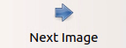 | D | 切换至下一张图片 |

(7)  使用快捷键“**Ctrl+U**”，并将图片存放目录选择为“**/home/pi/my_data/JPEGImages/**”，点击“**Choose**”按键。

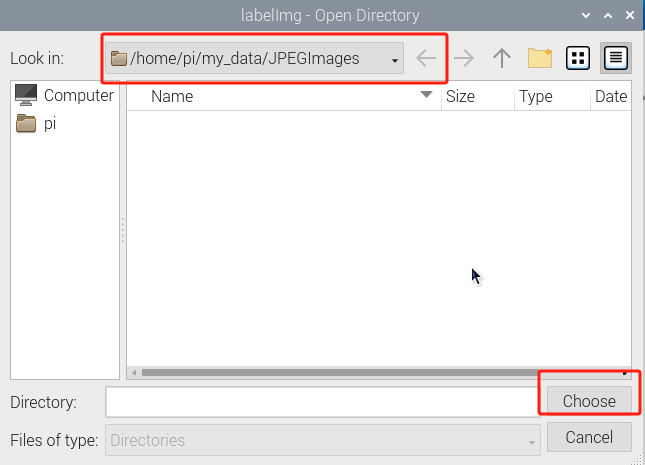

(8)  使用快捷键“**Ctrl+R**”，并将标定数据存放目录选择为“**/home/pi/my_data/Annotations/**”，点击“**Choose**”按键。

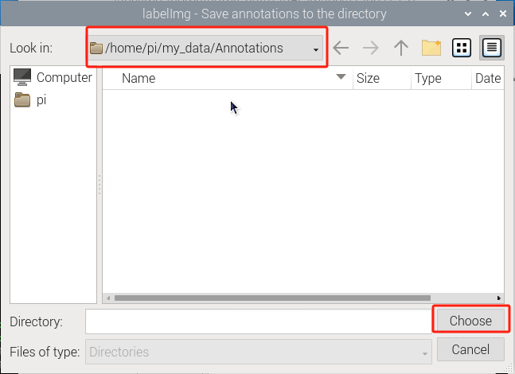

(9)  按下键盘按键“**W**”，开始创建标注框。

将鼠标移动到合适位置，长按鼠标左键进行拖动，令标注框覆盖目标识别内容的整体。松开鼠标左键，即可完成对目标识别内容的框选。

:::{Note}
下图中物体仅供讲解如何进行标注，并未包含在拿到的材料包内。这里可以选择任意物体来进行标注，并且可以设置任意标签名。
:::

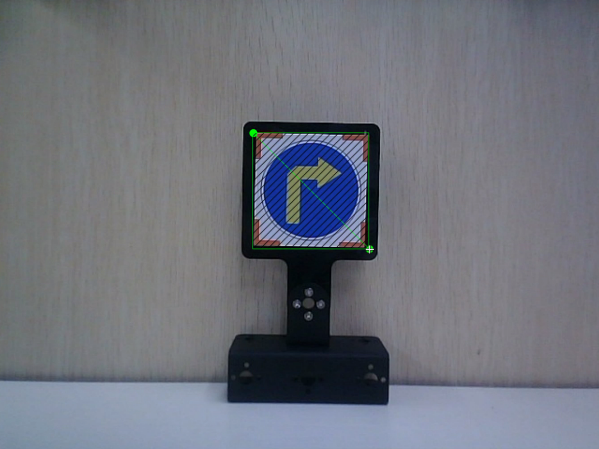

(10) 在弹出的窗口中命名目标识别内容的类别，此处命名为“**right**”。完成命名后，点击“**OK**”按键，或按下回车键“**Enter**”，保存此类别。

:::{Note}
标签可以自行命名成任意名称
:::


(11) 使用快捷键“**Ctrl+S**”，保存当前图片的标注数据。

(12) 参照步骤4-6，完成其他图片的标注操作即可。

(13) 单击系统状态栏的图标，打开文件管理器，进入目录“/home/pi**/my_data/Annotations**”，可以查看到图片的标注文件。

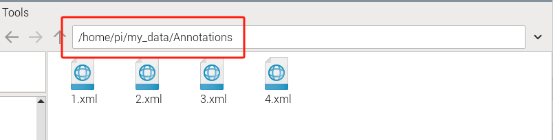

## 2. 格式转换

:::{Note}
输入指令时需要严格区分大小写，且可使用“Tab”键补齐关键词。
:::

(1)  启动树莓派，将其连接至远程控制软件VNC。

(2)  将同目录下的“**xml2yolo.py**”传输到树莓派中，

(3)  按下“**Ctrl+Alt+T**”，打开命令行终端，输入指令“**cp xml2yolo.py my_data/**”，并按下回车。

```bash
cp xml2yolo.py my_data/
```

(4) 输入指令“**cd my_data/**”，并按下回车进入指定路径。

```bash
cd my_data/
```

(5) 输入指令“**sudo vim classes.names**”，并按下回车创建文件。

```bash
sudo vim classes.names
```

(6)  点击“**I**”键进入编辑模式，添加目标识别内容的类名。当需要添加多个类名时，一个类名为一行。（**label为类名**）

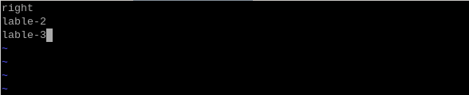

:::{Note}
此处添加的类名必须与图像标注软件“labelImg”内的命名一致。
:::

(7)  输入完成后，按下“**Esc**”键，再输入“**:wq**”，保存并关闭文件。

```bash
:wq
```

(8)  输入指令“**pip3 install PyYAML**”，并按下回车下载yaml模块。


```bash
pip3 install PyYAML
```

(9) 输入转换数据格式的指令“**python3 /home/pi/my_data/xml2yolo.py --data /home/pi/my_data --yaml /home/pi/my_data/data.yaml**”，并按下回车。

```bash
python3 /home/pi/my_data/xml2yolo.py --data /home/pi/my_data --yaml /home/pi/my_data/data.yaml
```

如果出现下图提示，即转换成功。

:::{Note}
下图中转化内容仅供参考，由于对标签设置数量和名字不同，所以会有改变，改变的内容根据标签设置数量和名字而定。
:::

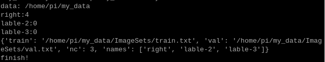

## 3. 训练模型

:::{Note}
输入指令时需要严格区分大小写，且可使用“Tab”键补齐关键词。
:::

### 3.1 环境安装

(1)  启动树莓派，将其连接至远程控制软件VNC。

(2)  按下“**Ctrl+Alt+T**”，打开命令行终端，输入指令“**git clone https://github.com/ultralytics/yolov5.git**” 下载Yolov5安装包（需要科学上网）

```bash
git clone https://github.com/ultralytics/yolov5.git
```

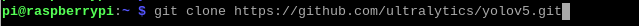

我们在课程目录下提供了“**yolov5.zip**”压缩包，也可以直接传输到树莓派中，“**ubzip yolov5.zip .d ./**”，并按下回车,将压缩包解压。

```bash
ubzip yolov5.zip .d ./
```

(3) 输入指令“**cd yolov5/**”，并按下回车，进入指定目录。

```bash
cd yolov5/
```

(4)  输入指令“**pip3 install -r requirements.txt**”，并按下回车，运行脚本安装环境，安装需要一定时间，请耐心等待。

```bash
pip3 install -r requirements.txt
```

### 3.2 训练模型

(1)  按下“**Ctrl+Alt+T**”，打开命令行终端，输入指令“**cd yolov5/**”，并按下回车，进入指定目录。

```bash
cd yolov5/
```

(2)  输入训练模型的指令“**python3 train.py --img 320 --batch 4 --epochs 5 --data /home/pi/my_data/data.yaml --weights ./yolov5s.pt**”，并按下回车。

```bash
python3 train.py --img 320 --batch 4 --epochs 5 --data /home/pi/my_data/data.yaml --weights ./yolov5s.pt
```

指令中，“**--img**”是图像尺寸；“**--batch**”是图片的单次输入数量；“**--epochs**”是训练次数；“**--data**”是数据集路径；“**--weights**”指定预训练模型的权重文件。如果提供这个参数，脚本将从这些预训练的权重开始训练。如果不提供这个参数，脚本将从零开始训练。

用户可根据实际情况修改上述参数。如需提高模型可靠性，可以增加训练次数，但训练耗费时间也会随之增加，为了保证模型识别效果，建议每个类的数据集在150张以上。

:::{Note}
这里我们使用的数据集需要根据“第5课 图像采集和标注”收集。
:::

(3)  如果出现下图所示内容，则表示正在训练。

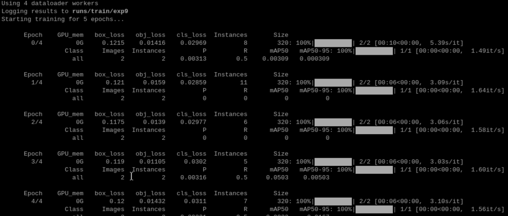

出现下面内容即为训练完成，红框内为训练完成后的模型存放位置，best.pt为模型文件。

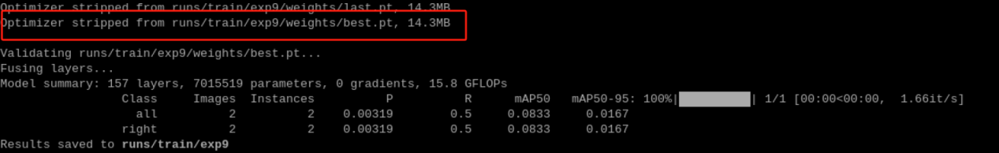

### 3.3 模型使用

(1)  启动树莓派，将其连接至远程控制软件VNC。

(2)  按下“**Ctrl+Alt+T**”，打开命令行终端，输入指令“**cd yolov5/**”，并按下回车，进入指定目录。

```bash
cd yolov5/
```

(3) 输入指令“**python3 detect.py --weights runs/train/exp10/weights/best.pt --source 0**”，开启Yolov5识别。

--weights runs/train/exp10/weights/best.pt：指定模型的权重文件路径为runs/train/exp10/weights/best.pt。

--source 0：指定输入源为0，这可能表示使用摄像头（webcam）作为输入源。

```bash
python3 detect.py --weights runs/train/exp10/weights/best.pt --source 0
```

等待一段时间后，出现下图回传画面中的框，即开启成功。

“**class_name**”是目标识别内容的类别名称；“**box**”是标识方框的起始坐标（左上角）与结束坐标（右下角）；“**score**”是检测识别的置信度。

按下“**ctrl+c**”可进行关闭。

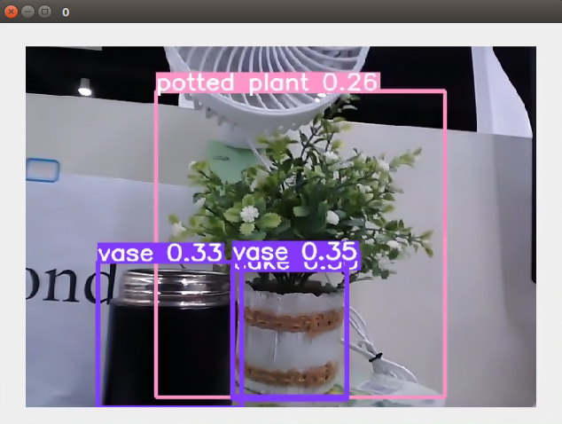
