# 机器学习应用课程

## 1. MediaPipe介绍

### 1.1 MediaPipe简介

MediaPipe是一款开源的多媒体机器学习模型应用框架。可在移动设备、工作站和服务器上跨平台运行，并支持移动GPU加速。还支持TensorFlow和TF Lite的推理引擎（Inference Engine），任何TensorFlow和TF Lite的模型都可以在MediaPipe上使用。同时，在移动端和嵌入式平台，MediaPipe也支持设备本身的GPU加速。


### 1.2 MediaPipe优缺点

- #### 1.2.1 MediaPipe优点

(1)  支持各种平台和语言，如IOS、Android、C++、Python、JAVAScript、Coral等。

(2)  速度很快，模型基本可以做到实时运行。

(3)  模型和代码能够实现很高的复用率。

- #### 1.2.2 MediaPipe缺点

(1)  对于移动端，MediaPipe略显笨重，需要至少10M以上的空间。

(2)  深度依赖于Tensorflow，若想更换成其他机器学习框架，需要更改大量代码。

(3)  使用的是静态图，虽然有助于提高效率，但也会导致很难发现错误。

### 1.3 MediaPipe使用流程

下图是MediaPipe的使用流程。其中，实线部分需要自行编写代码，虚线部分则无需编写。MediaPipe内部已经集成好了AI相关的模型，用户可以利用MediaPipe来快速推算出实现一个功能所需的框架。

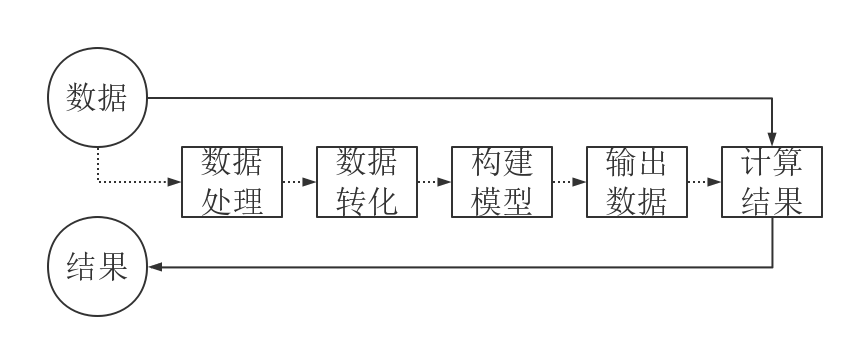

- #### 1.3.1 依赖

MediaPipe依赖[OpenCV](https://opencv.org/)来处理视频，[FFMPEG](https://www.ffmpeg.org/)来处理音频数据。它还有其他依赖项，如[OpenGL/Metal](https://www.opengl.org//)、[Tensorflow](https://www.tensorflow.org/)、[Eigen](https://eigen.tuxfamily.org/index.php?title=Main_Page)等。

我们建议您在开始使用MediaPipe之前先对OpenCV有一个基本的了解。前往“**第5章OpenCV计算机视觉学习**”对OpenCV内容进行了解。

- #### 13.2 MediaPipe Solutions

Solutions是基于特定的预训练TensorFlow或TFLite模型的开源预构建示例。MediaPipe Solutions构建在框架之上。目前，它提供了16个Solutions。其中包括人脸检测、Face Mesh、虹膜、手、姿态、人体等等。

### 1.4 MediaPipe学习网址

```bash
MediaPipe 官网：https://developers.google.com/mediapipe

MediaPipe Wiki：http://i.bnu.edu.cn/wiki/index.php?title=Mediapipe

MediaPipe github：https://github.com/google/mediapipe

dlib官网: http://dlib.net/

dlib github: <https://github.com/davisking/dlib>
```

### 1.5 安装MediaPipe

(1) 打开树莓派并连接到VNC，按下“**CTRL+ALT+T**”打开命令行终端，输入指令“**sudo apt update**”，安装更新APT下载列表。

```bash
sudo apt update
```

(2) 输入指令“**sudo apt install python3-pip**”，安装pip。

```bash
sudo apt install python3-pip
```

:::{Note}
若未更新pip可能会造成安装失败。
:::

(3) 输入指令“**pip3 install --upgrade pip**”，更新pip。

```bash
pip3 install --upgrade pip
```

(4) 输入指令“**pip3 install dataclasses**”，安装依赖包。

```bash
pip3 install dataclasses
```

(5) 输入指令“**pip3 install mediapipe**”，安装MediaPiPe，下载需要一些时间，请耐心等待。

```bash
pip3 install mediapipe
```

## 2. 图像背景分割

本节课通过MediaPipe的自拍分割模型，将训练好的模型（例如人脸、手部等）与背景分割，然后加入虚拟背景。

### 2.1 实验简介

首先，导入MediaPipe的自拍分割模型，并通过订阅话题消息，获取摄像头的实时画面。

随后，对图像进行翻转等处理，在背景图像上绘制分割图，为了改善边界周围的分割，进行双边过滤。

最后，将背景更换为虚拟背景。

### 2.2 实验步骤

:::{Note}
输入指令时需要严格区分大小写，且可使用“Tab”键补齐关键词。
:::

(1) 将同目录下的文件“**self_segmentation.py**”，传输到树莓派中。

```bash
self_segmentation.py
```

(2) 打开树莓派并连接到VNC，按下“**CTRL+ALT+T**”打开命令行终端，输入指令“**cd Mediapipe/**”，并按下回车键，进入玩法程序存放路径。

```bash
cd Mediapipe/
```

(3) 输入指令“**python3 self_segmentation.py**”，并按下回车，开启背景分割检测程序。

```bash
python3 self_segmentation.py
```

(4) 如需关闭程序，可使用快捷键 “**Ctrl+C**”。

### 2.3 实现效果

启动玩法后，画面变为全灰的虚拟背景，在人进入画面后，将人与背景分割出来。


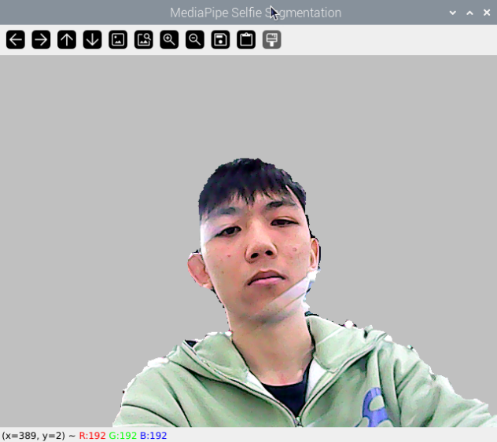

### 2.4 n程序简要分析

程序源码位于： **/home/pi/Mediapipe/self_segmentation.py**

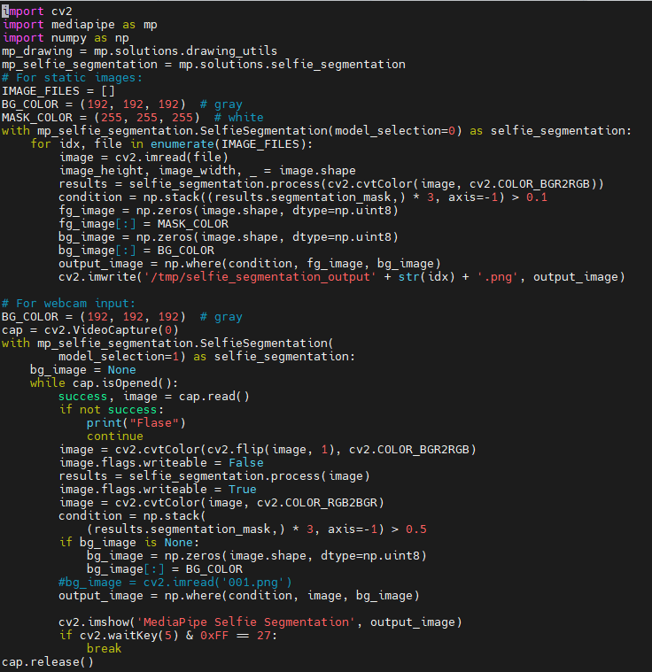

- #### 2.4.1 基础配置

**搭建自拍分割模型**

导入MediaPipe工具包中的自拍分割模型。

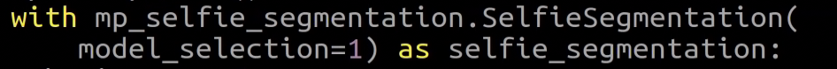

第一个参数“**model_selection**”是模型选择。MediaPipe提供了两种模型：通用模型和景观模型。两种模型都基于MobileNetV3，并进行了修改以提高效率。通用模型在256x256x3 (HWC)张量上运行，并输出代表分割掩码的256x256x1张量。

景观模型类似于通用模型，但在144x256x3 (HWC)张量上运行。它比通用模型具有更少的FLOP（计算量），因此运行速度更快。请注意，再将输入图像输入ML型之前，MediaPipe Selfie Segmentation会自动将输入图像的大小调整为所需的张量维度。

**获取摄像头画面**

通过调用cv2库中的VideoCapture()函数，获取摄像头画面。

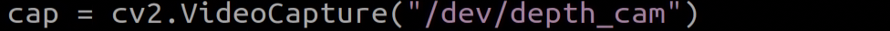

函数括号内的参数是摄像头的接口。也可以使用“0”进行读取。

若当前设备仅连接了一个摄像头，可以采用“0”或“-1”作为摄像头ID；若设备连接了多个摄像头，“0”表示第一个摄像头，“1”表示第二个摄像头，其余摄像头ID以此类推。

- #### 2.4.2 转换颜色空间


通过调用cv2库的cvtColor()函数转换颜色空间。

在对画面进行分割前，需要转换画面到RGB颜色空间。

- #### 2.4.3 分割及更换背景

(1) **绘制分割图像**

基于先前搭建的自拍分割模型，绘制图像内的人与背景的分割图。


(2) **边界滤波**

为了改善边界周围的分割，可以在results.segmentation_mask进行双边过滤。

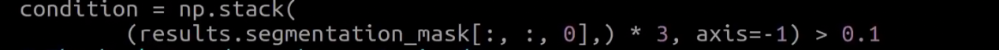

np.stack((results.segmentation_mask,) \* 3, axis=-1) \> 0.1最后参数越小，包括的边缘越多。

(3) **更换背景**

去除分割图中的背景，更换为虚拟背景。

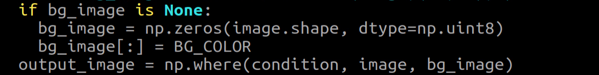

使用np.zeros(image.shape, dtype=np.uint8)去除背景，将背景更换为BG_COLOR，BG_COLOR可以是颜色或者图片。颜色为颜色RGB值，图片尺寸要与摄像头尺寸一致。


(4) **显示回传画面**

通过调用cv2库中的imshow()函数，在指定窗口显示摄像头画面。


函数括号内的第一个参数“**'MediaPipe Selfie Segmentation'**”是窗口名称，第二个参数“**result_image**”是显示图像。

## 3. D物体检测

本节课通过MediaPipe的3D目标检测模型，在画面中显示物体的3D边界框。

目标检测是一个广泛研究的计算机视觉问题，通过将预测扩展到3D，可以捕捉世界上物体的大小、位置和方向，从而在机器人、自动驾驶汽车、图像检索和增强现实中实现各种应用。

### 3.1 实验流程

首先，导入MediaPipe的3D Objectron (3D对象检测)，并通过订阅话题消息，获取摄像头的实时画面。

随后，对图像进行翻转等处理，对图像进行3D物体检测。

最后，在图像上绘制3D边界框。本次实验效果以杯子为例。

### 3.2 实验步骤

:::{Note}
输入指令时需要严格区分大小写，且可使用“Tab”键补齐关键词。
:::

(1) 然后将同目录下的文件“**mp_face_detect.py”**，传输到树莓派中。

(2) 打开树莓派并连接到VNC，按下“**CTRL+ALT+T**”打开命令行终端，输入指令“**cd Mediapipe/**”，并按下回车键，进入玩法程序存放路径。

```bash
cd Mediapipe/
```

(3) 输入指令“**python3 objectron.py**”，并按下回车，开启3D物体检测程序。

```bash
python3 objectron.py
```

(4) 如需关闭程序，可使用快捷键“**Ctrl+C**”。

### 3.3 实现效果

启动玩法后，画面中的物体边界会出现3D框，目前我们支持的识别物体有四类，分别是：杯子(带把手）、鞋子、椅子、相机。这里以杯子为例，如下图效果所示：

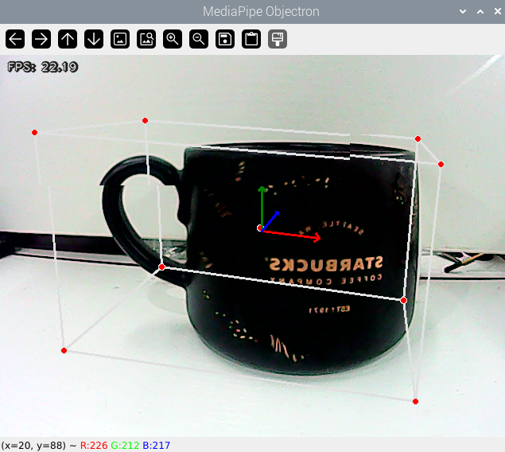

### 3.4 程序简要分析

程序源码位于：**/home/pi/Mediapipe/objectron.py**

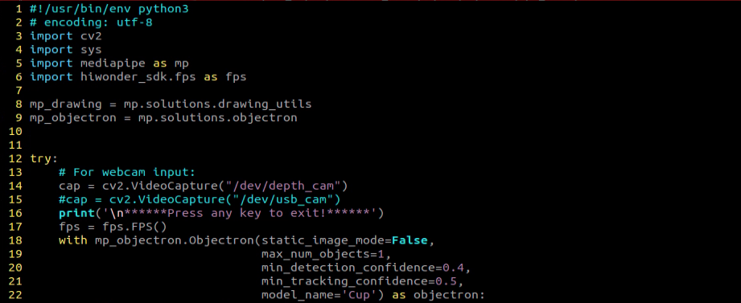

- #### 3.4.1 基础配置

(1) **搭建3D检测模型**

导入MediaPipe工具包中的Objectron (3D ObjectDetection)模型。

```bash
with mp_objectron.Objectron(static_image_mode=False,
                            max_num_objects=1,
                            min_detection_confidence=0.4,
                            min_tracking_confidence=0.5,
                            model_name='Cup') as objectron:
```

第一个参数“static_image_mode=False”是静态图像模式。如果设置为false，将输入图像视为视频流。如果设置为true对象检测运行每个输入图像，非常适合处理一批静态的、可能不相关的图像。默认为false.

第二个参数“max_num_objects=1”是检测目标的最大数量。默认为5.

第三个参数“min_detection_confidence=0.4”是最小检测置信度。最小置信度值(\[0.0, 1.0\])从对象检测模型中获得被认为是成功的检测。默认为0.5.

第四个参数“min_detection_confidence=0.4”是物体追踪的最小置信度。（将其设置为更高的值可以提高解决方案的稳健性，但代价是更高的延迟）。

第五个参数“model_name='Cup'”是3D边界框型号名称。用于显示3D边界框界标的模型的名称。目前支持{'Shoe', 'Chair', 'Cup', 'Camera'}。默认为Shoe.

(2) **获取摄像头画面 出**

通过调用cv2库中的VideoCapture()函数，获取摄像头画面。

```bash
cap = cv2.VideoCapture("/dev/usb_cam")
```

函数括号内的参数是摄像头的接口。也可以使用“0”进行读取。

若当前设备仅连接了一个摄像头，可以采用“0”或“-1”作为摄像头ID；若设备连接了多个摄像头，“0”表示第一个摄像头，“1”表示第二个摄像头，其余摄像头ID以此类推。

- #### 3.4.2 转换颜色空间

```bash
image = cv2.cvtColor(image, cv2.COLOR_BGR2RGB)
```

通过调用cv2库的cvtColor()函数转换颜色空间。

在对画面进行检测前，需要转换画面到RGB颜色空间。

- #### 3.4.3 3D物体检测

(1) **检测**

基于先前搭建的Objectron (3D ObjectDetection)模型，检测物体的3D形状。

```bash
results = objectron.process(image)
```

(2) **绘制3D边界框**

检测出物体的3D形状，遍历识别到的物体，使用mp_drawing.draw_landmarks()和mp_drawing.draw_axis()绘制物体的3D边界框。

```bash
for detected_object in results.detected_objects:
    mp_drawing.draw_landmarks(
        image, detected_object.landmarks_2d, mp_objectron.BOX_CONNECTIONS)
    mp_drawing.draw_axis(image, detected_object.rotation,
                         detected_object.translation)
```

(3) **显示回传画面**

通过调用cv2库中的imshow()函数，在指定窗口显示摄像头画面。

```bash
cv2.imshow('MediaPipe Objectron', result_image)
```

函数括号内的第一个参数“**'MediaPipe Objectron'**”是窗口名称，第二个参数“**result_image**”是显示图像。

## 4. 人脸检测

本节课通过MediaPipe的人脸检测模型，对画面中的人脸进行检测。

MediaPipe人脸检测是一个超快速的人脸检测解决方案，具有6个标志和多人脸支持。它是基于[BlazeFace](https://arxiv.org/abs/1907.05047)，一个轻量级的性能良好的人脸检测器，专为移动GPU推理量身定制。

### 4.1 实验流程

首先，导入MediaPipe的人脸检测模型，并通过订阅话题消息，获取摄像头的实时画面。

随后，通过OpenCV对图像进行翻转、转换颜色空间等处理。

接着，通过对比人脸检测模型的最小置信度，用以判断人脸是否检测成功。当判定到人脸后，会对人脸面部集合进行检测，其中每个面部都表示为检测原始消息，该消息包含一个边界框和6个关键点（右眼、左眼、鼻尖、嘴中心、右耳区域和左耳区域）。

最后把人脸框起来，同时标记出人脸6个关键点。

### 4.2 实验步骤

:::{Note}
输入指令时需要严格区分大小写，且可使用“Tab”键补齐关键词。
:::

(1) 将同目录下的文件“**mp_face_detect.py”**，传输到树莓派中。

(2) 打开树莓派并连接到VNC，按下“**CTRL+ALT+T**”打开命令行终端，输入指令“**cd Mediapipe/**”，并按下回车键，进入玩法程序存放路径。

```bash
cd Mediapipe/
```

(3) 输入指令“**python3 face_detect.py**”，执行人脸检测程序 

```bash
python3 face_detect.py
```

### 4.3 实现效果

启动玩法后，会将画面中的人脸识别出来，并且将人脸上的特征点标记出来。

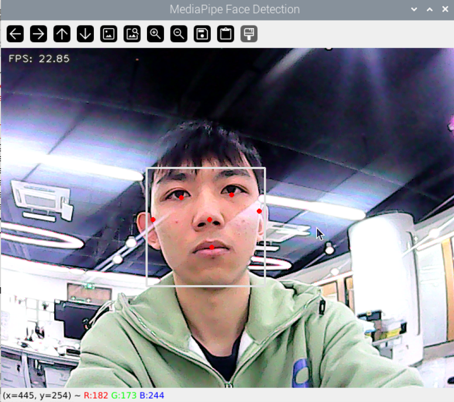

### 4.4 程序简要分析

程序源码位于：**/home/pi/Mediapipe/face_detect.py**

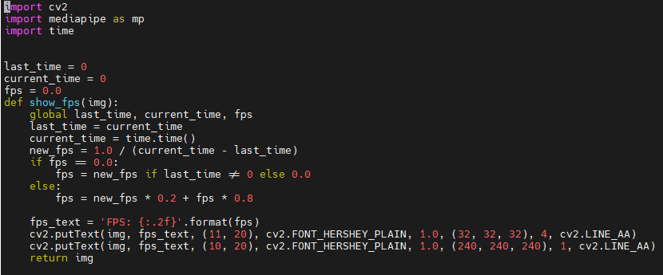

- #### 4.4.1 基础配置

(1) **搭建3D检测模型**

导入MediaPipe工具包中的FaceDetection(人脸模型)。

```bash
with mp_face_detection.FaceDetection(
    min_detection_confidence=0.5) as face_detection:
    while cap.isOpened():
        success, image = cap.read()
```

min_detection_confidence=0.5：表示只有当检测到的面部置信度至少为0.5时，才会将面部标记为真正检测到的面部。

while cap.isOpened():开始一个循环，该循环将持续进行，直到视频流结束或发生错误。cap.isOpened()检查视频捕获对象（由cap表示）是否已打开并可以读取。在循环内，这一行从视频流中读取一帧图像。如果读取成功，success将为True，并且image将包含读取的图像数据。

(2) **获取摄像头画面**

通过调用cv2库中的VideoCapture()函数，获取摄像头画面。

```bash
cap = cv2.VideoCapture("/dev/usb_cam")
```

函数括号内的参数是摄像头的接口。也可以使用“0”进行读取。

若当前设备仅连接了一个摄像头，可以采用“0”或“-1”作为摄像头ID；若设备连接了多个摄像头，“0”表示第一个摄像头，“1”表示第二个摄像头，其余摄像头ID以此类推。

- #### 4.4.2 转换颜色空间

```bash
image = cv2.cvtColor(image, cv2.COLOR_BGR2RGB)
```

通过调用cv2库的cvtColor()函数转换颜色空间。

在对画面进行检测前，需要转换画面到RGB颜色空间。

- #### 4.4.3 人脸检测

(1) **检测**

基于先前搭建的FaceDetection(人脸模型)，检测画面中的人脸。

```bash
results = face_detection.process(image)
```

(2) **绘制3D边界框**

使用mp_drawing.draw_detection(image, detection)将人脸框起来并且画出特征点。

```bash
if results.detections:
    for detection in results.detections:
        mp_drawing.draw_detection(image, detection)
        # Flip the image horizontally for a selfie-view display.
        image = show_fps(cv2.flip(image, 1))
```

(3) **显示回传画面**

通过调用cv2库中的imshow()函数，在指定窗口显示摄像头画面。

```bash
cv2.imshow('MediaPipe Face Detection', image)
```

函数括号内的第一个参数“**'MediaPipe Objectron'**”是窗口名称，第二个参数“**result_image**”是显示图像。

## 5. 三维人脸检测

本节课通过MediaPipe的人脸网格模型，对画面中的人脸进行检测。

MediaPipe Face Mesh是一款即使在移动设备上也能实时估计468个3D人脸特征的模型。它采用机器学习(ML)来推断3D面部。该模型利用轻量级模型架构和GPU加速，提供了至关重要的实时性能。

此外，该解决方案与面部变换模块捆绑在一起，该模块弥补了面部地标估计和有用的实时增强现实（AR）应用之间的差距。它建立度量3D空间，并使用面部地标屏幕位置来估计该空间内的面部变换。面部变换数据由常见的3D图元组成，包括面部姿势变换矩阵和三角形面部网格。

### 5.1 实验流程

首先我们需要知道这里的机器学习管线（线性模型，可视作流水线）是由两个协同工作的实时深度神经网络模型组成：一个对完整图像进行操作并计算人脸位置的检测器，以及一个对这些位置进行操作并通过回归预测近似3D表面的3D人脸地标模型。

对于3D人脸地标，我们采用了转移学习，并训练了一个具有多个目标的网络：该网络同时预测合成渲染数据上的3D地标坐标和注释真实世界数据上的2D语义轮廓。由此产生的网络不仅基于合成数据，还基于真实世界数据，为我们提供了合理的3D地标预测。

3D地标网络接收裁剪的视频帧作为输入，而无需额外的深度输入。该模型输出3D点的位置，以及面部在输入中出现并合理对齐的概率。

在导入人脸网格模型后，获取摄像头的实时画面。通过对图像进行翻转、转换颜色空间等处理，接着，通过对比人脸检测模型的最小置信度，用以判断人脸是否检测成功。

最后，将检测画面中的人脸绘制三维网格显示。

### 5.2 实验步骤

:::{Note}
输入指令时需要严格区分大小写，且可使用“Tab”键补齐关键词。
:::

(1) 将同目录下的文件“**mp_face_detect.py”**，传输到树莓派中。

(2) 打开树莓派并连接到VNC，按下“**CTRL+ALT+T**”打开命令行终端，输入指令“**cd Mediapipe/**”，并按下回车键，进入玩法程序存放路径。

```bash
cd Mediapipe/
```

(3) 输入指令“**python3 face_mesh.py**”，并按下回车键，启动玩法程序。

```bash
python3 face_mesh.py
```

(4) 如需关闭此玩法，可在终端界面按下“**Ctrl+C**”。若关闭失败，请反复尝试。

### 5.3 实现效果

启动玩法后，摄像头检测到人脸，就会在回传画面显示出人脸的三维轮廓。

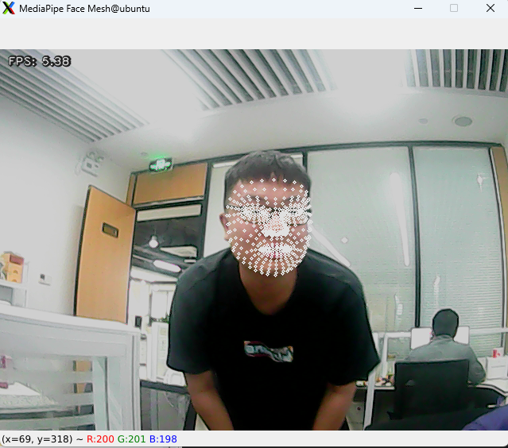

### 5.4 程序简要分析

程序源码位于：**/home/pi/Mediapipe/face_mesh.py**


- #### 5.4.1 基础配置

(1) **搭建人脸网格模型**

导入MediaPipe工具包中的人脸网格模型。

```bash
with mp_face_mesh.FaceMesh(
    max_num_faces=1,
    min_detection_confidence=0.5,
    min_tracking_confidence=0.5) as face_mesh:
```

其中第一个参数“**max_num_faces**”是要检测的最大人脸数，默认为1。

第二个参数“**min_detection_confidence**”是人脸检测的最小置信度，默认为0.5。范围\[0.0, 1.0\]。

第三个参数“**min_tracking_confidence**”是人脸追踪的最小置信度值（将其设置为更高的值可以提高解决方案的稳健性，但代价是更高的延迟）。

(2) **获取摄像头画面**

通过调用cv2库中的VideoCapture()函数，获取摄像头画面。

```bash
cap = cv2.VideoCapture("/dev/usb_cam")
```

函数括号内的参数是摄像头的接口。也可以使用“**0**”进行读取。

若当前设备仅连接了一个摄像头，可以采用“**0**”或“**-1**”作为摄像头ID；若设备连接了多个摄像头，“**0**”表示第一个摄像头，“**1**”表示第二个摄像头，其余摄像头ID以此类推。

- #### 5.4.2 转换颜色空间

```bash
image = cv2.cvtColor(image, cv2.COLOR_BGR2RGB)
```

通过调用cv2库的cvtColor()函数转换颜色空间。

在对画面进行检测前，需要转换画面到RGB颜色空间。

- #### 5.4.3 人脸检测处理

(1) **人脸检测**

基于先前搭建的人脸网格模型，检测画面中的人脸。

```bash
results = face_mesh.process(image)
```

(2) **绘制人脸网格**

使用mp_drawing.draw_landmarks()函数将画面中检测到的人脸网格绘制出来。

```bash
if results.multi_face_landmarks:
    for face_landmarks in results.multi_face_landmarks:
        mp_drawing.draw_landmarks(
            image=image,
            landmark_list=face_landmarks,
            landmark_drawing_spec=drawing_spec)
```

(3) **显示回传画面**

通过调用cv2库中的imshow()函数，在指定窗口显示摄像头画面。

```bash
cv2.imshow('MediaPipe Face Mesh', result_image)
```

函数括号内的第一个参数“**'MediaPipe Face Mesh'**”是窗口名称，第二个参数“**result_image**”是显示图像。

## 6. 手部关键点检测

本节课通过MediaPipe的手部检测模型，在回传画面显示出手的关键点以及关键点的连线。

MediaPipe Hands是一款高保真的手和手指检测模型。它采用机器学习(ML)从单个帧中推断出手部的21个3D标志。

### 6.1 实现流程

首先，我们需要知道MediaPipe的手掌检测模型，是利用了一个由多个模型组成的机器学习管线（线性模型，可视作流水线）。模型会将整个图像进行操作，并返回一个定向的手部边界框。手界标模型，对手掌检测器定义的裁剪图像区域进行操作，并返回高保真度3D手部关键点。

因此在导入手掌检测模型后，获取摄像头的实时画面，对图像进行翻转、转换颜色空间等处理，大大减少了手部界标模型对数据增强的需要。

此外，在我们的管线中，还可以基于在前一帧中识别的手标志来生成作物，只有当标志模型不再能够识别手的存在时，才调用手掌检测来重新定位手。

接着，通过对比手部检测模型的最小置信度，用以判断手掌是否检测成功。

最后，检测检测画面中的手部关键点并绘制。

### 6.2 实验步骤

:::{Note}
输入指令时需要严格区分大小写，且可使用“Tab”键补齐关键词。
:::

(1) 打开树莓派并连接到VNC，然后将同目录下的文件“**hand.py”**，传输到树莓派中。

(2) 打开树莓派并连接到VNC，按下“**CTRL+ALT+T**”打开命令行终端，输入指令“**cd Mediapipe/**”，并按下回车键，进入玩法程序存放路径。

```bash
cd Mediapipe/
```

(3) 输入指令“**python3 hand.py**”，并按下回车键，启动玩法程序。

```bash
python3 hand.py
```

### 6.3 实现效果

启动玩法后，当相机的回传画面检测到手部，就会在回传画面显示出手的关键点以及关键点的连线。

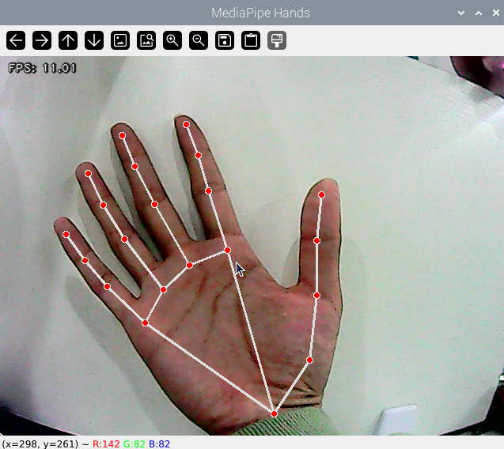

### 6.4 程序简要分析

程序源码位于：**/home/pi/Mediapipe/hand.py**

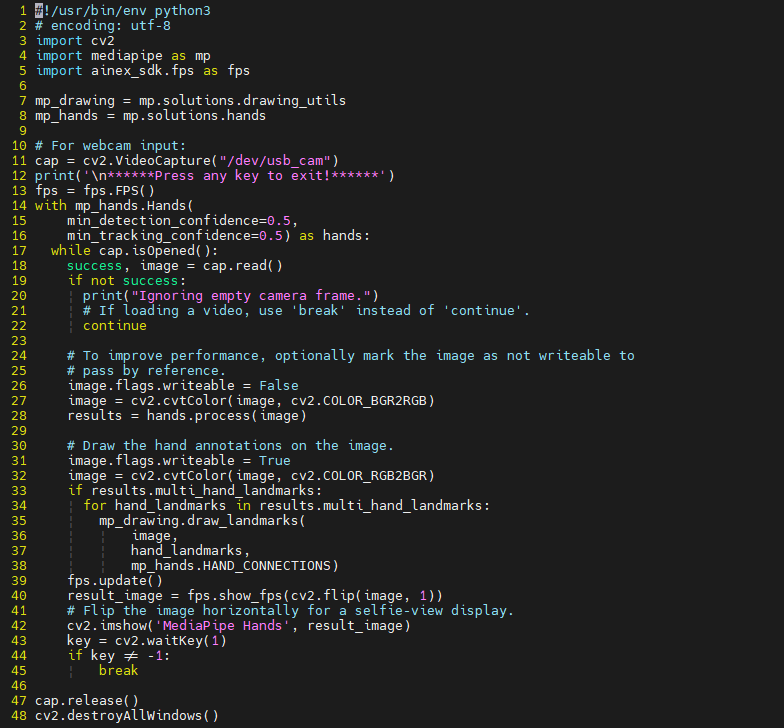

- #### 6.4.1 基础配置

(1) **搭建手部检测模型**

导入MediaPipe工具包中的手部检测模型。

```bash
with mp_hands.Hands(
    min_detection_confidence=0.5,
    min_tracking_confidence=0.5) as hands:
```

第一个参数“**min_detection_confidence**”是手部检测的最小置信度，默认为0.5。范围\[0.0, 1.0\]。

第二个参数“**min_tracking_confidence**”是手部追踪的最小置信度值（将其设置为更高的值可以提高解决方案的稳健性，但代价是更高的延迟）。

(2) **获取摄像头画面**

通过调用cv2库中的VideoCapture()函数，获取摄像头画面。

```bash
cap = cv2.VideoCapture("/dev/usb_cam")
```

函数括号内的参数是摄像头的接口。也可以使用“**0**”进行读取。

若当前设备仅连接了一个摄像头，可以采用“**0**”或“**-1**”作为摄像头ID；若设备连接了多个摄像头，“**0**”表示第一个摄像头，“**1**”表示第二个摄像头，其余摄像头ID以此类推。

- #### 6.4.2 转换颜色空间

```bash
image = cv2.cvtColor(image, cv2.COLOR_BGR2RGB)
```

通过调用cv2库的cvtColor()函数转换颜色空间。

在对画面进行检测前，需要转换画面到RGB颜色空间。

- #### 6.4.3 手部检测

(1) **检测**

基于先前搭建导入的手部检测模型，检测画面中的手。

```bash
results = hands.process(image)
```

(2) **绘制手部关键点**

使用mp_drawing.draw_landmarks()函数将画面中检测到的手部关节绘制出来。

```bash
for hand_landmarks in results.multi_hand_landmarks:
    mp_drawing.draw_landmarks(
        image,
        hand_landmarks,
        mp_hands.HAND_CONNECTIONS)
```

(3) **显示回传画面**

通过调用cv2库中的imshow()函数，在指定窗口显示摄像头画面。

```bash
cv2.imshow('MediaPipe Hands', result_image)
```

函数括号内的第一个参数“**'MediaPipe Hands'**”是窗口名称，第二个参数“**result_image**”是显示图像。

## 7. 肢体关键点检测

本节课通过MediaPipe的肢体检测模型，对肢体的关键点检测并在回传画面显示。

MediaPipe Pose是一种用于高保真身体姿势跟踪的模型，利用我们的BlazePose，从RGB颜色空间中推断出全身上的33个3D关键点，该研究也为ML Kit Pose（机器学习框架） 检测API提供了支持。

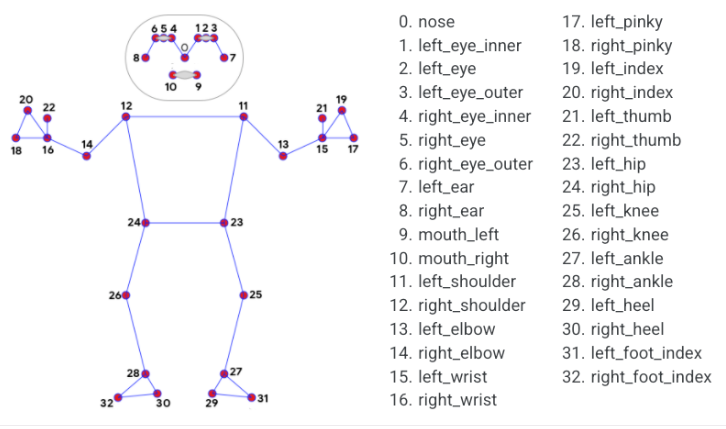

### 7.1 实现流程

首先，我们需要导入肢体检测模型。

随后，对图像进行翻转、转换颜色空间等处理，通过对比人体检测模型的最小置信度，用以判断人体是否检测成功。

接着，通过对比最小跟踪置信度，用于成功跟踪的姿势界定，如不符合，则在下一个输入图像上自动调用人体检测。

使用检测器，管线首先定位帧内的人姿势的感兴趣区域（ROI），跟踪器随后使用ROI裁剪帧作为输入，以此来预测ROI内的姿势界标和分割掩模。对于视频用例，仅在需要时调用检测器，即对于第一帧，当跟踪器不再能够识别前一帧中的身体姿势时。对于其他帧，管线仅从前一帧的姿势界标导出ROI。

在导入MediaPipe的肢体检测模型后，获取摄像头的实时画面。最后根据画面中的人体肢体关键点，并绘制出来。

### 7.2 实验步骤

:::{Note}
输入指令时需要严格区分大小写，且可使用“Tab”键补齐关键词。
:::

(1) 将同目录下的文件“**pose.py”**，传输到树莓派中。

(2) 打开树莓派并连接到VNC，按下“**CTRL+ALT+T**”打开命令行终端，输入指令“**cd Mediapipe/**”，并按下回车键，进入玩法程序存放路径。

```bash
cd Mediapipe/
```

(3) 输入指令“**python3 pose.py**”，并按下回车键，启动玩法程序。

```bash
python3 pose.py
```

(4) 如需关闭此玩法，可在终端界面按下“**Ctrl+C**”。若关闭失败，请反复尝试。

### 7.3 实现效果

启动玩法后，相机检测到人体姿态，在回传画面显示出肢体的关键点以及关键点的连线。

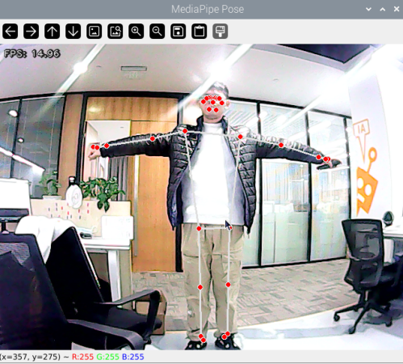

### 7.4 程序简要分析

程序源码位于：**/home/pi/Mediapipe/pose.py**

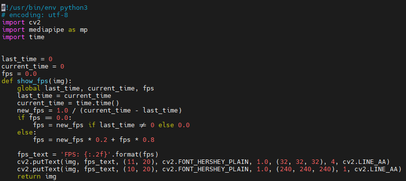

- #### 7.4.1 基础配置

(1) **搭建肢体检测模型**

导入MediaPipe工具包中的姿态检测模型。

```bash
with mp_pose.Pose(
    min_detection_confidence=0.5,
    min_tracking_confidence=0.5) as pose:
```

第一个参数“**min_detection_confidence**”是肢体检测的最小置信度，默认为0.5。范围\[0.0, 1.0\]。

第二个参数“**min_tracking_confidence**”是肢体追踪的最小置信度值（将其设置为更高的值可以提高解决方案的稳健性，但代价是更高的延迟）。

(2) **获取摄像头画面**

通过调用cv2库中的VideoCapture()函数，获取摄像头画面。

```bash
cap = cv2.VideoCapture("/dev/usb_cam")
```

函数括号内的参数是摄像头的接口。也可以使用“**0**”进行读取。

若当前设备仅连接了一个摄像头，可以采用“**0**”或“**-1**”作为摄像头ID；若设备连接了多个摄像头，“**0**”表示第一个摄像头，“**1**”表示第二个摄像头，其余摄像头以此类推。

- #### 7.4.2 转换颜色空间

```bash
image = cv2.cvtColor(image, cv2.COLOR_RGB2BGR)
```

通过调用cv2库的cvtColor()函数转换颜色空间。

在对画面进行检测前，需要转换画面到RGB颜色空间。

- #### 7.4.3 肢体检测

(1) **检测**

基于先前搭建的肢体检测模型，检测画面中的肢体。

```bash
results = pose.process(image)
```

(2) **绘制关键点**

使用mp_drawing.draw_landmarks()函数将画面中检测到的肢体的关键点以及关键点的连线绘制出来。

```bash
mp_drawing.draw_landmarks(
    image,
    results.pose_landmarks,
    mp_pose.POSE_CONNECTIONS)
```

(3) **显示回传画面**

通过调用cv2库中的imshow()函数，在指定窗口显示摄像头画面。

```bash
cv2.imshow('MediaPipe Pose', result_image)
```

函数括号内的第一个参数“**'MediaPipe Pose**”是窗口名称，第二个参数“**result_image**”是显示图像。
