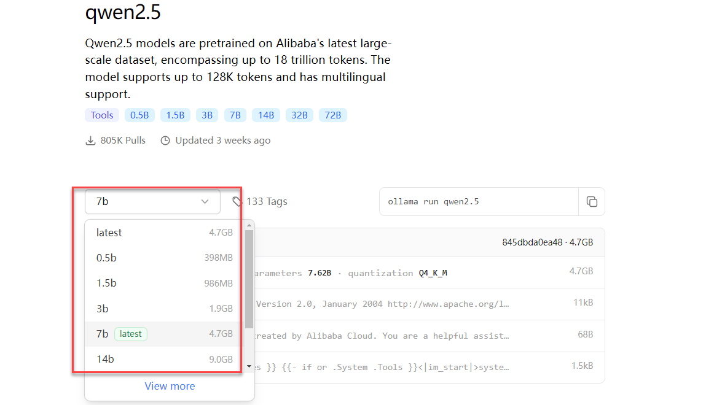
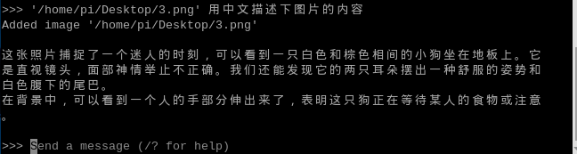

# AI大模型课程

## 1. AI大模型环境部署ollama

大型语言模型（Large Language Models，简称LLM）是一类基于人工智能技术的高级文本生成系统，其主要特点是能够通过大规模的训练数据来学习和理解人类语言，并能够生成自然流畅的文本。

Ollama是一个开源的工具，旨在简化大型语言模型的部署和运行过程，使得用户可以在**本地内网环境**中使用高质量的语言模型，无需依赖云服务。它具备一个简洁且用户友好的命令行界面，通过这一界面，用户可以轻松地部署和管理各类开源的 LLM。

| **模型规格** | **适用主板** |
|:-------------|:------------:|
| 树莓派5 8GB  |      √       |
| 树莓派5 4GB  |      √       |

### 1.1 Ollama安装 

ollama可以通过两种方式安装

(1) 二进制包，简单快速

(2) 源码编译，复杂耗时

**对于树莓派，官方不支持gpu推理，所以我们直接从二进制包进行安装。**

在环境部署前，请先给主板联网。

(1)  输入指令安装curl工具。

```bash
sudo apt install curl
```

(2)  输入指令安装ollama。

```bash
curl -fsSL https://ollama.com/install.sh \| sh
```


:::{Note}
根据网络环境不同，安装的时间会有差异，整个安装过程会耗时较久，请耐心等待！ 如果失败请多次尝试或者重启之后尝试！
:::

### 1.2 Ollama使用

安装成功后输入ollama，回出现如下提示：


|   **命令**    |          **作用**          |
|:-------------:|:--------------------------:|
| ollama serve  |         启动ollama         |
| ollama create |     从模型文件创建模型     |
|  ollama show  |        显示模型信息        |
|  ollama run   |          运行模型          |
|  Ollama pull  |     从注册表中拉取模型     |
|  ollama push  |     将模型推送到注册表     |
|  ollama list  |          列出模型          |
|   ollama ps   |       列出运行的模型       |
|   ollama cp   |          复制模型          |
|   Ollama rm   |          删除模型          |
|  Ollama help  | 获取有关任何命令的帮助信息 |

### 3.Ollama卸载

如需卸载Ollama工具，可按照下方步骤：

- #### 3.1 删除服务

```bash
sudo rm /etc/systemd/system/ollama.service
```

- #### 3.2 删除文件

```bash
sudo rm \$(which ollama)
```

- #### 3.3 删除模型和服务用户和组

```bash
sudo rm -r /usr/share/ollama
```

```bash
sudo userdel ollama
```

```bash
sudo groupdel ollama
```

**注意：如果输入指令sudo userdel ollama 失败，提示被占用的情况：**

(1)  这里可以看到当前正被进程ID12614占用（进程ID为示例，以实际环境为准），需要找到并结束进程：

```bash
sudo kill 12614
```

(2)  然后查看组成员：

```bash
getent group ollama
```

(3)  将ollama移出该组：

```bash
sudo gpasswd -d username ollama
```

username这里以hiwonder为例，请根据实际填写。

(4)  移除完成后，再次输入删除指令即可：

```bash
sudo userdel ollama
```

### 1.4 参考资料 

官网：[<u>https://ollama.com/</u>](https://ollama.com/)

GitHub：[<u>https://github.com/ollama/ollama</u>](https://github.com/ollama/ollama)

## 2. 中文输入法安装

### 2.1 显示中文的方法

由于树莓派系统默认为英文字库，如果你在使用中需要打开中文的文件，出现了一堆方块的情况，那么可以参照本小节的教程—手动来安装中文字体。

(1)  树莓派在开机后，打开LX终端，输入以下命令

```bash
sudo apt-get install ttf-wqy-zenhei
```

(2)  如果安装过程碰到（Y/n），都选择“y”。


### 2.2 中文输入法的安装

小企鹅输入法是一个以GPL方式发布的输入法平台,可以通过安装引擎支持多种输入法，支持简入繁出，是在 Linux 操作系统中常用的中文输入法。它的优点是，短小精悍、跟程序的兼容性比较好。

(1)  在LX终端界面中输入命令，

```bash
sudo apt-get install fcitx fcitx-config-gtk fcitx-table-all im-switch fcitx-frontend-gtk3 fcitx-frontend-gtk2 fcitx-ui-classic
```

(2)  如果安装过程碰到（Y/n）,都选择“y”。


(3)  安装完成后输入重启指令：

```bash
sudo reboot
```

并按下“**Enter**”（回车键）重启树莓派（注意：一定要重启）。

(4)  重启后，我们任意打开一个中文文件或在LX终端上测试一下输入法。


(5)  点击右上角的输入法图标，选择“**Input Method**”中的“**Sunpinyin**”或者“**Google Pinyin**”即可切换输入法。


(6)  或者按 “Ctrl+Space”（空格键）。在终端尝试输入汉字，下图可看到已经能够实现正常使用。


## 3. 大模型对话平台安装

### 3.1 ollama安装模型

在使用模型前，需要先拉取（安装）模型。在树莓派系统的浏览器中进入ollama官网查找模型。

ollama官网链接：[<u>https://ollama.com/</u>](https://ollama.com/)

(1)  在右上角点击“Models”查找模型。


(2)  可以在搜索栏直接查找。这里以qwen模型为例。


(3)  在模型介绍页面可以查看模型的所有版本。



(4)  找到合适的模型，可以使用指令拉取，指令以拉取qwen2.5：0.5b为例：

```bash
ollama pull qwen2.5：0.5b
```


:::{Note}
如果需要下载其他模型参考上述方法即可！
:::

### 3.2 Open WebUI 

Open WebUI 是一个开源项目，旨在提供一个简单易用的用户界面（UI），用于管理和监控开源软件和服务。

主板适用范围：

| **主板型号** | **是否支持** |
|:------------:|:------------:|
|  树莓派5 4G  |      √       |
|  树莓派5 8G  |      √       |

使用Open WebUI很大概率会出现对话无响应或超时的现象，可以尝试重启Open WebUI或者换Ollama工具运行模型使用！

教程演示Docker（容器）下安装Open WebUI。

- #### 3.2.1 Docker安装

如果使用我们提供的镜像，Docker已经安装好了。

(1) 更新本地软件包列表。

```bash
sudo apt update
```


(2) 升级已安装软件包。

```bash
sudo apt upgrade
```


- #### 3.2.2 Open WebUI安装

对于已安装Docker的系统，可以直接在终端输入下面命令。

```bash
sudo docker pull ghcr.io/open-webui/open-webui:main
```

:::{Note}
整个安装过程耗时比较久，请耐心等待！
:::

- #### 3.2.3 Open WebUI运行

(1)  输入指令启动，通过docker运行Open WebUI。

```bash
sudo docker run --network=host -v open-webui:/app/backend/data -e OLLAMA_BASE_URL=http://127.0.0.1:11434 --name open-webui --restart always ghcr.io/open-webui/open-webui:main
```

(2)  成功启动后，点击系统的浏览器，使用下面网址访问：

**http://localhost:8080/**


(3)  首次使用需要自己注册一个账号，该账号是管理员账号，信息可按照要求自行填写！这里以hiwonder举例。

用户名：hiwonder

邮箱：hiwonder@qq.com

密码：hiwonder


(4)  登录成功，使用界面如下图所示。


**演示**

使用Open WebUI进行对话会比直接使用Ollama工具运行更加慢，甚至出现超时服务连接失败现象，这个和主板的内存大小有关的，无法避免！

需要注意，有些模型是无法识别或者回复中文的。


**切换模型**

如果下载了多个模型，可以点击 Select a model 可以选择指定模型对话，使用ollama拉取的模型会自动添加到Open WebUI模型选项。


- #### 3.2.4 关闭Open WebUI

(1) 查看运行的Docker

```bash
docker ps
```

(2) 关闭运行的Docker

```bash
docker stop \[CONTAINER ID\] \# 示例 docker stop 5f42ee9cf784
```

以下步骤为卸载容器，请谨慎使用。

(3) 查看停止运行的容器

```bash
docker ps -a
```

(4) 清理停止运行的容器

```bash
docker rm \[CONTAINER ID\] \# 示例 docker rm 5f42ee9cf784
```

(5) 清理停止运行的所有容器：

```bash
docker container prune
```

### 3.3 常见问题

**服务连接超时**

报错：Open WebUI: Server Connection Error

解决办法：关闭Open WebUI一次并重新启动，然后重新提问或者换Ollama工具运行模型进行提问！

## 4. Meta AI：Llama3.2模型

### 4.1 Llama3.2介绍

Llama 3.2 是 Meta 公司于 2024 年 9 月 25 日发布的人工智能模型。Llama 3.2 引入了具有 11 亿和 90 亿参数的视觉启用模型，这是该版本的重大突破。这些模型可以同时处理图片和文字，能够回答与图片相关的问题、给图片配上描述性标题、理解复杂的视觉信息等。例如，可以分析嵌入文档中的图表并总结关键趋势，解释地图、确定最陡的徒步路径或计算两点之间的距离等。

Llama 3.2 推出了参数量为 1 亿和 3 亿的轻量级模型，这些模型专为边缘设备和移动设备设计，在资源受限的环境中也能高效运行。

**模型规模**

Llama3.2有多个版本，可以根据主板配置进行选择。

<table class="docutils" border="1">
<tbody>
<tr>
<td style="text-align: center;"><strong>模型规格</strong></td>
<td style="text-align: center;" colspan="7"><strong>适用主板</strong></td>
</tr>
<tr>
<td style="text-align: center;">Llama3.2</td>
<td style="text-align: center;">Jetson Nano</td>
<td style="text-align: center;" colspan="2">Jetson Orin Nano</td>
<td style="text-align: center;" colspan="2">Jetson Orin NX</td>
<td style="text-align: center;" colspan="2">树莓派5</td>
</tr>
<tr>
<td style="text-align: center;"></td>
<td style="text-align: center;"></td>
<td style="text-align: center;">4G</td>
<td style="text-align: center;">8G</td>
<td style="text-align: center;">8G</td>
<td style="text-align: center;">16G</td>
<td style="text-align: center;">4G</td>
<td style="text-align: center;">8G</td>
</tr>
<tr>
<td style="text-align: center;">1B</td>
<td style="text-align: center;">√</td>
<td style="text-align: center;">√</td>
<td style="text-align: center;">√</td>
<td style="text-align: center;">√</td>
<td style="text-align: center;">√</td>
<td style="text-align: center;">√</td>
<td style="text-align: center;">√</td>
</tr>
<tr>
<td style="text-align: center;">3B</td>
<td style="text-align: center;">√</td>
<td style="text-align: center;">√</td>
<td style="text-align: center;">√</td>
<td style="text-align: center;">√</td>
<td style="text-align: center;">√</td>
<td style="text-align: center;">√</td>
<td style="text-align: center;">√</td>
</tr>
</tbody>
</table>

### 4.2 运行Llama3.2

(1)  输入指令运行Llama3.2：1B。如果没有拉取模型，会先进行拉取。

```bash
ollama run llama3.2:1b
```


(2)  输入对话回车发送。（回复问题时间和硬件配置有关，耐心等待！）

**以科技改变生活写一段100字的中文文案**


**一个面积为120m²的矩形苗圃，它的长比宽多2m. 苗圃的长和宽各是多少？**


**中国的首都是哪里**

**它的面积多大**

**有什么旅游推荐的地方**


(3)  输入指令即可结束对话。

```bash
/bye
```

### 4.3 参考资料 

(1) Ollama

官网：[<u>https://ollama.com/</u>](https://ollama.com/)

GitHub：[https://github.com/ollama/ollama](https://github.com/ollama/ollama )

(2) Llama3.2

Ollama对应模型：[<u>https://ollama.com/library/llama3.2</u>](https://ollama.com/library/llama3.2)

## 5. 阿里云：Qwen2.5模型

### 5.1 Qwen2.5模型介绍

Qwen2.5 是阿里巴巴云推出的一系列语言模型。是一款功能强大、性能出色、应用广泛的语言模型系列，为开发者和用户提供了丰富的选择和强大的支持，在自然语言处理、代码生成、数学问题解决等多个领域具有广泛的应用前景。

**模型规模**

Qwen2.5 有多个版本，可以根据主板配置进行选择。

<table class="docutils" border="1">
<tbody>
<tr>
<td style="text-align: center;"><strong>模型规格</strong></td>
<td style="text-align: center;" colspan="7"><strong>适用主板</strong></td>
</tr>
<tr>
<td style="text-align: center;">Qwen2.5</td>
<td style="text-align: center;">Jetson Nano</td>
<td style="text-align: center;" colspan="2">Jetson Orin Nano</td>
<td style="text-align: center;" colspan="2">Jetson Orin NX</td>
<td style="text-align: center;" colspan="2">树莓派5</td>
</tr>
<tr>
<td style="text-align: center;"></td>
<td style="text-align: center;"></td>
<td style="text-align: center;">4G</td>
<td style="text-align: center;">8G</td>
<td style="text-align: center;">8G</td>
<td style="text-align: center;">16G</td>
<td style="text-align: center;">4G</td>
<td style="text-align: center;">8G</td>
</tr>
<tr>
<td style="text-align: center;">0.5B</td>
<td style="text-align: center;">√</td>
<td style="text-align: center;">√</td>
<td style="text-align: center;">√</td>
<td style="text-align: center;">√</td>
<td style="text-align: center;">√</td>
<td style="text-align: center;">√</td>
<td style="text-align: center;">√</td>
</tr>
<tr>
<td style="text-align: center;">1.5B</td>
<td style="text-align: center;">√</td>
<td style="text-align: center;">√</td>
<td style="text-align: center;">√</td>
<td style="text-align: center;">√</td>
<td style="text-align: center;">√</td>
<td style="text-align: center;">√</td>
<td style="text-align: center;">√</td>
</tr>
<tr>
<td style="text-align: center;">3B</td>
<td style="text-align: center;">√</td>
<td style="text-align: center;">√</td>
<td style="text-align: center;">√</td>
<td style="text-align: center;">√</td>
<td style="text-align: center;">√</td>
<td style="text-align: center;">√</td>
<td style="text-align: center;">√</td>
</tr>
<tr>
<td style="text-align: center;">7B</td>
<td style="text-align: center;">×</td>
<td style="text-align: center;">×</td>
<td style="text-align: center;">√</td>
<td style="text-align: center;">√</td>
<td style="text-align: center;">√</td>
<td style="text-align: center;">×</td>
<td style="text-align: center;">√</td>
</tr>
<tr>
<td style="text-align: center;">14B</td>
<td style="text-align: center;">×</td>
<td style="text-align: center;">×</td>
<td style="text-align: center;">×</td>
<td style="text-align: center;">×</td>
<td style="text-align: center;">√</td>
<td style="text-align: center;">×</td>
<td style="text-align: center;">×</td>
</tr>
</tbody>
</table>

### 5.2 运行qwen2.5

(1)  输入指令运行qwen2.5:0.5b。如果没有拉取模型，会先进行拉取。

```bash
ollama run qwen2.5:0.5b
```

(2)  输入对话回车发送。（回复问题时间和硬件配置有关，耐心等待！）

**以科技改变生活写一段100字的中文文案**


**一个面积为120m²的矩形苗圃，它的长比宽多2m. 苗圃的长和宽各是多少？**


**中国的首都是哪里**

**它的面积多大**

**有什么旅游推荐的地方**


(3)  输入指令结束对话。

```bash
/bye
```

### 5.3 参考资料 

(1) Ollama

官网：[<u>https://ollama.com/</u>](https://ollama.com/)

GitHub：[https://github.com/ollama/ollama](https://github.com/ollama/ollama )

(2) Qwen2

GitHub：[<u>https://github.com/QwenLM/Qwen2.5</u>](https://github.com/QwenLM/Qwen2.5)

Ollama对应模型：[<u>https://ollama.com/library/qwen2.5</u>](https://ollama.com/library/qwen2.5)

## 6. 微软：Phi-3.5模型

### 6.1 Phi-3.5模型介绍

Phi-3.5 是微软公司推出的一系列语言模型。这是一个轻量级模型，拥有 38.2 亿参数。尽管参数规模相对较小，但在多语言和多轮对话任务中表现出较强的竞争力，在一些基准测试中展现出接近最先进的性能。

适合在内存或计算资源受限的环境中使用，比如一些小型设备或对资源要求较高的应用场景，可用于代码生成、数学问题求解和基于逻辑的推理任务等。

**模型规模**

<table class="docutils" border="1">
<tbody>
<tr>
<td style="text-align: center;"><strong>模型规格</strong></td>
<td style="text-align: center;" colspan="7"><strong>适用主板</strong></td>
</tr>
<tr>
<td style="text-align: center;">Phi-3.5</td>
<td style="text-align: center;">Jetson Nano</td>
<td style="text-align: center;" colspan="2">Jetson Orin Nano</td>
<td style="text-align: center;" colspan="2">Jetson Orin NX</td>
<td style="text-align: center;" colspan="2">树莓派5</td>
</tr>
<tr>
<td style="text-align: center;"></td>
<td style="text-align: center;"></td>
<td style="text-align: center;">4G</td>
<td style="text-align: center;">8G</td>
<td style="text-align: center;">8G</td>
<td style="text-align: center;">16G</td>
<td style="text-align: center;">4G</td>
<td style="text-align: center;">8G</td>
</tr>
<tr>
<td style="text-align: center;">3.8B</td>
<td style="text-align: center;">√</td>
<td style="text-align: center;">√</td>
<td style="text-align: center;">√</td>
<td style="text-align: center;">√</td>
<td style="text-align: center;">√</td>
<td style="text-align: center;">√</td>
<td style="text-align: center;">√</td>
</tr>
</tbody>
</table>

### 6.2 运行Phi-3.5

(1)  输入指令运行phi3:3.8b。如果没有拉取模型，会先进行拉取。（运行失败可以多次尝试或者重启再尝试）

```bash
ollama run phi3.5:3.8b
```


(2)  输入对话回车发送。（回复问题时间和硬件配置有关，耐心等待！）

**以科技改变生活写一段100字的中文文案**


**一个面积为120m²的矩形苗圃，它的长比宽多2 m. 苗圃的长和宽各是多少？**


**中国的首都是哪里**

**它的面积多大**

**有什么旅游推荐的地方**


(3)  输入指令结束对话。

```bash
/bye
```

### 6.3 参考资料 

(1) Ollama

官网：[<u>https://ollama.com/</u>](https://ollama.com/)

GitHub：[https://github.com/ollama/ollama](https://github.com/ollama/ollama )

(2) Phi-3

Ollama对应模型：[<u>https://ollama.com/library/phi3.5</u>](https://ollama.com/library/phi3.5)

## 7. 谷歌：Gemma模型

### 7.1 Gemma模型介绍

Gemma是由谷歌DeepMind和其他团队共同开发的开源AI大模型，旨在推动负责任的人工智能发展。

Gemma模型采用了与Gemini模型相同的研究和技术，包括旋转位置编码(RoPE)、SentencePiece分词器、Logit软上限、‌GeGLU激活函数等。Gemma 2采用了更深的网络结构，并交替使用局部滑动窗口和全局注意力机制，以提高模型的性能和效率。

**模型规模**

Gemma有多个版本，可以根据主板配置进行选择。

<table class="docutils" border="1">
<tbody>
<tr>
<td style="text-align: center;"><strong>模型规格</strong></td>
<td style="text-align: center;" colspan="7"><strong>适用主板</strong></td>
</tr>
<tr>
<td style="text-align: center;">Gemma</td>
<td style="text-align: center;">Jetson Nano</td>
<td style="text-align: center;" colspan="2">Jetson Orin Nano</td>
<td style="text-align: center;" colspan="2">Jetson Orin NX</td>
<td style="text-align: center;" colspan="2">树莓派5</td>
</tr>
<tr>
<td style="text-align: center;"></td>
<td style="text-align: center;"></td>
<td style="text-align: center;">4G</td>
<td style="text-align: center;">8G</td>
<td style="text-align: center;">8G</td>
<td style="text-align: center;">16G</td>
<td style="text-align: center;">4G</td>
<td style="text-align: center;">8G</td>
</tr>
<tr>
<td style="text-align: center;">2B</td>
<td style="text-align: center;">√</td>
<td style="text-align: center;">√</td>
<td style="text-align: center;">√</td>
<td style="text-align: center;">√</td>
<td style="text-align: center;">√</td>
<td style="text-align: center;">√</td>
<td style="text-align: center;">√</td>
</tr>
<tr>
<td style="text-align: center;">7B</td>
<td style="text-align: center;">×</td>
<td style="text-align: center;">×</td>
<td style="text-align: center;">√</td>
<td style="text-align: center;">√</td>
<td style="text-align: center;">√</td>
<td style="text-align: center;">√</td>
<td style="text-align: center;">×</td>
</tr>
</tbody>
</table>

### 7.2 运行Gemma

(1)  输入指令运行Gemma:2b。如果没有拉取模型，会先进行拉取（运行失败可以多次尝试或者重启再尝试）

```bash
ollama run gemma:2b
```

(2)  输入对话回车发送。（回复问题时间和硬件配置有关，耐心等待！）

**以科技改变生活写一段100字的中文文案**


**中国的首都是哪里**

**它的面积多大**

**有什么旅游推荐的地方**


**一个面积为120m²的矩形苗圃，它的长比宽多2 m. 苗圃的长和宽各是多少？**


(3)  输入指令即可结束对话。

```bash
/bye
```

### 7.3 参考资料 

(1) Ollama

官网：[<u>https://ollama.com/</u>](https://ollama.com/)

GitHub：[https://github.com/ollama/ollama](https://github.com/ollama/ollama )

(2) Gemma

GitHub：[https://github.com/google-deepmind/gemma](https://github.com/google-deepmind/gemma )

Ollama对应模型：[<u>https://ollama.com/library/gemma</u>](https://ollama.com/library/gemma)

## 8. DeepSeek-Coder模型

### 8.1 DeepSeek-Coder模型介绍

DeepSeek-Coder是一个具有强大功能和出色性能的人工智能代码语言模型。该模型在训练数据上有独特的组合，其中 60% 是源代码，10% 是数学数据，30% 是自然语言。这种数据组合使得模型在代码生成和数学推理方面有很强的能力，同时也能较好地处理一般语言任务。

除了在代码和数学方面的优势，在一般语言任务的处理上也有相当的性能，具有良好的通用性能，在中英通用能力上位列国内第一梯队。

**模型规模**

<table class="docutils" border="1">
<tbody>
<tr>
<td style="text-align: center;"><strong>模型规格</strong></td>
<td style="text-align: center;" colspan="7"><strong>适用主板</strong></td>
</tr>
<tr>
<td style="text-align: center;">DeepSeek-Coder</td>
<td style="text-align: center;">Jetson Nano</td>
<td style="text-align: center;" colspan="2">Jetson Orin Nano</td>
<td style="text-align: center;" colspan="2">Jetson Orin NX</td>
<td style="text-align: center;" colspan="2">树莓派5</td>
</tr>
<tr>
<td style="text-align: center;"></td>
<td style="text-align: center;"></td>
<td style="text-align: center;">4G</td>
<td style="text-align: center;">8G</td>
<td style="text-align: center;">8G</td>
<td style="text-align: center;">16G</td>
<td style="text-align: center;">4G</td>
<td style="text-align: center;">8G</td>
</tr>
<tr>
<td style="text-align: center;">2B</td>
<td style="text-align: center;">√</td>
<td style="text-align: center;">√</td>
<td style="text-align: center;">√</td>
<td style="text-align: center;">√</td>
<td style="text-align: center;">√</td>
<td style="text-align: center;">√</td>
<td style="text-align: center;">×</td>
</tr>
<tr>
<td style="text-align: center;">7B</td>
<td style="text-align: center;">×</td>
<td style="text-align: center;">×</td>
<td style="text-align: center;">√</td>
<td style="text-align: center;">√</td>
<td style="text-align: center;">√</td>
<td style="text-align: center;">√</td>
<td style="text-align: center;">×</td>
</tr>
</tbody>
</table>

### 8.2 运行DeepSeek Coder

(1)  输入指令运行DeepSeek Coder：1.3B。如果没有拉取模型，会先进行拉取。

```bash
ollama run deepseek-coder:1.3b
```


(2)  输入对话回车发送。（回复问题时间和硬件配置有关，耐心等待！）

**以科技改变生活写一段100字的中文文案**


**用python找出列表\[12, 45, 7, 23, 56, 89, 34\]中最小的偶数**


(3)  输入指令结束对话。

```bash
/bye
```

### 8.3 参考资料 

(1) Ollama

官网：[<u>https://ollama.com/</u>](https://ollama.com/)

GitHub：[https://github.com/ollama/ollama](https://github.com/ollama/ollama )

(2) DeepSeek Coder

Ollama对应模型：<https://ollama.com/library/deepseek-coder>

GitHub：<https://github.com/deepseek-ai/DeepSeek-Coder>

## 9. Orca Mini模型

### 9.1 Orca Mini模型介绍

Orca Mini模型是一个可以在本地运行的开源LLM（大型语言模型）‌。这个模型的特点是它可以在本地运行，使得用户无需依赖云端服务即可使用先进的语言模型技术。Orca Mini模型由ORCA项目开发，该项目旨在提供一种高效、易用本地大型语言模型解决方案。

**模型规模‌**

Orca Mini‌有多个版本，可以根据主板配置进行选择。

<table class="docutils" border="1">
<tbody>
<tr>
<td style="text-align: center;"><strong>模型规格</strong></td>
<td style="text-align: center;" colspan="7"><strong>适用主板</strong></td>
</tr>
<tr>
<td style="text-align: center;">Orca Mini</td>
<td style="text-align: center;">Jetson Nano</td>
<td style="text-align: center;" colspan="2">Jetson Orin Nano</td>
<td style="text-align: center;" colspan="2">Jetson Orin NX</td>
<td style="text-align: center;" colspan="2">树莓派5</td>
</tr>
<tr>
<td style="text-align: center;"></td>
<td style="text-align: center;"></td>
<td style="text-align: center;">4G</td>
<td style="text-align: center;">8G</td>
<td style="text-align: center;">8G</td>
<td style="text-align: center;">16G</td>
<td style="text-align: center;">4G</td>
<td style="text-align: center;">8G</td>
</tr>
<tr>
<td style="text-align: center;">3B</td>
<td style="text-align: center;">√</td>
<td style="text-align: center;">√</td>
<td style="text-align: center;">√</td>
<td style="text-align: center;">√</td>
<td style="text-align: center;">√</td>
<td style="text-align: center;">√</td>
<td style="text-align: center;">√</td>
</tr>
<tr>
<td style="text-align: center;">7B</td>
<td style="text-align: center;">×</td>
<td style="text-align: center;">×</td>
<td style="text-align: center;">√</td>
<td style="text-align: center;">√</td>
<td style="text-align: center;">√</td>
<td style="text-align: center;">×</td>
<td style="text-align: center;">√</td>
</tr>
<tr>
<td style="text-align: center;">13B</td>
<td style="text-align: center;">×</td>
<td style="text-align: center;">×</td>
<td style="text-align: center;">×</td>
<td style="text-align: center;">×</td>
<td style="text-align: center;">√</td>
<td style="text-align: center;">×</td>
<td style="text-align: center;">×</td>
</tr>
</tbody>
</table>

### 9.2 运行orca-mini

(1)  输入指令运行orca-mini:3b。如果没有拉取模型，会先进行拉取。

```bash
ollama run orca-mini:3b
```


(2)  输入对话回车发送。（回复问题时间和硬件配置有关，耐心等待！）

**以科技改变生活写一段100字的中文文案**


**中国的首都是哪里**

**它的面积多大**

**有什么旅游推荐的地方**


**一个面积为120m²的矩形苗圃，它的长比宽多2 m. 苗圃的长和宽各是多少？**


(3)  输入指令结束对话。

```bash
/bye
```

### 9.3 参考资料 

(1) Ollama

官网：[<u>https://ollama.com/</u>](https://ollama.com/)

GitHub：[https://github.com/ollama/ollama](https://github.com/ollama/ollama )

(2) Orca Mini

Ollama对应模型：[<u>https://ollama.com/library/orca-mini</u>](https://ollama.com/library/orca-mini)

## 10. StarCoder2模型

### 10.1 StarCoder2模型

StarCoder2模型是一系列面向代码的开源大语言模型，提供3种规模的模型，分别包括30亿、70亿和150亿参数。‌这些模型基于The Stack v2数据集进行训练，涵盖了600多种编程语言，并在多项评估中表现出色。

**模型规模**

StarCoder2有多个版本，可以根据主板配置进行选择。

<table class="docutils" border="1">
<tbody>
<tr>
<td style="text-align: center;"><strong>模型规格</strong></td>
<td style="text-align: center;" colspan="7"><strong>适用主板</strong></td>
</tr>
<tr>
<td style="text-align: center;">StarCoder2</td>
<td style="text-align: center;">Jetson Nano</td>
<td style="text-align: center;" colspan="2">Jetson Orin Nano</td>
<td style="text-align: center;" colspan="2">Jetson Orin NX</td>
<td style="text-align: center;" colspan="2">树莓派5</td>
</tr>
<tr>
<td style="text-align: center;"></td>
<td style="text-align: center;"></td>
<td style="text-align: center;">4G</td>
<td style="text-align: center;">8G</td>
<td style="text-align: center;">8G</td>
<td style="text-align: center;">16G</td>
<td style="text-align: center;">4G</td>
<td style="text-align: center;">8G</td>
</tr>
<tr>
<td style="text-align: center;">3B</td>
<td style="text-align: center;">√</td>
<td style="text-align: center;">√</td>
<td style="text-align: center;">√</td>
<td style="text-align: center;">√</td>
<td style="text-align: center;">√</td>
<td style="text-align: center;">√</td>
<td style="text-align: center;">√</td>
</tr>
<tr>
<td style="text-align: center;">7B</td>
<td style="text-align: center;">×</td>
<td style="text-align: center;">×</td>
<td style="text-align: center;">√</td>
<td style="text-align: center;">√</td>
<td style="text-align: center;">√</td>
<td style="text-align: center;">×</td>
<td style="text-align: center;">√</td>
</tr>
<tr>
<td style="text-align: center;">15B</td>
<td style="text-align: center;">×</td>
<td style="text-align: center;">×</td>
<td style="text-align: center;">×</td>
<td style="text-align: center;">×</td>
<td style="text-align: center;">√</td>
<td style="text-align: center;">×</td>
<td style="text-align: center;">×</td>
</tr>
</tbody>
</table>

### 10.2 运行 StarCoder2

StarCoder2主要用于代码生成、编辑和推理任务。

(1) 输入指令运行‌StarCoder2:3b。如果没有拉取模型，会先进行拉取。

```bash
ollama run starcoder2:3b
```


(2) 输入对话回车发送。（回复问题时间和硬件配置有关，耐心等待！）

**用python找出列表\[12, 45, 7, 23, 56, 89, 34\]中最小的偶数**


(3) 输入指令结束对话。

```bash
/bye
```

### 10.3 参考资料 

(1) **Ollama**

官网：[<u>https://ollama.com/</u>](https://ollama.com/)

GitHub：[https://github.com/ollama/ollama](https://github.com/ollama/ollama )

(2) **StarCoder2**

GitHub：[https://ollama.com/library/starcoder2](https://ollama.com/library/starcoder2 )

Ollama对应模型：[<u>https://ollama.com/library/starcoder2</u>](https://ollama.com/library/starcoder2)

## 11. LLaVA-Phi3模型

### 11.1 LLaVA-Phi3模型介绍

LLaVA-Phi3是从Phi 3 Mini 4k微调而来的LLaVA模型。 LLaVA（Large-scale Language and Vision Assistant）是一个多模态模型，旨在通过结合视觉编码器和大规模语言模型来实现通用的视觉和语言理解。

**模型规模**

<table class="docutils" border="1">
<tbody>
<tr>
<td style="text-align: center;"><strong>模型规格</strong></td>
<td style="text-align: center;" colspan="7"><strong>适用主板</strong></td>
</tr>
<tr>
<td style="text-align: center;">LLaVA-Phi3</td>
<td style="text-align: center;">Jetson Nano</td>
<td style="text-align: center;" colspan="2">Jetson Orin Nano</td>
<td style="text-align: center;" colspan="2">Jetson Orin NX</td>
<td style="text-align: center;" colspan="2">树莓派5</td>
</tr>
<tr>
<td style="text-align: center;"></td>
<td style="text-align: center;"></td>
<td style="text-align: center;">4G</td>
<td style="text-align: center;">8G</td>
<td style="text-align: center;">8G</td>
<td style="text-align: center;">16G</td>
<td style="text-align: center;">4G</td>
<td style="text-align: center;">8G</td>
</tr>
<tr>
<td style="text-align: center;">3.8B</td>
<td style="text-align: center;">√</td>
<td style="text-align: center;">√</td>
<td style="text-align: center;">√</td>
<td style="text-align: center;">√</td>
<td style="text-align: center;">√</td>
<td style="text-align: center;">√</td>
<td style="text-align: center;">√</td>
</tr>
</tbody>
</table>

### 11.2 运行LLaVA-Phi3

(1) 输入指令运行LLaVA-Phi3:3.8b。如果没有拉取模型，会先进行拉去。

```bash
ollama run llava-phi3:3.8b
```

(2) 输入对话回车发送。（回复问题时间和硬件配置有关，耐心等待！）

这里图片仅作示例，大家可以导入自己的图片。

**/home/pi/Desktop/3.png 使用中文描述一下图片内容**




(3)  输入指令即可结束对话。

```bash
/bye
```

### 11.3 参考资料 

(1) Ollama

官网：[<u>https://ollama.com/</u>](https://ollama.com/)

GitHub：[https://github.com/ollama/ollama](https://github.com/ollama/ollama )

(2) LLaVA-Phi3

Ollama对应模型：[<u>https://ollama.com/library/llava-phi3</u>](https://ollama.com/library/llava-phi3)
